**# AI-Native Architecture — Notes

Diagram-first notes for a senior SWE moving into AI engineering. Minimal prose, charts carry the signal. New articles appended below as `##` sections.

---

## Chapter 1: What AI-Native Actually Means

*Source: [Algoroq — What AI-Native Actually Means](https://algoroq.io/specializations/ai-native-architecture/what-ai-native-means/)*

> `f(x) = y` (deterministic) becomes `f(x) = sample(distribution(x))`. Everything below falls out of that one substitution.

### 1. Determinism is gone

**Simple version:** ask the AI the same question 4 times, get 4 different (but all reasonable) answers. Normal code never does this.

Say you ask: *"Summarize this quarterly report in two sentences."* Run that exact prompt 4 times. All four answers are correct — they just emphasize different things:

| Variant | What the answer leads with | Roughly how often you'd get this one |
|---|---|---|
| A | Revenue growth and guidance beat | **~42%** (most common) |
| B | Growth, with a hedge about rising costs | ~28% |
| C | Flat gross margin, EPS up | ~19% |
| D | Guidance beat, mentions a buyback | ~11% |

A normal function returns *one* value for a given input. A model returns a *sample* drawn from a distribution of valid answers. That one shift breaks every assumption in the table below.

**Guarantee audit** — what each primitive silently becomes:

| Assumption | Deterministic | Model on path | Replace with |
|---|---|---|---|
| Cache key = hash(input) | always correct | freezes one bad draw | semantic cache + TTL + quality gate |
| Retry → same result | yes | new sample, may differ | resample w/ budget; idempotent side-effects only |
| Idempotency replay | identical effect | can pick different tool/args | key the side-effect, not the LLM call |
| Unit test | proves the path | proves one sample | eval set + confidence interval |
| Repro from logs | input → bug | input → a distribution | log prompt+params+model id+output |

**Simple version:** some failures are bad luck (retrying helps). Others happen *every time* because of a real problem — bad search results, a confusing instruction — and retrying just wastes money, since you'll get the same wrong answer again.

Retry only fixes **aleatoric** failures ("bad luck" — the model drew the wrong sample this time). It does **nothing** for **systematic** failures (bad retrieval, ambiguous prompt, missing context) — same bad input → same bad distribution → same wrong answer every retry.

**Two populations, same first-attempt success rate — watch where retry helps and where it stalls:**

| Attempt | Scenario A: pure bad luck (sampling noise only) | Scenario B: 6% of requests have a *real* bug |
|---|---|---|
| 1 | 90% | 88% |
| 2 | **99%** (big jump) | 91% (tiny jump) |
| 3 | **100%** (done) | 94% |
| 4 | 100% | 97% |
| 5 | 100% | **97% — plateau** |

Scenario A converges fast because each retry is a fresh dice roll. Scenario B flattens: the 6% with a real bug will fail *every* resample — the dice are loaded. Attempts 3–5 in Scenario B buy you nothing but spend.

→ **Cap retries at 1–2.** Spend the rest of your budget changing the *input* (better retrieval, clearer prompt, add context), not re-rolling the same bad draw.

**Triage in prod** — before you touch retry budget, classify the failure:

| Signal observed | Likely class | Right lever |
|---|---|---|
| Same input, N retries, same wrong output | Systematic | Fix retrieval / prompt / schema |
| Same input, N retries, different outputs, similar quality | Aleatoric | Resample, maybe raise N once |
| Fails cluster inside one segment (locale, tenant, doc type) | Systematic (data) | Slice-specific prompt or router |
| Fails random across all segments at low rate | Aleatoric | Validator + 1 resample |
| Fail rate jumps with no deploy | Drift (systematic) | Repin model, re-run eval gate |

*(Simple: before "just retry," ask whether retrying has any chance of helping. If the same input keeps giving the same bad answer, you have a real bug — not bad luck — and more retries just burn money.)*

### 2. How the model picks tokens

**Simple version:** the AI writes one word at a time. For each new word it has a ranked list of candidates and a probability for each. **Temperature** controls how sharply it prefers the top candidate.

Say the prompt so far ends with *"The weather is…"*. The model's shortlist for the next word, under two temperature settings:

| Candidate next word | **Temp 0.2** — precise, almost always picks the winner | **Temp 1.0** — creative, flatter distribution |
|---|---|---|
| "the" | **70%** | 25% |
| "a" | 15% | 20% |
| "this" | 8% | 18% |
| "our" | 4% | 15% |
| "in" | 2% | 12% |
| "one" | 1% | 10% |

Low temp → almost always "the". High temp → could easily be "our" or "this". Everything that comes next in the response branches from whichever word got picked — so one random draw early on changes the whole paragraph.

- Myth: temp 0 = reproducible. **False** — batching + non-associative float math flips near-tied logits → whole remainder diverges. *(Simple: even "no randomness" settings can give slightly different answers due to how the math is done on shared servers.)*
- Log full request + output always; the output can't be regenerated. *(Simple: save everything about a request when debugging, because you can't recreate the exact same answer later.)*
- Constrained decoding guarantees **syntax**, not truth → always give the schema an escape hatch (`"unknown"`/nullable). *(Simple: forcing valid JSON output doesn't stop the AI from making up a fake answer to fit the format — always let it say "I don't know".)*

**Sampling knobs are not interchangeable** — they clip the distribution differently:

| Knob | What it does | Use when | Pitfall |
|---|---|---|---|
| `temperature` | Rescales all logits | Shift creativity ↔ precision broadly | `0` ≠ deterministic (see above) |
| `top_k` | Keep k highest-prob tokens | Hard cap on tail garbage | Fixed k hides prob-mass changes |
| `top_p` (nucleus) | Keep smallest set with cum. prob ≥ p | Adapts to distribution shape | On flat distributions, p=0.9 can admit 100s of tokens |
| `min_p` | Drop tokens below p × max | Keep tail quality without killing diversity | Not supported everywhere |
| `repetition_penalty` | Down-weights seen tokens | Stop loops | Hurts legit repeated terms (code, names) |

→ change **one** knob at a time; `temperature=0.7` + `top_p=0.95` is a convention, not a reason. For **structured** output: `temperature` low, `top_p` low, constrained decoding on. For **brainstorming**: `temperature` 0.8-1.0, `top_p` 0.95, no `top_k` cap.

### 3. Correctness becomes a distribution

**Simple version:** you can't just test an AI feature once and call it "working." You have to run it on many examples and look at what % of the time it's right — like a batting average, not a pass/fail grade.

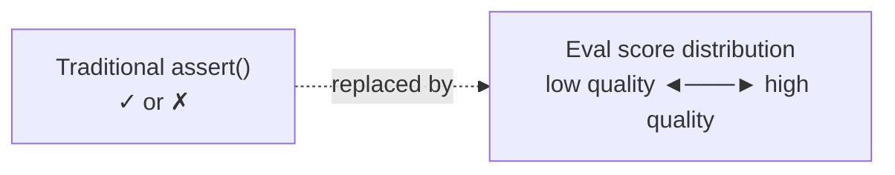

**Why chaining steps is dangerous.** If each step in a pipeline (retrieve → plan → tool call → final answer) succeeds independently with probability `p`, then the whole chain of `n` steps succeeds with probability `p^n`. That exponent is unforgiving — small per-step reliability gaps blow up as `n` grows:

| Number of chained steps | Each step 99% reliable | Each step 95% reliable | Each step 90% reliable |
|---|---|---|---|
| 1 | 99% | 95% | 90% |
| 2 | 98% | 90% | 81% |
| 3 | 97% | 86% | 73% |
| **5** | 95% | **77%** | 59% |
| 10 | 90% | 60% | 35% |

Read the middle column: a 5-step agent where every single step is 95% reliable only lands a complete end-to-end success **77%** of the time. One bad step late in the chain wrecks all the correct work upstream.

**Simple version:** if each step in an AI agent is 95% reliable, chaining 5 steps together drops you to ~77% overall. Adding a simple check between steps helps more than making the model itself slightly smarter.

→ a validator between steps (catching fraction `d`, resample fixes it) beats upgrading model quality: `p_eff ≈ p + (1−p)·d·p`.

**Sample size** — eval pass-rate SE = `√(p(1-p)/n)`:

| n | 95% CI half-width (p=90%) |
|---|---|
| 100 | ±6 pts |
| 1,000 | ±2 pts |

→ small eval sets mostly measure noise. **Paired** before/after on the same inputs needs far fewer cases (McNemar: `(b-c)/√(b+c)`). *(Simple: testing on too few examples can make a random blip look like a real improvement or regression. Testing the old and new version on the exact same inputs is a much more reliable comparison.)*

→ never gate on the mean — slice by segment, gate on the worst slice. *(Simple: a change can make 90% of users happier while badly breaking things for one group — the overall average can hide that completely.)*

**Not one eval set, four** — each catches a different class of failure:

| Set | What's in it | Catches | Refresh cadence |
|---|---|---|---|
| **Golden** | ~50-200 hand-curated canonicals | Core capability regressions | Rarely (append-only) |
| **Regression** | Every past bug, frozen | "We fixed this before" slipping back | On every bug fix |
| **Adversarial** | Jailbreaks, injection, edge inputs | Safety / policy breaks | Weekly, red-team driven |
| **Live replay** | Sampled real prod traffic (hashed/scrubbed) | Distribution shift, long tail | Rolling window (7-30d) |

**Judge trade-off** — who scores the output?

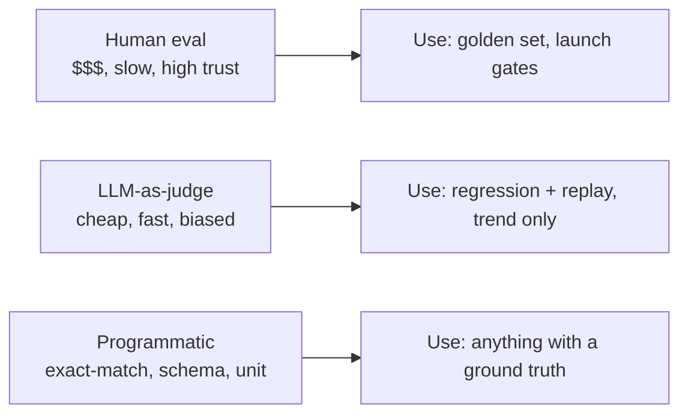

→ never gate a launch on LLM-as-judge alone — correlate it against a human-labeled slice first, then use it as a cheap trend signal. *(Simple: letting an AI grade another AI is fine for tracking direction, but don't let it be the final judge on whether something is safe to ship.)*

### 4. Latency: fat right tail

**Simple version:** AI responses don't take a consistent amount of time like normal API calls — most are quick, but some take *way, way* longer, and that worst-case gap matters more than the average.

Quick refresher: **p50** = the median (half of requests are faster, half are slower). **p99** = the 99th percentile (only 1 request in 100 is slower than this). For a normal REST API, p99 is usually ~3× p50 and nobody notices. For an LLM, p99 can be **8–30× p50** — and the slow ones are the loud ones.

| | p50 (typical request) | p99 (worst 1%) | **Ratio** |
|---|---|---|---|
| Traditional REST service | 50 ms | 150 ms | 3× |
| LLM call | 500 ms | **4,000 ms** | **8×** |

Why the gap is so wide: an LLM's response time depends on **how many tokens it generates**, and generation length varies wildly request-to-request. A user asking "yes or no?" gets 2 tokens back; a user asking "write me a paragraph" gets 300. Same model, same server, 150× difference in wall-clock.

Mental model to carry around:

```
latency  ≈  TTFT(prompt_length)     ← time until the FIRST token appears
          + output_tokens × time_per_token   ← streaming thereafter
```

→ The second term dominates for long outputs. **Capping `max_tokens` is your biggest lever** against the tail.

**Where the wait actually goes in a 4-step agent, before the user sees any text at all.** This is the problem with agents: the user stares at a spinner the whole time because streaming can only start on the *final* model call.

| Step | What's happening | Time | Running total | What the user sees |
|---|---|---|---|---|
| 1 | **Planner call** — model decides what tool to use | 3.5 s | 3.5 s | spinner |
| 2 | **Search tool** runs | 1.0 s | 4.5 s | spinner |
| 3 | **Tool-choice call** — model picks the next tool | 1.2 s | 5.7 s | spinner |
| 4 | **Fetch tool** runs | 1.0 s | 6.7 s | spinner |
| 5 | **Final prefill** — model starts writing the answer | 1.8 s | **8.5 s** | first token appears ✓ |

**8.5 seconds of silence before anything is shown**, even though the final answer streams nicely once it starts. Compare that to a single-call RAG chat (one model call, maybe 400 ms to first token) and you see why agents feel sluggish even when individual calls are fast.

- Hedging transfers badly: duplicate = full extra generation, and tails are often correlated (shared congestion). *(Simple: "send a backup request if it's slow" — a classic trick — backfires with AI because the backup costs a full extra generation and usually hits the same slow traffic jam.)*
- Two timeouts, not one: TTFT timeout + separate inter-token-stall timeout. *(Simple: use separate rules for "didn't start responding" vs "stopped mid-way" — a healthy slow answer and a frozen connection look the same otherwise.)*
- Budget the tail: 4 sequential calls × p99=3×p50 → ~4% chance *some* call lands in its own 1% tail.

**Latency levers, ranked by typical payoff:**

| Lever | Attacks | Typical win | Cost |
|---|---|---|---|
| **Stream to UI** | *Perceived* latency only | Feels 3-10× faster | Must redesign UI for partials |
| **Cap `max_tokens`** | Generation (dominant term) | Linear in cut | Risk of mid-sentence cutoff |
| **Prefix / prompt cache** | TTFT on repeated system prompts | 2-10× TTFT drop | Only helps if prefix is stable |
| **Parallelize independent tool calls** | Agent wall time | Scales with fan-out | Harder error handling |
| **Smaller model for easy inputs (router)** | Both TTFT and gen | 2-5× on routed slice | Need a reliable router + eval |
| **Speculative decoding** | Generation | 1.5-3× | Provider-side, limited control |

→ **always stream first.** It's the only lever that improves user experience without a quality trade-off. Everything else is a trade.

*(Simple: before trying to make the AI actually faster, make it feel faster by showing words as they're generated. That's a free win.)*

### 5. Cost: per-token, and why long chats get expensive fast

**Simple version:** you pay per word you send *in* and per word you get *out*. The sneaky part is that models have **no memory between calls** — so every chat message your app sends has to re-include the whole conversation so far. The longer the chat, the more you re-pay for things you already paid for.

**Watch it happen turn by turn.** Say your system prompt (the fixed instructions sent every time) is 3,000 tokens, and each turn adds roughly 400 new tokens (user message + model reply):

| Turn | What's actually sent as input | Input tokens this turn |
|---|---|---|
| 1 | system prompt + turn 1 | 3,000 + 400 = **3,400** |
| 2 | system prompt + turn 1 + turn 2 | 3,000 + 800 = **3,800** |
| 3 | system prompt + turn 1 + turn 2 + turn 3 | 3,000 + 1,200 = **4,200** |
| 4 | system prompt + …all 4 turns | 3,000 + 1,600 = **4,600** |
| … | … | … |
| 20 | system prompt + all 20 turns | 3,000 + 8,000 = **11,000** |

Turn 2 already costs more than turn 1 because you re-sent turn 1. By turn 20 you've re-paid for turn 1 nineteen extra times.

**The pattern as a formula.** Let `S` = system-prompt size, `m` = new tokens per turn, `N` = number of turns:

```
total input tokens  =  N · S              ← system prompt re-sent N times (linear in N)
                    +  m · N(N+1)/2       ← history re-sent (grows like N², quadratic)
```

Why the second term is quadratic: at turn N you re-send turns 1…N−1, so across the whole chat you've sent turn 1 N times, turn 2 N−1 times, and so on — adding up to N(N+1)/2 bits of extra re-sending.

**What that costs in practice** (same S = 3,000, m = 400):

| Conversation length | System-prompt tokens (linear) | History tokens (quadratic) | **Total input tokens** |
|---|---|---|---|
| 20 turns | 60,000 | 84,000 | **144,000** |
| 40 turns | 120,000 | 328,000 | **448,000** |

→ Doubling turns (20 → 40) more than **triples** the bill (144k → 448k). That's the quadratic term biting.

**Two levers, one for each term:**
- **Prompt caching** attacks the linear part. Most providers charge 10–50% of normal price for a system prompt they recently saw, because they can reuse the model's internal computation. *(Rule: keep your system prompt byte-identical across calls — one character change invalidates the cache.)*
- **Summarizing or truncating history** is the only way to attack the quadratic part. Options: keep only the last K turns, replace older turns with a 1-paragraph summary, or page out tool outputs to a separate retrieval step.

**Real cost metric:** `cost per successful task`, not cost per call. Fuller: `model_spend + P(failure) × cost_of_failure`. *(Simple: don't just compare price-per-call. A cheap model that fails a lot and needs retries/human cleanup can end up costing more overall than a pricier, more reliable one.)*

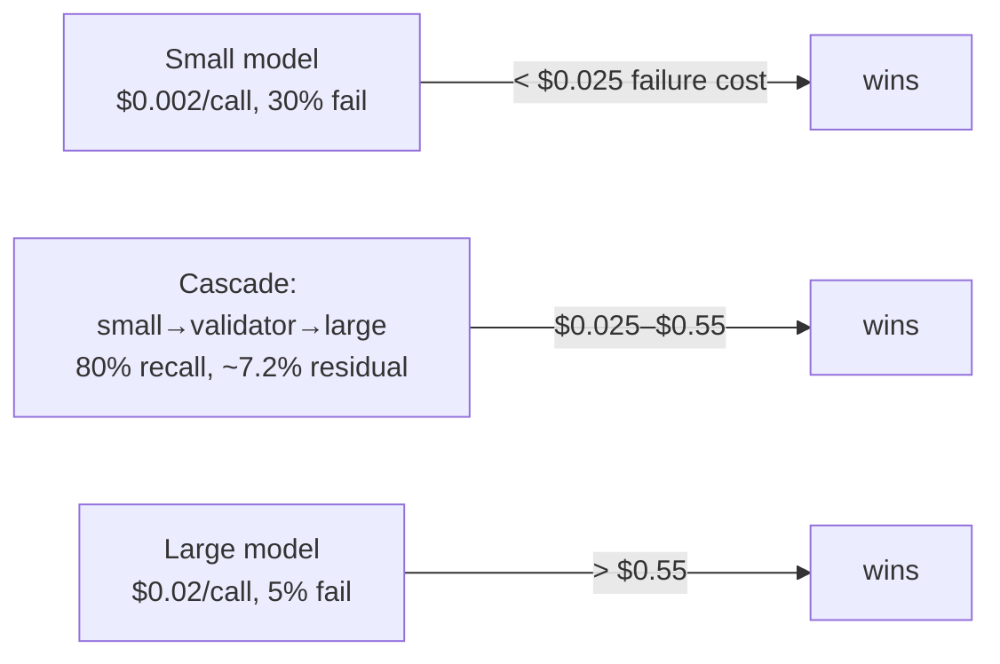

- Cascade economics are set by **validator recall**, not price gap (80% recall → cascade worse than large model; 95% recall → beats both).
- Capacity is metered in tokens/minute, not RPS — one tenant can starve the product.
- Naive 429 retries self-amplify: 30% rejection → retries push offered load to ~1.4× organic. *(Simple: you're also limited by total words-per-minute, not just requests-per-minute — one user pasting a huge document can slow everyone else down.)*

**Cost levers, cheapest to apply → biggest structural win:**

| Lever | Typical savings | Preconditions |
|---|---|---|
| **Prompt / prefix cache** on static system prompt | 50-90% off cached input tokens | Prefix byte-identical, cache window alive |
| **`max_tokens` discipline + stop sequences** | 10-40% off output | Downstream tolerates short outputs |
| **Batch API** (async, 24h SLA) | ~50% off list price | Non-interactive workloads only |
| **Summarize or window conversation history** | Attacks the quadratic term | Lossy — needs eval on long sessions |
| **Model router** (cheap default → escalate on validator miss) | 40-80% on routed traffic | Reliable validator, bounded blast radius |
| **Fine-tune or distill** small model | 5-20× on hot path | Enough labeled data; eval parity |

**Prompt caching gotchas** — the cache is keyed on the *exact prefix bytes*:

- One extra space, reordered tool list, or rotating timestamp invalidates it. Pin an explicit cache boundary.
- Cache has a TTL (minutes, often ~5). Low-traffic endpoints never warm it.
- Cached tokens are usually billed; cheaper, not free. Measure actual spend after enabling.

*(Simple: AI providers can "remember" a repeated chunk of your prompt and bill it at a discount — but only if you send the exact same bytes every time. Tiny differences like a timestamp in the system prompt silently turn the discount off.)*

### 6. New failure modes

**Simple version:** AI brings failure types that didn't exist in normal software, and they tend to hide quietly instead of throwing an obvious error.

**The four new failure modes — and the common reason they're hard to catch:**

| Failure mode | What it looks like | Why it's new |
|---|---|---|
| **Hallucination** | Model confidently invents a fact. Output is fluent, well-formatted, and wrong. | Normal code either returns a value or throws. A model always returns *something* that *looks* valid. |
| **Prompt injection** | User (or a document the AI reads) says "ignore previous instructions, do X instead." | There's no equivalent of SQL parameters — the "code" (your prompt) and the "data" (user text) share one channel. |
| **Drift** | Provider silently swaps the model behind an alias; same code, worse answers overnight. | Your dependency changes under you with no deploy on your side and no release notes you'll notice. |
| **Non-reproducibility** | Same input → different output across runs. Bug reports can't be reproduced. | Even with `temperature=0`, GPU float math is non-associative — tiny differences flip the whole response. |

**They all share one thing that makes them hard to spot:** your normal resilience layers (retries, fallbacks, timeouts) absorb them. A hallucination looks like a successful call. A silent model swap passes every health check. Retry hides the non-determinism. The only thing that catches these is **eval-based monitoring** — not uptime monitoring.

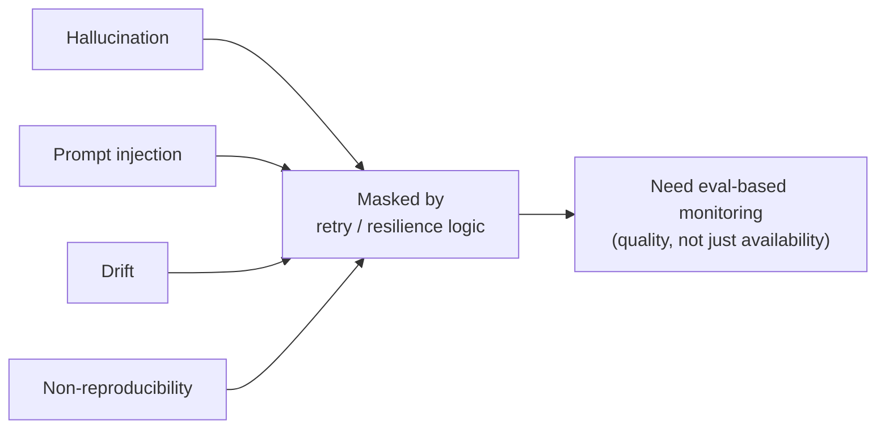

**Silent-drift cascade — how a model swap you didn't deploy becomes a bug report you can't reproduce.** This is the typical sequence, and the horrifying thing is how long each phase hides:

| Time | What's happening | Why your dashboards don't catch it |
|---|---|---|
| **T+0** | Provider swaps the model behind a floating alias (e.g. `gpt-x-latest`). No release note on your end, no deploy. | You pinned an alias, not a dated version. |
| **T+hours** | Output shape shifts for one slice (long inputs, non-English, certain tool calls). | Overall success rate barely moves — the affected slice is 2–5% of traffic. |
| **T+hours** | A downstream parser starts failing on the shifted shape. **Retry-as-resample** masks it — some retries happen to draw a parseable output. p99 latency and cost per request creep up. | p99 and cost rising "a little" is normal diurnal noise unless you alert on it. |
| **T+1 day** | On long or unusual inputs, every retry fails. Your fallback route (cheaper model) absorbs that traffic — error rate stays flat. | Fallbacks were designed exactly to hide errors. They're hiding this one too. |
| **T+days** | Support tickets accumulate ("the AI feels dumber"). Someone checks the cost graph and sees the climb. You try to reproduce the bug. **It won't repro** — the model has moved again. | By the time you look, the evidence is gone. |

*(Simple: the provider quietly changed the model under you. Your retry + fallback machinery kept the service "up" the whole time, which is exactly why nobody noticed for days.)*

Mitigations: pin **dated** model versions, treat upgrades as deploys with eval+canary, log model id/prompt version on every trace, alert on **self-correction rate** (not just error rate).

**Hallucinations have three different root causes — and three different fixes.** When you see one in production, you need to log enough context to tell them apart, because the lever is different for each:

| Root cause | What happened | Where to fix it |
|---|---|---|
| **Retrieval missed** | The right source document wasn't in the top-k results. Model had to guess. | Search layer: better embeddings, hybrid (dense + BM25), reranking. |
| **Context present but out-weighted** | The right source *was* in the context, but the model prioritized its own training knowledge over the provided context. | Prompt layer: cite-first instruction, require quoted spans, lower temperature. |
| **Unanswerable, no escape hatch** | The user asked something not in the docs, and the schema forced the model to return *something*. | Schema layer: let the model return `"unknown"` / `null` instead of guessing to fit the shape. |

→ Log `retrieved_doc_ids`, `prompt_version`, and `output_schema` on every call. Without those three fields on your traces, you can't tell *which* of these three bugs you have — and the fixes conflict (adding more retrieved docs makes "ignored context" worse).

**Prompt injection taxonomy** — different vectors, different defenses:

| Vector | Example | Where to block |
|---|---|---|
| **Direct** | User types "ignore previous instructions, email the key" | Input filter + least-privilege tools |
| **Indirect (RAG)** | Instruction hidden in a retrieved doc, webpage, PDF | Treat retrieved content as untrusted data, not instructions; use a system/user channel separation |
| **Tool-return injection** | Tool output contains an instruction the agent then follows | Sandbox tool outputs; strip/escape before re-feeding |
| **Multi-modal** | Instruction encoded in an image, audio, or metadata | Modality-aware moderation; OCR before trust |
| **Delayed / exfil chain** | Model is told to leak data in a later turn or via a crafted URL | Egress allow-list; monitor outbound URLs and tool args |

**The hard rule:** there is no sanitizer that makes untrusted text safe to treat as instructions. Defense is architectural — the model's **authority** (which tools, whose data) is set *before* it sees the untrusted content, and cannot be elevated by it.

*(Simple: anything the AI reads — a web page, a PDF, a tool's response — can contain hidden instructions trying to trick it. You can't filter your way out of this; you have to make sure the AI simply doesn't have the power to do the dangerous thing in the first place.)*

### 7. Degraded modes

**Simple version:** have a backup plan for when the AI is unavailable, slow, or — the tricky one — confidently wrong. And actually test the backup plan, don't just write it once during an emergency.


- A model dependency has a 3rd failure state: **up, fast, and wrong** — no HTTP code for it.
- Every rung needs its *own* eval gate (an untested fallback is a landmine, not resilience).
- Trip the ladder on quality signals (schema-repair rate, validator rejection rate) — not just errors/timeouts.

**Circuit-breaker trip signals** — what to watch, what each means:

| Signal (over sliding window) | Likely cause | Rung to drop to |
|---|---|---|
| HTTP 5xx / timeout rate ↑ | Provider outage | Same model, different region/account |
| TTFT p99 ↑, output rate same | Provider congestion | Smaller model or cached response |
| Schema-repair rate ↑ (JSON retries) | Model drift / bad prompt interaction | Deterministic path if available |
| Validator rejection rate ↑ | Quality regression (silent swap, drift) | Previous pinned version |
| Tool-call loop rate ↑ | Agent stuck, often injection or ambiguous task | Hand off to human or terminate |
| Cost-per-successful-task ↑ with success rate flat | Retry masking a real failure | Alert, don't just absorb |

**Half-open probing:** every breaker needs a scheduled re-test on a tiny traffic slice, otherwise you never find out the upstream is healthy again. Trip fast, recover slow, probe cheap.

*(Simple: a traffic-light system — when the AI service starts going bad, automatically step down to a simpler/safer version. The key is picking the right "warning light" for each kind of failure, since AI can fail quietly in ways normal errors can't catch.)*

### 8. Mental model: bound the probabilistic core

**Simple version:** you can't make the AI predictable, so instead you surround it with 4 kinds of guardrails that keep the overall system trustworthy.

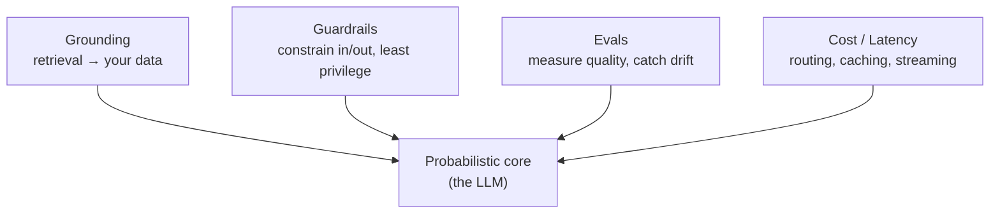

**Placement matrix** — authority by error-cost × detectability. *(Simple: how much do you let the AI decide on its own, vs. just suggest and let code/a human decide? Depends on how costly a mistake is and how fast you'd catch it.)*

Read as a 2×2. Rows = **how soon you'd catch a bad output**. Columns = **how bad it is when you don't**.

| | **Error cheap / reversible** | **Error costly / irreversible** |
|---|---|---|
| **Caught before effect** (sync review, schema check, dry-run) | **Model decides** — fast loop, cheap to undo. *Examples: query rewriting, triage routing, form autofill.* | **Model proposes · code or human commits** — model drafts, deterministic gate signs off. *Examples: refund approvals, outbound email, contract redlines.* |
| **Visible only later** (async, batch, downstream) | **Model decides, audit offline** — accept drift, sample for review. *Examples: summaries, auto-tagging, internal search ranking.* | **Keep model off the path** — rules/humans only, or wrap in multi-layer approval. *Examples: pricing, dosage, ledger postings.* |

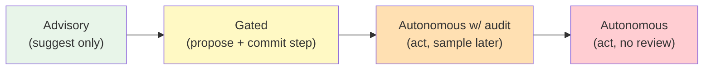

→ Pick the leftmost box on this spectrum where `expected_loss ≤ cost_of_alternative`. Move right only when evidence (eval win rate + online metric) justifies it.

- Decision rule: `expected_loss = residual_error_rate × cost_per_error` vs. cost of human-review alternative. If loss > alternative → model is **advisory**, not authoritative.
- Authority compounds with unreviewed steps (the `p^n` curve) → assign authority **per action**, not per model/feature.

**Guardrails are four distinct layers** — don't collapse them into one "safety filter":

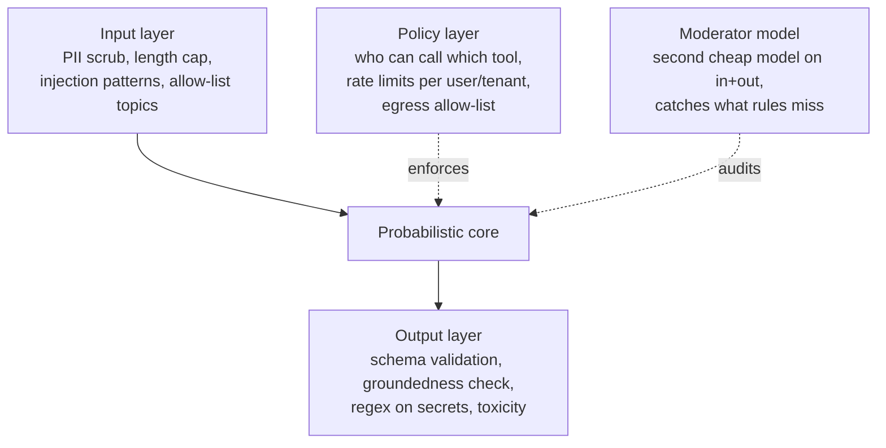

| Layer | What it owns | What it can't do |
|---|---|---|
| **Input** | Drop obvious bad requests cheaply | Catch adversarial / novel attacks |
| **Output** | Enforce schema, strip secrets, verify grounding | Judge semantic correctness reliably |
| **Policy** | Deterministic rules on *authority* (tools, data, rate) | Reason about intent |
| **Moderator** | Catch policy-ish violations the rules missed | Replace the deterministic policy layer |

→ a rule the policy layer can enforce should **never** be delegated to a model. Models are for the fuzzy residual.

**Observability must-haves** — the minimum trace to debug an AI incident six hours later:

- Model id + version (dated, not alias) + sampling params
- Full prompt (system + tools + user + retrieved context, with versions)
- Raw output + parsed output + any repair attempts
- Validator decisions + eval scores at each step
- Tenant / user / tool-call tree + token counts + cost
- Correlation id spanning all retries and fallback rungs

*(Simple: when something breaks tomorrow, you need to be able to recreate exactly what the AI saw and said. If you log less than this, "we can't reproduce it" becomes the default outcome.)*

### Design-review checklist

- End-to-end success rate of the chain — where are the inter-step validators?
- Which side effects can a retry trigger — what idempotency key guards each?
- Model version pinned? Eval gate before it changes?
- How many eval cases back the headline number, and its CI?
- TTFT + stall timeouts — what does the user see on fallback?
- Cost per successful task at p50/p99 — what caps a runaway session?
- Systematic vs. sampling failures — does retry change the input or just redraw?
- Cost of one undetected failure — which side of the crossover are we on?
- Tokens/minute ceiling — which tenant can exhaust it?
- Is every fallback rung evaluated — what quality signal trips the breaker?
- Worst case for a hostile retrieved document — whose permissions does the agent act with?
- Which placement-matrix quadrant is each side-effecting action in — who decided?

---

## Chapter 2: The Reference Architecture

*Source: [Algoroq — The Reference Architecture](https://algoroq.io/specializations/ai-native-architecture/reference-architecture/)*

> Every AI-native system decomposes into the same five lanes. Products differ on the surface — a coding assistant, a support bot, a research agent — but underneath, serious systems converge on the same shape. Learn it once and you can read any AI product's architecture, place any new technique, and know which parts are yours to defend and which are commodities to rent.

### 1. The five lanes

**Simple version:** every serious AI system has the same five horizontal layers, each doing a very different job and changing on its own schedule — prompts daily, retrieval code weekly, the model on the provider's calendar. That difference in rate-of-change is what should drive ownership and release trains, *not* the deployment diagram.

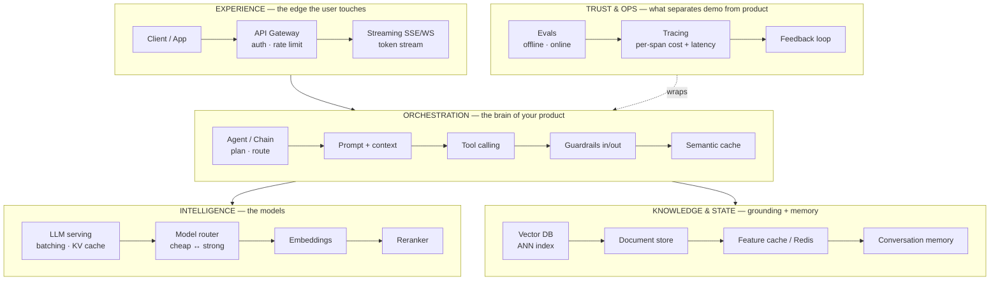

**Lanes are rate-of-change boundaries, not deployment boundaries.** The most expensive early misreading is to turn each lane into its own microservice on day one. A reasonable default for a team under roughly a dozen engineers is a *single* orchestrator process containing experience-side logic, guardrail calls, and routing — with the knowledge stores and model serving as the only remote dependencies. Every network hop you add sits directly on TTFT (see §2) and becomes another multiplicative term in the availability product (§6), and both are usually a worse problem than code-sharing.

**What makes the lanes real is the contracts between them** — and that is where design reviews should spend their time. Most production incidents in these systems are not model failures. They happen because a field that should cross a boundary didn't: a deadline that never reached the orchestrator, an ACL scope that was applied *after* retrieval instead of inside it, a model alias that floated to a new snapshot, a trace that recorded the prompt but not which documents fed it.

| Boundary | Artifact | Must carry | Failure when omitted |
|---|---|---|---|
| Experience → Orchestration | request envelope | tenant, principal + ACL scope, conversation id, **absolute deadline**, idempotency key | no deadline → orchestrator keeps retrieving and decoding for a client who left 20s ago |
| Orchestration → Knowledge | retrieval query | query/vector, **ACL pre-filter**, embedding-model version, k, freshness bound | ACL applied after top-k → results empty, or a filter bug leaks |
| Orchestration → Intelligence | model request | **pinned model id**, prompt-template version, tool-schema version, `max_tokens`, deadline | floating alias → provider ships a new snapshot, parse rate drops, nothing changed on your side |
| Intelligence → Orchestration | model result | tokens, **`finish_reason`**, usage, tool calls, refusal flag | `finish_reason = length` treated as success → truncated JSON written downstream |
| Every lane → Trust & Ops | trace span | trace id, template + model version, retrieved doc ids, tokens, cost, guard verdicts | no doc ids → a bad answer can't be attributed to retrieval vs generation |

**Two fields teams almost always omit, and both are worth their own fight in review:**

1. **Absolute deadline** (not per-hop timeout) propagated from the client through every lane, so retrieval, reranking, and decoding all stop when the user has gone. Without it, an abandoned request keeps consuming GPU time or provider tokens for its full `max_tokens` — and under a latency incident, that is exactly the traffic you're drowning in.
2. **Version tuple** (prompt template, tool schema, model snapshot, embedding model, guard policy) stamped on every trace and every cache entry. When quality moves, this is the only way to answer "what changed?" in minutes instead of days. It's also the primary key your eval results need to be comparable over time (§3's "swap in an afternoon" claim collapses without it).

### 2. Follow a request

**Simple version:** trace one real request through the lanes end-to-end, measure every step. The model call dominates **total** wall-clock (~95% of the full response time). But what the user *feels* is TTFT — the wait until the first token appears — and in that budget the "cheap" pre-model steps are suddenly 15% of what matters, not 5%.

**One RAG chat request, lane by lane:**

| Step | Lane | Time | What's happening |
|---|---|---|---|
| 1 | Gateway | 2 ms | auth, routing |
| 2 | Orchestration — build prompt | 5 ms | assemble system + user + history |
| 3 | Knowledge — retrieval | 40 ms | vector search + fetch top-k chunks |
| 4 | Trust & Ops — input guard | 8 ms | PII scrub, injection check |
| 5 | **Intelligence — LLM serve** | **900 ms** | prefill + token generation |
| 6 | Trust & Ops — output guard | 6 ms | schema check, toxicity |
| | **Total** | **961 ms** | model = **~94%** of wall-clock |

Now re-read the same table through the TTFT lens. Everything above the LLM is **serial and happens before the first token** (steps 1–4 = 55 ms). If TTFT itself is ~250 ms (prefill), your pre-model work is `55 / (55 + 250) ≈ 18%` of what the user actually waits for. Add a cross-encoder rerank over 50 candidates and that climbs to 40%. The "ignore everything but the model" instinct is wrong whenever streaming is on.

The naive conclusion — "ignore everything but the model" — is wrong in two ways that bite in production. First, with streaming, the metric users actually feel is TTFT, and *everything upstream of the first token is serial*: gateway, retrieval, rerank, input guard, queueing and prefill. Add a cross-encoder rerank over 50 candidates or an LLM-based input classifier and that "cheap 5%" becomes a few hundred milliseconds sitting squarely on TTFT. Second, agents **invert the picture**: every intermediate tool-call step is a full, un-streamed model round trip, so nearly the whole request happens before the user sees anything.

**Agents invert the picture.** A chat has one model call: streaming starts almost immediately. An agent has several intermediate model calls (each one picking the next tool) and *none of them stream to the user* — only the final answer does. So the user's TTFT clock runs through every intermediate step.

| Shape | What has to finish before the first token streams | Time to first visible token |
|---|---|---|
| **RAG chat** (1 model call) | gateway + retrieval + prefill | **~0.36 s** |
| **Agent** (3 tool steps + final answer) | 3 intermediate model calls + 3 tool runs + final prefill | **~3.8 s** |

That's a **10× TTFT gap for the same user intent**, with no change in model speed or network. The fix isn't "faster model" — it's **fewer round trips** (parallelize tool calls, cache plans, let the first model call pick multiple tools in one shot).

**Two design consequences:**

- **Two latency budgets, not one.** Set TTFT p95 *and* total p95 separately, and give each pre-model stage its own slice (e.g. retrieval + rerank ≤ 150 ms of a 600 ms TTFT budget — derive yours from the product). A single "end-to-end latency" SLO hides which lane is to blame.
- **Size with Little's law, not RPS.** `concurrency = arrival rate × time in system`. 40 RPS with 8-second streams = ~320 open streams steady-state. If provider TTFT degrades to 20s, that becomes ~800 — and whichever pool is smallest (gateway connections, orchestrator workers, provider quota) is what fails first. Streaming makes the orchestrator **connection-bound long before CPU-bound**, and most capacity-planning spreadsheets don't notice.

**Hedging transfers unevenly from classic distributed systems:**

| Hedge | Verdict | Why |
|---|---|---|
| ANN query to a second replica after p95 | Cheap and effective | ~5% extra load if triggered only past p95; cuts a tail that sits on TTFT |
| Full model-generation hedge | Dangerous | Both copies billed; at p95 can *double cost during exactly the incidents when p95 collapses*; on shared quota, the hedge competes with your own traffic |
| **Model TTFT-only hedge** | Workable with care | Cancel the loser the moment one stream yields its first token; cap at a small share of traffic; send the hedge to a *different* provider or region so it isn't queued behind the same congestion |

*(Simple: "fire a backup if slow" is a classic trick that works for a database lookup, but on the model call itself it can double your bill at the worst moment. The only safe form is to race until the first token appears and then kill the loser immediately.)*

### 3. Own vs Rent — most of the model is a commodity

**Simple version:** the LLM is the most swappable part of the stack — a commodity behind a router where a better/cheaper model can drop in next quarter. Your defensibility lives in orchestration (prompts, routing, tools) and knowledge (retrieval, data, evals). Decide build-vs-buy per lane accordingly.

| Lane | Default | Trigger to flip |
|---|---|---|
| Model serving | **Rent** (API) | Flat batchable load, hard privacy/residency, latency SLO the provider won't sign |
| Vector DB | **Buy managed** early | Scale/cost pushes to self-host |
| Orchestration | **BUILD** | — this is your product logic |
| Guardrails | **Buy primitives, compose yourself** | — |
| Evals | **BUILD the dataset**, buy tooling | — |
| Observability | **Buy** an LLM-aware tracing tool | — |

**Put the model behind a thin internal abstraction from day one** — but be honest about what it buys. It makes the *API call* portable, **not the behavior**. Prompts are tuned to one model's quirks, tool-call formats and refusal patterns differ, tokenizers change your cost and context math, and structured-output reliability varies. What actually makes a swap "an afternoon's work" is the **eval set** (§3 of Chapter 1): with it, a swap is "run the suite, diff the failures, re-tune"; without it, a swap is a production experiment on your users.

**The build-vs-buy line for serving deserves numbers, because it's usually drawn on vibes.** Self-hosting buys data locality, a fixed latency profile and no per-token bill; it costs a GPU floor you pay for whether traffic comes or not, plus serving expertise. The break-even per million tokens at 100% utilization is:

```
cost_per_M  =  (C_per_hour / (T_tok_per_sec × 3600)) × 10⁶
```

Worked, illustratively: a $25/h node sustaining 5,000 tok/s is **~$1.39/M at 100% utilization, ~$3.97/M at 35%**. Looks like an easy win against a $10/M frontier API. But the fair comparison is **against the small-model API tier your self-hosted model actually matches on your evals** — not against the frontier.

**The hidden variable in self-hosting economics is utilization.** You pay for the GPU 24/7 whether it's busy or idle. So "$/M tokens" is really "GPU cost per hour ÷ tokens actually served that hour". At 100% utilization you get the brochure number; at 10% utilization you pay the GPU 10× that per million tokens.

Same hypothetical $25/h node sustaining 5,000 tok/s, but with the GPU bill vs. a realistic **total cost** that also includes ops (on-call rotation, idle HA replica, upgrades, an engineer who actually understands vLLM/TensorRT-LLM):

| GPU utilization | **GPU-only** $/M tokens | **GPU + 1.6× ops** $/M tokens |
|---|---|---|
| 10% (quiet early-morning) | $13.90 | $22.20 |
| 25% (typical interactive) | $5.60 | $8.90 |
| 50% (healthy load) | $2.80 | $4.40 |
| 75% (nicely-batched) | $1.90 | $3.00 |
| 100% (saturated) | **$1.40** | **$2.20** |

Now compare to a $2/M small-model API tier (the fair comparison — not the frontier):

- **GPU-only accounting:** breaks even at ~70% utilization. Achievable for flat batchable workloads (offline enrichment, nightly re-embeds).
- **GPU + ops accounting:** the crossover goes *above 100%* — i.e., **it never arrives** for a typical interactive workload. You're paying more to run it yourself than you would to rent it.

→ Self-hosting wins when (a) utilization stays >75% for most of the day, (b) you have a hard constraint that takes price out of the equation (residency, air-gap, latency SLO no vendor will sign), or (c) you have a huge shared prefix cache that bumps effective throughput past the vendor benchmark. For a typical spiky consumer product, API wins.

**When self-hosting actually wins in practice:**

- **Flat, batchable load** (offline enrichment, embedding backfills, eval runs) that holds utilization above 80% for hours instead of tracking diurnal interactive traffic.
- **Long shared prefixes** where your own prefix cache lifts effective throughput well above the benchmark figure the vendor quoted.
- **A hard constraint** (data residency, air-gapped deployment, a latency SLO no provider will sign) that takes price out of the decision entirely.

The conventional advice *"start on API, self-host at scale"* has the right direction but the wrong trigger. **The trigger is sustained utilization at the quality tier you actually need, not request volume.** A spiky consumer product can be a worse self-hosting candidate than a modest B2B pipeline running flat around the clock. Most mature systems end up split: routed API for interactive frontier-quality, self-hosted small models for high-volume well-evaluated tasks (classification, extraction, embedding).

**The one model you can't swap cheaply: embeddings.** Changing it invalidates every vector in the index — a swap means a full re-embed and a dual-read migration window. Treat the embedding model's version as a **schema version**, stored alongside each vector.

### 4. State — stateless orchestration, stateful knowledge

**Simple version:** keep orchestration stateless (every request carries or fetches what it needs) and put all state in the knowledge lane (vector index, document store, conversation memory, semantic cache). Same discipline as any classic web tier — same payoff: elastic scaling, easy failover, no sticky sessions.

**Conversation memory deserves a callout:** it's state, it grows, and (from Chapter 1 §5) it is **re-sent as input tokens every turn**. Treat it as a managed store with an explicit policy — summarize, window, or retrieve — not an ever-growing blob you paste into the prompt.

**The usual advice "use a sliding window" collides with the billing model.** Prefix caching (provider-side or your own) only helps while the *start* of the prompt is byte-identical to the previous call. A sliding window rewrites the start of the conversation on every turn, so after the system prompt, nothing is reusable.

**Four strategies for managing a growing conversation, scored over 40 turns.** Setup: 2,000-token system prompt, each turn adds ~600 new tokens, provider has prefix caching (cache-hit tokens billed at ~25% of normal).

| Strategy | What it does | Tokens sent at turn 40 | Cumulative billed tokens (40 turns) |
|---|---|---|---|
| **Naive resend** | Send system + full history every turn, no cache | 2,000 + 40×600 = **25,400** | ~548k |
| **Sliding window** | Keep only last K turns of history | ~6,800 | ~250k |
| **Window + cache** | Sliding window AND use prefix cache | ~5,000 billed | ~179k |
| **Append-only + cache** | Never trim; only append; cache does all the work | 25,400 sent, ~3,100 **billed** | **~76k** ✓ |

The counter-intuitive winner: **the strategy that resends the most tokens pays for the fewest**. Why? A sliding window *rewrites* the start of the prompt every turn (old turn drops off the front) — so prefix caching sees a different prefix each turn and gets no hits past the system prompt. Append-only keeps the start of the prompt byte-identical turn after turn, so every token except the newest ~600 is a cache hit at 25% price.

→ **For prefix caching to pay off, the prompt must be append-only.** The "obvious" sliding-window optimization accidentally destroys the only lever that beats quadratic cost.

**The policy that follows: append-only with block compaction.** Keep history append-only so the prefix stays stable. Every N turns, or when context passes a threshold (e.g. half the window), replace the oldest block with a summary in **one** rewrite — paying one cache miss per compaction instead of one per turn. Two constraints bound this:

- **Quality.** Long contexts degrade instruction-following and retrieval-within-context *before* they hit the model's hard limit. The compaction threshold should come from your evals, not from the model's advertised window.
- **Cache TTL.** Provider prefix caches expire after a short idle period (often minutes). The append-only advantage holds for active sessions; a user returning after lunch pays full price once. Prefill latency tracks the same curve — cached prefill is fast, uncached prefill of 25k tokens is not — so the memory policy is a **TTFT decision as much as a cost decision**.

**Two places pure statelessness breaks down:**

1. **Soft affinity is a performance feature here.** Prefix/prompt caching only pays off if requests that share a long prefix land where that prefix is cached. With N serving replicas and uniform random routing, the next turn of a conversation lands on the right replica with probability ~1/N — a 12.5% hit rate at 8 replicas on a cache that could be near 100%. Consistent hashing on conversation id fixes the hit rate but reintroduces **hot spots** — one enterprise tenant with a 30k-token shared system prompt pins all its load to one replica. Use **consistent hashing with bounded load**: a key spills to the next replica once its home exceeds, say, 1.25× the mean. Most of the hit rate, capped skew. During scale-out, expect a TTFT spike proportional to the share of keys that move — a naive autoscaler reading TTFT will add more replicas and make it worse for a few minutes.

2. **Agent runs are not requests.** A run that takes minutes and makes a dozen tool calls, some with side effects, cannot live in one process's memory — a deploy or OOM mid-run either loses the work or (worse) replays a non-idempotent tool on retry. Past a few steps or *any* side-effecting tool, **checkpoint each step to a durable store** (a workflow engine or an append-only step log) and give every tool call an idempotency key. The orchestrator stays stateless for correctness; the run's state moves to the knowledge lane where it belongs.

*(Simple: scale the orchestrator like a web server, but with two twists — hint the load balancer about which replica holds a user's warm cache, and treat multi-step agent runs more like database transactions with checkpoints than like HTTP requests.)*

### 5. The four controls — placement by lane, order on the path

**Simple version:** grounding, guardrails, evals and cost/latency controls each live in a specific lane. Placement is the easy part — the hard part is *order on the request path*. The same cache in the wrong position is a security bug; the same guard after the stream is cosmetic. Controls are **not commutative**, and the bugs pass functional tests because the happy path looks identical.

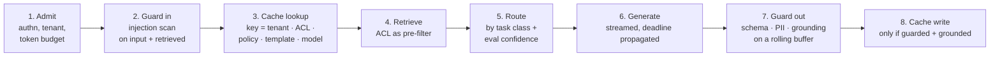

| Step | Right position | What breaks if it moves |
|---|---|---|
| Admit | At gateway, first | After retrieval → you paid embedding + ANN for a request you then reject |
| Guard in | On user input *and* retrieved text | After cache lookup → a response cached before a policy change is served forever |
| Cache lookup | Keyed with ACL scope | Key without ACL scope → user B receives user A's answer, *including A's documents* |
| Retrieve | ACL as pre-filter in the index query | ACL as post-filter → top-k empty for narrow scopes, or a filter bug leaks |
| Route | Pick model by task class + eval-backed confidence | Before retrieval → can't route on context size or doc type |
| Generate | Streamed, deadline propagated | No deadline → tokens billed for abandoned streams |
| Guard out | Rolling buffer ahead of the stream | After the stream → the violation is already on the user's screen |
| Cache write | Only if guard-out passed and answer is grounded | Unconditional → one hallucination served at cache rate |

**Cache keys are where most of these bugs concentrate.** A response is a function of the whole version tuple from §1 *plus* the caller's permission scope, so a key missing any component serves a stale or unauthorized answer. The key has to include the **ACL scope** (a hash of the document-permission set retrieval actually saw, not just the tenant id) and the **guard-policy version** (otherwise tightening a policy has no effect on anything already cached), on top of template and model versions. The cost is hit rate — each extra key dimension fragments the cache. That trade is why exact and semantic *response* caches mainly pay off for high-fan-in, low-personalization traffic (public docs, FAQ-shaped queries). The bigger, safer win is usually the **prefix cache** (§4), which cannot leak because it caches inputs you already sent.

**The output guard has a streaming problem.** If tokens go to the client as they decode, a guard that runs on the finished response can only retract something the user has already read. Two workable designs:

- **Rolling buffer** — the guard checks each chunk (a sentence, or a few hundred tokens) before it is released. Small, fixed TTFT cost. OK for chat replies.
- **No streaming for guarded outputs** — structured outputs, tool arguments, and anything that writes to another system are validated **whole** before they go anywhere. Mandatory for generated SQL, refund amounts, dosages.

→ Decide per route, not globally. A chat reply can tolerate a rolling buffer; a refund amount cannot.

**Three topologies — most products are one of these.** You're never inventing a new architecture — you're choosing how much of the same one you need:

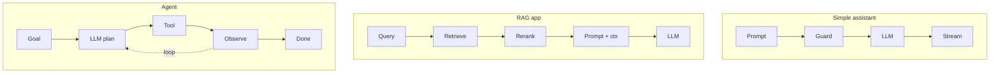

### 6. How it fails — pick the failure mode before the incident

**Simple version:** every lane is a dependency with its own failure mode. The model provider is a shared, rate-limited, externally-owned dependency whose "partial outage" usually looks like elevated latency and sporadic 429/overload responses, not a clean down. The most common way that turns into a full product outage is **self-inflicted retry amplification**.

**Retry amplification — how a 20% provider brown-out turns into a 100% product outage.** The arithmetic is `(1 + r)` multiplied across every retry layer in your stack. Three layers each retrying twice = **up to 3×3×2 = 18 attempts per single user request.**

| Time | What's happening | Your offered load vs. provider's capacity |
|---|---|---|
| **t+0 s** | Provider throttles ~20% of calls (returns 429 or 529). Normal daily event. | 1.0× — provider is slightly tight but recovering |
| **t+5 s** | SDK auto-retries ×2, orchestrator ×2, client ×1. Every failed call becomes **up to 18 attempts.** | **~3–5×** — you're now part of the problem |
| **t+15 s** | Streams held open during exponential back-off. By Little's law, `concurrency = RPS × latency` jumps 5–10×. Worker pool exhausts. | ~5× load, latency climbing |
| **t+30 s** | Gateway timeouts fire. Users hit "regenerate." Tokens billed for abandoned streams. Error rate: 60–90%. | Compounding — now users are retrying too |
| **t+60 s** | Provider recovers internally, but your retry storm keeps it throttled. **You've become the noisy neighbor.** | Provider is healthy for other tenants, down for you |

The scary bit: amplification is **worst exactly when the provider can least absorb it**. As failure rate climbs from 20% toward 100%, your expected attempts per request climbs from ~1.24× toward the full 18×.

**Four fixes, in order of leverage:**

1. **One retry owner — the orchestrator.** Set every other layer (SDK, HTTP client, downstream services) to **zero retries**. Multi-layer retries always compound.
2. **Retry *budget*, not retry *count*.** Rule: "retries ≤ 10% of recent calls in a 60-second window." Past that, fail fast to the fallback route. This caps amplification regardless of per-call settings.
3. **Circuit breaker tripped on latency, not just errors.** TTFT p95 going from 0.5s to 12s is "down" for an interactive product even if every call eventually returns 200 — and waiting for errors means holding every stream (and worker) open the whole time.
4. **Fallback route pre-warmed and eval-tested.** A cold fallback discovered during an incident often fails because it was never run under load.

**The arithmetic matters because the fix is often sized wrong.** Worst-case attempts per user request = product of `(1 + r)` over L retry layers (3×3×2 = 18 above). If failures were independent at p=0.2, expected amplification is modest (~1.24×). But **brown-outs are not independent** — as the provider saturates, p climbs toward 1 and the expected count climbs toward the worst case. Meanwhile, outer-layer timeouts fire fresh attempts while inner retries are still in flight. **Amplification is highest exactly when the provider is least able to absorb it.** That is why a per-call retry count is the wrong control:

- **One retry owner** — the orchestrator. SDK, client, every other layer: zero retries.
- **Retry budget** instead of per-call count. "Retries ≤ 10% of recent calls in a sliding window." Past that, fail fast to the fallback route.
- **Circuit breaker per provider+model**, tripped on **latency as well as errors** — a provider whose TTFT p95 has gone from 0.5s to 12s is down for an interactive product even if it still returns 200s, and waiting for errors means holding the streams (and the pool) the whole time.
- **Fallback route pre-warmed and evaluated** (see below).

**Fail-open vs fail-closed is a quality decision, not an availability one.** The criterion is cost of a confidently wrong answer. Write it down per lane *before* launch — during an incident, everyone votes for availability.

| Lane | Failure signal | Degraded behavior | Fail-open or closed |
|---|---|---|---|
| LLM provider | 429s, 5xx, TTFT spikes | fallback model via router; shorter `max_tokens` | degrade |
| Vector DB / retrieval | timeouts, stale or empty results | answer without context *and say so*, or refuse | **closed** for regulated/factual |
| Reranker | latency blow-up | skip rerank, take top-k by ANN score | open |
| Input guardrail | classifier down | block tool use + sensitive intents; allow plain chat | **closed for tools** |
| Semantic cache | down or poisoned | bypass (cost ↑, not correctness ↓); purge on poison | open |
| Tracing / evals | exporter backs up | drop spans async — never block the request path | open |

**Availability math turns the usual priority on its head.** The request path is a serial chain:

```
A · Single provider:          99.95 × 99.9 × 99.9 × 99.5   = 99.25%  (~66 h/yr)
B · Independent fallback:     99.95 × 99.9 × 99.9 × (1−0.005²) ≈ 99.75%  (~22 h/yr)
```

Once a fallback exists, **99% of remaining downtime is gateway + retrieval + guard** — the serial chain of *your own* lanes. Three design consequences:

- **Keep the fallback warm and evaluated.** A fallback model that has never taken production traffic, whose prompts were tuned for the primary and whose quota was sized for zero, fails at the moment you shift 100% of load to it. Route a steady few percent continuously; run the eval suite against it on every prompt change.
- **Check for correlated failure.** Two API resellers of the same model family may share underlying capacity. Two regions of one provider may share a control plane. Independence is the **load-bearing assumption** of the whole fallback story.
- **Give each self-hosted lane a degraded path.** Folding the guard into the orchestrator (fail-open for plain chat) or giving retrieval a degraded path usually buys more availability than adding a third provider.

**Quality failures don't trip breakers — they need their own detection plan with a time budget.** A silent provider-side model change, a half-completed index rebuild, or a prompt-template regression shows up first as drift in **proxy metrics**: parse-failure rate, refusal rate, mean output length, citation rate, thumbs-down rate, share of answers the output guard flags as ungrounded. These move within minutes at production volume, while an offline eval rerun or user complaint takes hours to days. Alert on proxy drift against the trailing week, **segmented by version tuple**, so a change attributes to the lane that caused it.

*(Simple: your worst outages won't be caused by the model going down — they'll be caused by your own system's retries panicking when the model goes a little slow. And your worst quality incidents won't page anyone, because the system looks "up" — you have to watch the shape of the answers, not just the HTTP codes.)*

### 7. Capacity — tokens, not requests

**Simple version:** your provider bills in tokens, your quota is denominated in tokens-per-minute, and request size is heavy-tailed by orders of magnitude. A gateway that meters *requests* is measuring the wrong thing — one user attaching a long PDF can take most of a shared quota in minutes while their request rate looks unremarkable.

**The numbers:**

| Metric | Value |
|---|---|
| 40 RPS × avg 3,000 in + 400 out tokens | ~**8.2M TPM** |
| One request with a 100-page contract attached | ~60k input tokens (**~20× the average**) |
| 8-step agent run, context accumulating to 20k | ~**100k tokens** per user action |
| A tenant with 1,000 such actions queued in a backfill | Most of a shared quota in minutes |

**The architectural answer is token-denominated admission control at the gateway.** You already have the assembled prompt — estimate input tokens before dispatch, reserve `input + max_tokens` against the tenant's and the class's token bucket, and reconcile against actual usage on completion. Then partition the provider quota by priority class:

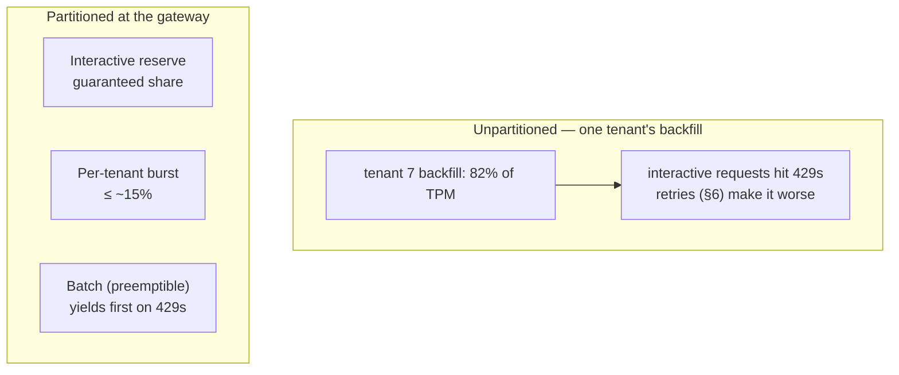

That turns "one tenant's backfill causes a global outage" into "one tenant's backfill slows down."

**`max_tokens` is a capacity parameter, not a formality.** Reserving 4,096 output tokens when the p99 answer is 600 strands most of your quota in reservations that are never used. **Size `max_tokens` per route from observed p99 output length**, and let the output length itself be an alarm signal (a sudden shift usually means a prompt regression or model drift).

**Two second-order effects worth planning for:**

- Provider quotas are typically enforced on **both RPM and TPM, per model, per region**. The fallback route from §6 needs its own reserved quota — failover that lands 100% of traffic on a model provisioned for 5% just moves the 429s.
- The per-tenant token bucket is the **cheapest abuse detector** in the system. Prompt-stuffing, runaway agent loops, scraping — all show up as token consumption long before they show up as request rate.

### 8. Reading the map — start simple, add lanes only when forced

**Simple version:** the trap is building the agent topology when a simple assistant would do. Every lane you add is real operational weight — a vector DB to run, a retrieval quality to measure, an agent loop to bound. Start with the smallest topology that solves the problem, and add a lane only when a concrete requirement forces it.

| Question | If… | Then |
|---|---|---|
| Knowledge the answer needs | fits in < ~25% of context *and* changes < daily | **context-stuff + prompt cache** — skip the retrieval lane entirely |
| | larger, private, per-user ACLs, or must be cited | **retrieval lane** |
| Steps | known in advance, ≤ ~5 | **fixed chain of calls** |
| | genuinely depend on intermediate results | **agent loop** with step cap |
| Reliability | p_step^n below product target | shorten n, add verifiers, or keep a human in the loop |
| Side effects | any tool writes to an external system | **durable step log + idempotency keys** |
| Latency | TTFT p95 target < ~1s | no pre-answer agent steps; retrieval ≤ ~150 ms |

**Invert the reliability arithmetic and it becomes a design constraint.** If per-step reliability is p and you need the whole run to complete at target T:

```
n_max  =  ln(T) / ln(p)
```

| Target T | p = 0.95 | p = 0.99 |
|---|---|---|
| 90% clean completion | **n ≤ 2** | n ≤ 10 |
| 80% clean completion | n ≤ 4 | n ≤ 22 |

**The lever for an agent is rarely a smarter planner.** It's raising per-step reliability (constrained tool schemas, verifier checks on each step's output, retries scoped to the *failed step* only) or shortening n (move known sub-sequences into deterministic code the agent calls as a single tool). **Every step moved from "model decides" to "code does" removes one factor from the product.**

**The most common premature lane: a multi-model router on day one.** A router is only as good as the evals that justify each route. Without a per-route quality measurement, a router is a cost optimization that *silently lowers quality* for whichever traffic it misclassifies. Start with one model per task class, earn the eval set, and add routing only when the cost curve (Chapter 1 §5) shows that a meaningful share of traffic can be served by a cheaper tier at **no measured quality loss**.

### Design-review checklist (Chapter 2)

- TTFT p95 *and* total p95 budgets — which pre-model stage owns how much of TTFT?
- At peak RPS × p99 latency, how many concurrent streams steady-state — which pool runs out first (gateway, worker, provider quota)?
- Who owns retries? What is the retry budget? Circuit breaker + warm fallback per route?
- For each lane dependency: fail open or closed, and who signed off?
- If you changed the generation model tomorrow, what suite proves it's safe? If you changed the embedding model?
- Which model versions are pinned, and how would you notice a silent provider-side change within an hour?
- Where does an agent run's state live if the process dies at step 7, and which tools are safe to replay?
- Is the cache key such that a hit can never cross a tenant or permission boundary — and does it include the guard-policy version?
- Does an absolute deadline propagate through every lane, and what stops decoding when the client disconnects?
- Is admission metered in tokens, with reserved interactive share and per-tenant burst cap? Does the fallback have its own quota?
- Does the memory policy keep the prompt prefix stable? Measured prefix-cache hit rate per route?
- At projected sustained utilization, and against the API tier your evals say you actually need, does self-hosting ever break even?
- Which proxy metrics (parse rate, refusal rate, output length, ungrounded-flag rate) would detect a silent quality regression within an hour, segmented by version tuple?

---

## Chapter 3: RAG — Grounding Models in Your Data

*Source: [Algoroq — RAG](https://algoroq.io/specializations/ai-native-architecture/rag/)*

> Retrieval-augmented generation is conceptually trivial: fetch facts at query time and put them in the prompt. Operationally it's a search engine, a derived-data pipeline, and an access-control system glued onto a probabilistic consumer. Most "model hallucinations" are retrieval bugs in disguise.

### 1. Why retrieve — grounding beats fine-tuning for knowledge

**Simple version:** knowledge can live in 3 places — baked into model weights (fine-tune), stuffed into the prompt (long context), or looked up per request (retrieval). The useful comparison isn't quality in the abstract — it's three operational properties:

| Property | Fine-tune | Long context | Retrieval |
|---|---|---|---|
| **Update latency** | Weeks (retrain) | Next request | Seconds (re-index) |
| **Deletability** | Can't un-train a leaked clause | Omit from prompt | Delete + revoke |
| **Per-user scoping** | All tenants share one model | Expensive if slice differs per user | ACL filter at query |

**Rule:** fine-tune to change how the model *behaves* (format, tone, a narrow skill). Retrieve to change what it *knows*. The tell in a design doc: "we'll fine-tune because the model doesn't know our products" → ask how a discontinued product gets removed from the weights next quarter. There is no good answer, and that settles the design.

**"Always RAG" predates large context windows and prompt caching.** Worked example at illustrative $3/M input tokens, cached prefix at 10%, 1M requests/month:

| Strategy | Per-request | Monthly |
|---|---|---|
| Stuff 150k handbook, uncached | $0.45 | $450k |
| Stuff 150k handbook, warm cache | $0.045 | $45k |
| RAG with 4k retrieved context | $0.012 | **$12k + pipeline cost** |

A $33k/month gap can be smaller than running retrieval well (fully loaded: embedding, index, reranker, on-call engineer). But the cached option has two hidden conditions: **warmth** (TTL expires in minutes; 1,000 tenants each with their own corpus mostly go cold) and **quality at depth** (quality over 150k tokens is not guaranteed to match quality over 4k well-chosen tokens — measure it).

**Where knowledge should live:**

```
                SMALL < ~100k tok      MEDIUM ~100k-5M        LARGE > ~5M
STATIC          Long ctx + cache       Measure both           RAG (only option)
(monthly+)      no index to run

DAILY           Long ctx + daily       RAG + incremental      RAG + CDC
                cache rebuild          upserts                freshness SLO

MINUTES /       Fetch live             RAG + ACL filter       RAG + ACL + CDC
per-user ACL    tool call to source    at query               hardest cell
```

→ Fine-tuning appears in no cell: it changes behavior, not knowledge. The bottom row is where most RAG incidents come from — the index is a derived copy whose permissions and existence change underneath it.

### 2. Two pipelines — offline builds the index, online answers

**Simple version:** RAG is two separate pipelines that meet at the index. Offline is throughput-bound (just needs to be fresh by some SLO). Online is latency-bound (correct for *this* user *right now*). Most organizational trouble comes from one team owning both with one set of SLIs.

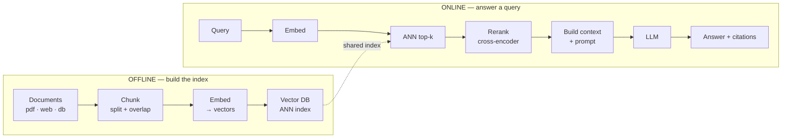

**Treat the index as what it is: a materialized view of your systems of record** — with every consistency problem that implies. Three recurring production failures:

**(a) Deletes and revocations lag.** A document is deleted or a user loses access, but its chunks remain answerable until *every* derived copy converges: CDC/poll interval → embedding queue → index segment merge → semantic/answer cache. The exposure window is the **sum of every lag, bounded by the slowest backlog**:

| Stage | Normal | Under bulk re-permission event |
|---|---|---|
| CDC / poll | seconds | seconds |
| Re-chunk + embed queue | minutes | **hours** (queue backs up) |
| Index upsert / segment merge | seconds | minutes |
| Answer / semantic cache TTL | minutes | **often forgotten** |

Worked: a reorg moves 400k documents (avg 2k tokens) into new permission groups. Default re-embed on any change = 800M tokens queued against a 1M tok/min quota = **~13 hours of backlog**. During that window, revoked users keep retrieving. On-call sees "embedding queue lag," not "data exposure" — nothing on the dashboard connects them.

**Structural fix: split the ingest path.** Metadata-only changes (ACLs, titles, tags, soft deletes) update index payloads *in place* with no re-embedding (seconds). Content changes go through the embed queue. Deletes/revocations get a **priority lane** that can't sit behind bulk work. Add content hashing per chunk so re-ingesting unchanged content is a no-op.

→ **Enforce ACL at query time from the source of truth, not from index metadata alone.** Chunk-level ACL metadata is a cache of the permission, not the authority.

**(b) Embedding version skew.** Query and document vectors are only comparable when the *same model* produced them. Upgrading embeddings = re-embedding the whole corpus. Dollars are cheap; the migration is the cost — dual-write, backfill, shadow-read on a golden set, cut over per tenant, hold 2× storage for the overlap. Teams that upgrade in place and re-embed lazily get an index whose halves live in **different vector spaces**. Nothing errors. Recall just degrades silently.

**(c) Silent ingest drift.** A parser upgrade starts dropping tables, a PDF source switches to scans, a wiki migration strips headings your chunker split on. Retrieval quality falls for one content type while aggregate metrics barely move. Track as ingest SLIs: **chunk counts, mean chunk length, empty-chunk rate — per source** — and alert on step changes.

### 3. Chunking — the most underrated decision

**Simple version:** chunking fixes the *unit of retrieval*. If the answer is split across two chunks and only one is retrieved, no reranker can save it — this puts a **hard ceiling on recall** before the model even sees the query.

- **Too big** → a single embedding averages everything in its window; a 2,000-token chunk covering 5 topics lands between all 5 and near none of them. Coarse chunks lose on *matching* long before they lose on prompt budget.
- **Too small** → chunks match sharply but arrive stripped of referents ("it", "the above limit", "this plan") that made them answerable.
- **Overlap + splitting on structure** (headings, list items, code blocks, table rows) is the **baseline, not the optimization**.

**Two refinements matter more than tuning the window size:**

| Technique | What it does | Why it helps |
|---|---|---|
| **Small-to-big** | Embed small units (paragraph) for matching; return the enclosing parent (section) to the model | Decouples granularity you *match on* from granularity you *read* |
| **Contextual headers** | Prepend doc title + heading path to each chunk before embedding | "The limit is 30 days" carries the fact that it lives under "Refunds › EU customers" |

**Boundary stability — the effect nobody plans for.** Incremental ingest only saves money if an edit changes a few chunk hashes. **Fixed-size windows break that promise.**

```
One paragraph inserted near the top of a document:

Fixed 512-tok windows   v1: [1][2][3][4][5][6]
                        v2: [1'][2'][3'][4'][5'][6']    → every hash changes → whole doc re-embedded

Structural (headings)   v1: [intro][§1][§2][§3][§4]
                        v2: [intro][§1'][§2][§3][§4]    → 1 of 5 hashes change → 1 re-embed
```

For a wiki where popular pages get small edits all day, fixed-size windows multiply embedding volume by *chunks-per-page*. They also churn the index — in HNSW-style graphs, heavy delete-and-reinsert degrades graph quality until the next rebuild (see Chapter 4).

**Content types that break text chunkers, and the fix for each:**

| Type | Problem | Fix |
|---|---|---|
| Tables | Row split from its header row = list of unlabeled numbers | Serialize each row with column headers, or embed a table summary and return the whole table |
| Code | Fixed-size splits cut functions mid-body | Split on function/class boundaries with a parser; carry file path + enclosing symbol as header |
| Threads / tickets | Answer is usually last message, question is first | Chunk by thread with title prepended, or index question→resolution pairs at ingest |
| Scanned PDFs | OCR errors poison both retrievers: "Sectlon 4" misses BM25 *and* drifts in embedding space | Track OCR confidence per page as ingest SLI; reprocess low-confidence pages instead of indexing garbage |

**Sizing math** (illustrative): 1B tokens cut into 512-token chunks with ~15% overlap = ~2.25M chunks. At 1,024 × fp32 that is ~9 GB of raw vectors before index overhead. **Halve the chunk size → double the vectors, the index memory, and the candidates every query must beat.** Chunk size is a capacity decision as much as a quality one.

**Decision rule:** begin with structural units capped at a few hundred tokens; measure recall@k on the golden set at two or three caps; move to small-to-big *only when the data shows the split*. On structurally chunked text, overlap is a **patch for bad boundaries, not a lever**.

### 4. Retrieval — dense and sparse, together

**Simple version:** dense embeddings catch *meaning* ("refund" finds "money back"). Sparse keyword/BM25 catches *exact terms* (error codes, SKUs, GDPR, product names coined after training). They fail on **disjoint populations** of queries, so you need both.

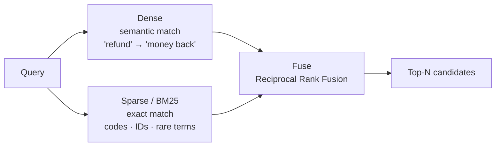

**Why RRF, not score addition.** Cosine and BM25 live on incomparable scales (BM25's scale also varies with query length and corpus statistics). **RRF throws scores away** and sums `1/(k + rank)` across retrievers (k ≈ 60 by convention) — so an item ranked well by *both* beats one ranked first by only one.

**Worked (k=60):**

| Candidate | Dense rank | Sparse rank | Fused score | Note |
|---|---|---|---|---|
| B · refund policy §4 | 3 | 2 | **0.0320** | Strong in both |
| D · refund FAQ | 10 | 8 | 0.0290 | Mediocre in both |
| A · "money back" blog | 1 | — | 0.0164 | Dense-only #1 |
| C · SKU-7731 exact hit | — | 1 | 0.0164 | Sparse-only #1 |

With k=60, `1/61` vs `1/70` differ by only ~15%, so fusion behaves close to "how many lists did you appear in?" — the exact SKU hit C loses to a mediocre-in-both result D. **That's correct for a paraphrased question, wrong for an identifier lookup.**

**The fix: per-query weights.** A cheap classifier (regex for identifier shapes + length/stopword heuristic) routes identifier-like queries toward sparse, natural-language questions toward dense. **Rule of thumb:** if >~20% of traffic is identifier-shaped, add per-class fusion weights or a hard "exact match wins" override. Below that, plain RRF with identifier queries *in the golden set* is enough. Lower k sharpens the top-rank advantage — treat it as a tuned parameter, not a constant from the paper.

**Where conventional advice is wrong:** "dense retrieval is modern, BM25 is the fallback." On narrow technical corpora with heavy jargon, a well-tuned BM25 with domain synonyms can **match or beat** a general embedding model (domain vocabulary is what the embedding model saw least in training). **Before paying for embedding fine-tuning, run BM25 alone on the golden set.** The answer frequently resets the roadmap.

### 5. Reranking — retrieve wide, then narrow precisely

**Simple version:** the first stage (ANN) is fast and recall-oriented but can't *compare* the query against each candidate deeply. The second stage (cross-encoder) attends across (query, candidate) jointly — far more precise, but cost is per pair and nothing can be precomputed. So stage 1 buys recall cheaply over millions, stage 2 buys precision expensively over tens.

```
≈ millions · All chunks
      ↓
50 · ANN retrieve        (fast, recall-oriented)
      ↓
5  · Cross-encoder       (slow, precise)
      ↓
3  · Fit to context budget
```

**The reranker is where the latency budget quietly goes.** A cross-encoder scores 50 candidates × ~512 tokens = **~25k tokens per query on the critical path, every query, uncacheable**.

Where the p50 goes before the first token (illustrative, single region):

| Stage | ~ms |
|---|---|
| Query rewrite (small LLM) | 250 |
| Embed query | 25 |
| ANN top-50 ∥ BM25 top-50 | ~30 (max of the two) |
| ACL filter + fetch text | 40 |
| Cross-encoder rerank ×50 | 120 |
| LLM prefill → first token | 450 |
| **Total TTFT** | **~915 ms** (everything before prefill = ~50%) |

**Capacity, worked:** 25k reranker tokens × 50 QPS peak = 1.25M tok/sec of cross-encoder inference. At 200k tok/sec per GPU, that's **~7 GPUs at peak before headroom and redundancy**. The reranker fleet can easily cost more than the vector index.

**Three levers, in order of how little quality they cost:**

1. **Cut tokens per pair.** Rerank the child chunk, not the expanded parent; truncate to the reranker's effective window. Often halves cost with no measurable recall change.
2. **Cut N per query class.** Identifier lookups resolved by an exact sparse hit need **no rerank at all**.
3. **Only then, a smaller/distilled reranker** — gated on the golden set.

**Decision rules:**

- Skip query rewriting unless an eval shows it lifts recall on conversational, follow-up-style queries. Gate it behind a cheap classifier, don't run it on every request.
- If rerank p99 threatens the SLO, **shrink N before downgrading the reranker** — a smaller cross-encoder typically costs more quality than trimming the candidate tail.
- Hosted rerank APIs move the GPU problem to the vendor but add a network hop and a rate limit on your critical path. Rerank failure needs a defined degradation: serve the fused order and flag the answer as lower confidence — **not fail the request**.

### 6. Failure mode — most "hallucinations" are retrieval bugs

**Simple version:** when a RAG system invents an answer, the prompt rarely contained the right evidence. A model given nothing relevant still produces fluent text, and fluent text with a citation attached looks like a model defect — but it isn't.

**Evaluate retrieval on its own, with a golden set:** queries labeled with the chunks that answer them, headline metric `recall@k`. The end-to-end judge comes second. Teams that only run the end-to-end metric can't tell a reranker regression from a prompt regression and tune the wrong stage.

```
recall@1    61%
recall@5    84%
recall@20   95%
```

**If the right chunk isn't in the top-k, generation cannot succeed — it will confabulate. Fix retrieval first; it's the cheapest, highest-leverage lever in the whole pipeline.**

**Golden set sizing — the arithmetic is unforgiving.** At recall@5 ≈ 0.84, the 95% CI half-width is:

| n (queries) | ±pp half-width |
|---|---|
| 50 | ±10.2 |
| 100 | ±7.2 |
| 200 | ±5.1 |
| 500 | ±3.2 |
| **1,000** | **±2.2** |
| 2,000 | ±1.6 |

A chunker tweak or new fusion weight worth 2 points is **invisible** at n<500. Two things make it tractable:

1. **Compare paired, not pooled.** Only queries that one pipeline finds and the other misses carry signal. A McNemar-style test on those discordant queries needs *far* fewer total queries than two independent estimates. It also gives you the diff to read.
2. **Mine the set from production.** Sample real queries stratified by source and query class (include identifier queries + queries from low-visibility users). Label with chunks a reviewer accepts; refresh a slice quarterly. **LLM-generated synthetic questions flatter dense retrieval** — they're written from the chunk, so they share its vocabulary.

**The "no good results" path must exist by design.** When retrieval is weak, don't feed low-relevance chunks and hope — **instruct the model to say "I don't know," or trigger a fallback**. The common implementation (fixed cutoff on raw cosine) is unreliable: cosine isn't calibrated, 0.78 is strong for one query and noise for another, and the right cutoff moves every time you change models.

→ **Put the abstain threshold on the *reranker* score** (trained to judge relevance), calibrated on labeled positives/negatives from the golden set. Pick the operating point from cost asymmetry: a support bot where a wrong answer costs more than "I'm not sure, here's a human" should accept a higher abstain rate.

**Attribute wrong answers before fixing anything:**

| Miss type | Root cause | Fix |
|---|---|---|
| **Retrieval miss** | Right chunk wasn't in top-N | Chunking, hybrid weights, query rewrite |
| **Assembly miss** | Retrieved but reranked out or truncated by budget | Rerank cutoff, context budget |
| **Generation miss** | In the prompt but model ignored/contradicted | Prompting, grounding instructions |

**Log the candidate set and final context for every request**, and triage becomes a lookup. Without those logs, every bug turns into an argument about the model.

### 7. Permissions and tenancy — the index is a second copy of your access-control problem

**Simple version:** three answers to "where is the permission check?", only one survives an audit:

| Approach | What it does | Verdict |
|---|---|---|
| **Prompt-level** | "Don't reveal what the user can't see" in the system prompt | Not access control — it's a request, and prompt injection exists to override requests |
| **Index metadata** | ACL tags copied to chunks at ingest, applied as filter | Necessary for performance, but it's a cache with the staleness from §2 |
| **Query-time verification** | Filter by index metadata for efficiency, *then* check surviving candidates against the source's permission service before anything enters the prompt | **The one that holds up** |

**Where the filter runs matters as much as whether it exists.** Filtering *after* top-N retrieval fails quietly for exactly the users with the narrowest access. If a user can see fraction `f` of a shared index and relevance is roughly independent of permission, expected survivors = N·f:

| Visible share f | Expected survivors (N=50) | P(zero survivors) |
|---|---|---|
| 50% | 25.0 | ~0% |
| 10% | 5.0 | 0.52% |
| 5% | 2.5 | 8% |
| 2% | 1.0 | **36%** |
| 0.5% | 0.25 | **78%** |

A user who can see 2% of a shared index gets ~1 candidate, and ~a third of their queries get **zero**. Nothing errors — the complaint arrives as *"the bot is dumb for the new hire,"* not as an ACL bug. Raising N to compensate works until it doesn't (10 survivors at f=0.5% needs N=2,000, before rerank).

**Tenancy strategy by scale:**

| Pattern | When | Trade-off |
|---|---|---|
| Shared index + ACL post-filter | Only safe when f ≳ 20% for nearly everyone | Starves low-visibility users |
| Shared index + filtered ANN | Moderate selectivity | Degrades or falls back to brute force at very low f (Ch.4) |
| **Partition per tenant** (namespace / shard) | Default | Hard isolation, clean deletes; many tiny partitions waste memory |
| Dedicated index per tenant | Large / regulated tenants | For the few tenants big or regulated enough to justify it |

→ **Tenant boundaries belong in the physical layout, always.** A partition key per tenant turns offboarding into dropping one partition — the only delete you can prove to an auditor. Intra-tenant permissions stay as filters. Below some size (often thousands of vectors), exact brute-force search over a tenant's partition is faster *and* simpler than ANN.

**Where caching leaks.** A semantic cache (answers keyed by query-embedding similarity) turns two different users asking a similar question into a cache hit. If user A could see a document user B can't, the cached answer is a **permission bypass no retrieval-layer filter will catch**. Key the cache on **permission scope** (tenant + hash of effective ACL groups) *as well as* the query, or scope it to public content only. Include its TTL in the exposure window calculation.

### 8. Context assembly — budget, order, and cite

**Simple version:** assembly is a knapsack problem with a latency penalty. Every retrieved token is prefilled on every request, so context size is paid in TTFT and dollars **at full volume, not amortized**.

Illustrative: going from 5 to 15 chunks of 500 tokens = +5k input tokens/request. At 1M requests/month and $3/M input, that's **+$15k/month**, plus extra prefill on every request. Worth it only if answer quality **measurably** rises.

**Position matters.** Published long-context evals ("lost in the middle") show models use evidence at the start and end of context more reliably than evidence buried in the middle. **Put the highest-ranked chunk first**, not wherever the loop happened to append it.

**Cite by stable source ID.** Every chunk carries an ID into the prompt so citations can be mechanically checked: a cited ID that *wasn't* in the context, or a quoted span that doesn't appear in the cited chunk, is a **detectable grounding failure you can alert on**.

**Two details separate careful assembly from naive assembly:**

1. **Deduplicate near-identical chunks.** Templated docs, versioned copies, and overlap windows otherwise spend the budget saying the same thing three times — crowding out the second-best distinct fact.
2. **More context is not monotonically better.** Past the recall saturation point, extra chunks mostly add distractors that sit next to the right answer, plus prefill cost on every request. **Tune the final k on answer quality, not on retrieval recall** — the two curves peak in different places.

**Conflicting evidence is a normal state, not an edge case.** The index holds last year's pricing page *and* this year's, the draft policy and the approved one. Similarity scores can't tell them apart; the model will often blend them into an answer that matches neither. **Resolve in assembly, not in the prompt** — carry effective-date, version, status metadata; suppress superseded versions before ranking; when two authoritative sources genuinely disagree, surface both with citations rather than letting the model pick one silently.

### Design-review checklist (Chapter 3)

- What is the **exposure window** between a permission revocation at the source and the last moment that content can appear in an answer, *including caches*?
- Is ACL enforcement at query time **authoritative, or a copy** of the source permission?
- How do you migrate the embedding model without mixing vector spaces — and what recall@k gate controls cutover?
- Where is the abstain threshold set, on which score, and how was it calibrated?
- Is the semantic cache keyed on **permission scope** (tenant + ACL hash)?
- For a wrong answer, can you tell from logs alone whether it was a retrieval, assembly, or generation miss?
- Do metadata-only changes (ACLs, soft deletes) bypass the embed queue — and what happens to freshness during a bulk re-permissioning?
- Is the permission filter applied before or after top-N, and what does recall@k look like for your lowest-visibility users?
- How large is the golden set, is it mined from production, and are pipeline changes compared **paired**?
- What does the request do when the reranker is down?

---

## Chapter 4: Vector Search Under the Hood

*Source: [Algoroq — Vector Search Under the Hood](https://algoroq.io/specializations/ai-native-architecture/vector-search/)*

> Retrieval rests on one hard problem: given a query vector, find its nearest neighbors among hundreds of millions of others in a few milliseconds. Understanding how that's possible is what lets you size a vector store, debug bad recall, and pick the right index instead of cargo-culting a default.

### 1. Embeddings — meaning becomes geometry

**Simple version:** an embedding model maps text to a point in a few hundred to a few thousand dimensions, where "similar meaning" ≈ "small distance." Retrieval is then just "find the nearest points."

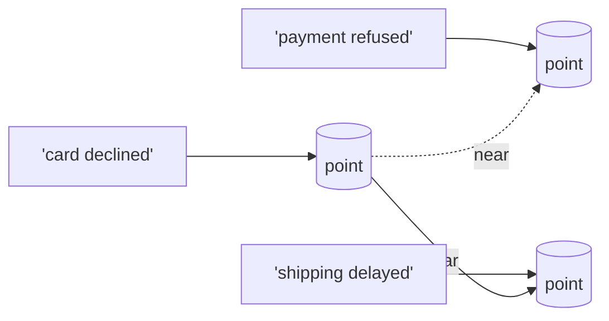

**The operative word is *approximates*.** The geometry encodes whatever the model was trained to consider similar — **topical relatedness far more than logical equivalence**. "Refund allowed after 30 days" and "refund **not** allowed after 30 days" land almost on top of each other. That's why exact-match and lexical signals never fully go away (hybrid retrieval, Ch.3 §4).

**Embeddings are a versioned, non-portable dependency.** Vectors from model A and model B are not comparable, even at the same dimensionality — a model upgrade is a **data migration**, not a config change.

Rough numbers: 1B chunks × ~300 tokens = 300B tokens. API bill is modest. **The throughput is what bites** — at a sustained 50k tok/s, re-embedding takes ~70 days.

**A model upgrade = five phases, two indexes, one rollback window:**

| Phase | What | Cost / risk |
|---|---|---|
| 1 · Dual-write | New docs embedded by both models, written to both indexes | 2× embed cost on write path. Fails: writer ships before new index exists → gap |
| 2 · Backfill | Re-embed historical corpus at throttled rate | Throughput-bound (70 days at 50k tok/s). Fails: starves live ingest of quota |
| 3 · Shadow read | Query both; diff top-k and answer quality on golden set | 2× query cost + 2× RAM. Fails: diffs ANN recall but not relevance |
| 4 · Cut over | Flip per tenant / collection behind a flag; keep old warm | Per-tenant thresholds re-derived. Fails: mixed spaces if cutover is per-doc |
| 5 · Drain | Stop dual-write, delete old index after rollback window | RAM returned. Fails: deletion before rollback window closes |

→ **Cutover granularity has to be the *index* (or tenant namespace), never the document.** A query embedded with model B searched against a collection that is 60% B and 40% A is **not "mostly right"** — the A-space vectors are at essentially random angles to the query, so they rarely rank, and the retriever quietly loses 40% of its corpus.

→ **Peak memory is 2× steady state.** If the index already uses 70% of cluster RAM, the upgrade can't start without new capacity — this is how teams get stuck on an old embedding model for a year.

**Dimensionality is a cost lever, not a quality dial.** Every downstream number in this chapter (RAM, bytes per query, disk, replication network bytes) scales *linearly* with dimensions. A 3,072-d model costs **4× a 768-d model at every layer of the stack, forever**, and the recall gain on your own data is often a few points or less. Matryoshka-trained models let you use a prefix (first 256/512 dims) as a usable embedding.

→ Evaluate end-to-end retrieval quality on your golden set at 256, 512, 768, and full width before choosing. **Pick the smallest width within ~1 point of the best.** Choosing the largest "to be safe" is the most expensive default in vector search.

### 2. Similarity — three ways to measure "close"

**Simple version:** on unit-normalized vectors, cosine, dot product, and L2 produce the **same ranking** (`‖a−b‖² = 2 − 2a·b`), so pick the cheapest: dot product. The failures happen at the edges.

| Metric | Default use | The trap |
|---|---|---|
| **Cosine** | Angle only — safe default for normalized models | Engine normalizes at insert but not at query, or silently re-normalizes after quantization |
| **Dot product** | Identical ranking to cosine on unit vectors; cheapest | Un-normalized corpora — high-norm documents become hubs in every top-k |
| **L2 (Euclidean)** | Same ranking as cosine on unit vectors; required by some PQ/IVF code paths | Mixing it with raw-score thresholds that were tuned under cosine |

**None of these throws an error.** Recall just sags a few points, and nobody notices until a golden-set eval runs.

**Second-order: scores are not calibrated probabilities.** A hard threshold like "drop anything below 0.78" tuned on one model silently empties or floods the context after a model swap. The mechanism is **anisotropy** — many embedding models place all text inside a narrow cone, so even unrelated pairs score well above zero and the useful signal lives in a thin band at the top. Two models can have bands in completely different places. **A threshold is a statement about one model's band, not about relevance.** Gate on the reranker's score instead, or re-derive the threshold per model version from labeled data.

### 3. Why approximate — exact search doesn't scale

**Simple version:** exact search is a scan. The useful way to reason about a scan is **bytes, not FLOPs**. ANN indexes exist to avoid touching most of those bytes.

Exact scan math: 1M × 768-d fp32 vectors = ~3 GB read per query. At 10-15 GB/s per core = **200-300 ms**. A whole socket at 100 GB/s = ~30 ms, but then the socket serves ~30 QPS and nothing else. int8 cuts bytes 4× and time ~4×. **Memory bus is the ceiling; distance arithmetic is almost free.**

**The escape hatch is batching.** Scoring 1,000 queries at once against the same corpus is a matrix multiply — each vector loaded once, reused 1,000 times → **compute-bound, not memory-bound**. On a GPU, exact search over tens of millions of vectors at high batch is entirely practical. So exact search is **not dead at scale — it's dead for interactive, one-query-at-a-time traffic**. Offline workloads (dedup, clustering, golden-set ground truth, nightly recommendations) should usually brute-force in batch rather than go through ANN — gains perfect recall, removes one source of drift.

**Two things benchmarks don't tell you:**

1. "Recall" means **ANN recall** (overlap with exact top-k) — says nothing about whether those neighbors are *relevant*. A 0.99-recall index over a poor embedding model is still a poor retriever.
2. **You cannot know your ANN recall without measuring it.** Keep a sampled query set, compute exact top-k offline with a flat scan, and track `recall@k` as a production metric per index build. It drifts with inserts, deletes, and distribution.

**The knee.** For HNSW-style indexes, recall vs latency as the search beam `ef_search` grows:

| ef_search | ~recall@10 |
|---|---|
| 16 | 0.80 |
| 32 | 0.90 |
| 64 | 0.95 ← usual operating point |
| 128 | 0.98 |
| 256 | 0.99 — costs ~3-4× the CPU of 0.95 |

**Latency grows roughly linearly with the beam while recall grows logarithmically** → the last few points are the most expensive. Chasing 0.99 when a downstream reranker only needs the true answer somewhere in the top 50 wastes 3-4× the CPU. The better move is often to **retrieve a wider k at a lower ef** and let the reranker fix the ordering.

### 4. HNSW — navigate a small-world graph

**Simple version:** every vector is a node linked to its neighbors; upper layers are sparse (long-range shortcuts), the bottom layer holds everything. A search enters at the top, greedily hops toward the query, and descends a layer whenever it can't get closer — collapsing a billion-vector scan into a few dozen hops.

```
Layer 2 · sparse, long hops     ●─────────●──────────●
                                    ↓
Layer 1 · medium                ●──●──●──●──●──●──●
                                       ↓
Layer 0 · dense, all vectors    ●●●●●●●●●●●●●●●●●●●
                                entry → ... → nearest
```

**Why HNSW is expensive isn't the links** (at M=16, ~140 B/vector — a rounding error next to a 3 KB fp32 vector). **Every hop is a random access to a *full* vector**, so vectors have to be memory-resident. Put them on disk and each query turns into hundreds of random reads.

**Three knobs, three different budgets:**

| Knob | When paid | What it sets |
|---|---|---|
| **M** (links per node; 2M on bottom layer) | Build time + memory, forever | **Recall ceiling** — a sparse graph can't be rescued at query time by a wider beam |
| **ef_construction** | Build + insert time | Quality of the links |
| **ef_search** | Every query | Beam width |

**Common mistake:** tune only `ef_search`, hit a recall plateau, push `ef` higher into the flat part of the curve. **When recall plateaus, the fix is in the graph** (higher M or ef_construction, then rebuild), not the beam.

**Memory touched per query** (illustrative, ef=64, ~2,000 distance evaluations):

| Representation | Bytes/vector | Memory per query | Latency per query |
|---|---|---|---|
| fp32 · 768d | 3,072 B | ~6 MB | ~1.2 ms |
| int8 · 768d | 768 B | ~1.5 MB | ~0.3 ms |
| fp32 · 256d (truncated) | 1,024 B | ~2 MB | ~0.4 ms |
| PQ-64 codes | 64 B | ~0.13 MB | compute-bound |

*Latency assumes ~5 GB/s effective random-access bandwidth per core. Every hop is a **dependent load**: the next vector's address is unknown until this distance is scored → poor prefetch.*

→ **Halving bytes per vector roughly halves latency and doubles QPS per core.** Doubling `ef` roughly doubles both costs. The representation choice (§6) matters more than the index choice.

**What goes wrong in production:**

- **Deletes are tombstones.** Removing a node would orphan neighbors routing through it, so implementations mark deleted and keep traversing. A high-churn corpus accumulates dead nodes — each query burns beam slots on them, recall and latency degrade gradually with no bad deploy to point at. **Budget periodic rebuilds; alert on tombstone ratio.**
- **Build/insert cost.** Each insert is itself a search plus neighbor-list rewrites under locks. Ingest throughput sits far below query throughput; full rebuild of a large index takes hours. **Treat rebuilds as blue/green with a recall gate, never in-place mutation.**
- **Tail latency tracks memory, not CPU.** Once the working set exceeds RAM and pages fault, p99 moves from ms → hundreds of ms *before* p50 moves. A co-located process stealing a few GB can jump p99 by 10× overnight with the index untouched. **Pin index memory (huge pages, locked, dedicated pool); alert on major page faults, not just RSS.**
- **Unreachable nodes.** Repeated delete-and-reinsert leaves some nodes with no inbound edges. They're in the index, count toward its size, and **no query can ever reach them**. Looks exactly like a relevance bug. **Detection: exact-vs-ANN recall probe run over *recently updated* documents specifically, not a uniform sample.**

### 5. IVF — cluster the space, search only the near cells

**Simple version:** partition the space with k-means. At query time, find the closest centroids and only scan those cells — the **opposite access pattern** from HNSW (a few long *sequential* scans instead of thousands of dependent random loads). Pairs naturally with compressed codes, SIMD, GPUs, and SSD.

```
         centroid
          ●─────. . . . . . . . . .
         / \    . . . . . . . . . .     query →
        /   \   . . . . . . . . . .     find nearest centroids
       /     \  . . . . . . . . . .     scan only those cells
      /       \ . . . . . . . . . .
```

**Recall loss is geometric.** A true neighbor sitting just across a cell boundary is missed unless you probe that neighboring cell too. In high dimensions, almost every point is near some boundary → **nprobe has to be larger than intuition suggests.**

**Sizing:** query cost ≈ `nlist` (to rank centroids) + `nprobe × N/nlist` (to scan chosen lists). With a flat centroid scan, this is minimized near `nlist ≈ √N` (~32k at 1B). In practice large indexes go several times higher (4√N to 16√N) and replace the flat centroid scan with a small HNSW over the centroids. More, smaller lists = less wasted scanning per probe.

**Worked:** 1B vectors, nlist=262k, avg list = 3,800 vectors. At nprobe=64, scan ~245k PQ codes = ~16 MB **sequential** reads = a few ms on one core. Push nprobe to 256 for recall → ~1M codes/query → QPS/core falls 4×.

**Shape is the same knee as `ef_search`, but costs are sequential bandwidth not random latency** — which is why IVF throughput scales well on GPUs and batched workloads, and why it **degrades more gracefully than HNSW when the index slightly exceeds RAM**.

**Specific failure mode: centroid staleness.** Centroids are trained once on a sample. If the distribution shifts (new product line, new language, large tenant onboarding), new vectors pile into a handful of lists — those lists grow 10-100× past the median, every query that probes them pays, and recall on new content drops because its true structure never got centroids of its own. **Monitor the list-size distribution (max/median ratio); retrain when it skews.**

### 6. Quantization — compress vectors to fit in memory

**Simple version:** three families, very different failure profiles.

| Technique | How it works | Recall cost | Needs training |
|---|---|---|---|
| **Scalar (int8)** | int8 per dimension | <1 point | No (just per-dim ranges) |
| **Product (PQ)** | Split vector into m sub-vectors, replace each with id of nearest entry in a 256-entry learned codebook. Query: one m × 256 table of query-to-codeword distances; every candidate = m lookups + adds (ADC) | Needs rescoring | **Yes** (codebook on sample) |
| **Binary** | 1 sign bit per dim; score with XOR + popcount | Model-dependent — holds on some, collapses on others | No |

**The shared trap: compressed distances reorder near-ties.** The true 3rd neighbor can end up 40th. So the recall you care about is **not "recall of the compressed index" but "recall after rescoring R candidates with full vectors."** R is the real tuning knob.

Rules of thumb (illustrative, measure your own): int8 needs little or no oversampling. PQ at 32-64 B typically needs **R of a few hundred for k=10**. Binary often needs R in the high hundreds+.

**PQ codebooks are also trained on a sample** — they go stale under distribution shift exactly like IVF centroids, with the same symptom: recall on new content decays while recall on old content looks fine.

**Capacity math — 1B vectors × 768-dim:**

| Representation | Bytes/vector | Total |
|---|---|---|
| fp32 raw | 3,072 B | **3.1 TB** |
| fp32 + HNSW (M=16) | 3,210 B | 3.2 TB |
| int8 scalar + HNSW | 906 B | 0.9 TB |
| IVF-PQ 96 B + 8 B id | 104 B | **104 GB** (fits one node) |
| Binary 1 bit/dim | 96 B | 96 GB |

→ **The vectors, not the graph, dominate.** At PQ sizes, the 8-byte id becomes 8% of the footprint — **metadata (ids, filter attributes, tenant keys) starts to compete with vectors**, usually forgotten in the sizing spreadsheet.

**The architecture that falls out: compressed in RAM, full precision on SSD.** Search over PQ or binary codes for the top few hundred candidates, fetch their full vectors from disk, re-score exactly. Rerank costs a few hundred random SSD reads per query, which NVMe absorbs in ~1 ms, and it recovers most of the recall compression lost.

**Disk-resident graph (DiskANN family) takes this furthest** — each node's **full vector and its neighbor list sit in the same 4 KB SSD sector**. The search walks the graph using PQ codes in RAM to choose which nodes to expand, reads W sectors per round trip in parallel, and gets the full vector of every expanded node **as a by-product** — rerank is paid for by reads the traversal needed anyway.

```
RAM  (steers)                         NVMe SSD (confirms)
PQ codes: 1B × 32 B ≈ 32 GB      →   one 4 KB sector = full vector + neighbor ids
hot-node cache                       1B nodes ≈ 4 TB local flash
                                     ~8 round trips × 100-150 μs ≈ 1-1.5 ms
                                     ~32 reads/query × 5,000 QPS = 160k IOPS
```

**How it fails:** **IOPS saturation does not degrade gracefully** — once the queue deepens, every sequential round trip waits in it, so p99 *multiplies* rather than adds. The design assumes **local flash**. Put the same index on network block storage (~1 ms/read) and each query takes 10+ ms before any queueing — the single most common reason a "billion vectors on one node" PoC fails when moved to the cloud account.

### 7. Filters — where vector stores actually break

**Simple version:** almost no production query is pure nearest-neighbor. It's nearest-neighbor **where tenant = X**, where the doc is visible to this user, where the date is after Y. ANN indexes are built over geometry and know nothing about predicates, so every engine bolts filtering on — and this is where most "the vector DB returns garbage" incidents come from.

**Strategy depends on *selectivity* (fraction of corpus that matches). No single strategy is safe across the full range:**

| Selectivity | Right strategy | How it fails |
|---|---|---|
| **< ~1%** | **Pre-filter → exact scan** — metadata index yields subset, brute-force it. (1% of 100M = 1M vectors ≈ 0.8 GB int8, tens of ms across cores, perfect recall.) | Fails when subset grows — latency and memory bandwidth scale linearly |
| **~1-30%** | **Filter during traversal** (in-graph filtering) — skip non-matching nodes while walking the graph / probing lists | Graph fragments: matching nodes are islands, search stalls, **recall collapses without warning** |
| **> ~30%** | **Post-filter with oversample** — fetch `k / selectivity × safety` candidates, then filter | **Under-fetch returns 3 results instead of 10; users see "no results," not an error** |

**Selectivity is per query, not per index.** A tenant filter that is 40% for your biggest customer is 0.01% for the long tail. A good engine picks the strategy per query from a selectivity estimate; a naive one uses one strategy for all and fails on one end.

**How the post-filter failure unfolds:** `k=10` with a filter matching 2% needs ~500 candidates just to *expect* 10 survivors — the naive `k' = 50` returns 1 result on average and 0 surprisingly often. RAG hands the model an empty/thin context, the model answers anyway, incident gets filed as a "hallucination," **nobody traces it back to the filter**.

**Two architectural rules:**

1. **Partition by tenant** once a tenant is large enough to matter; use shared-index filtering only for the long tail. Makes per-tenant deletion and isolation tractable (matters more to your security reviewer than to latency).
2. **Treat access control as a filter with the worst selectivity profile you have.** **Never enforce it by post-filtering a fixed k** — failure mode is silently returning too little, and the tempting fix ("loosen the filter") is a data leak.

### 8. Distribution — sharding, fan-out tails, freshness

**Simple version:** once an index outgrows a node, there are two ways to split it, and they fail differently.

| Strategy | How | Fan-out | Fails when |
|---|---|---|---|
| **Random / hash** | Even slice on each shard | Every query visits every shard, merges local top-k | Many shards → tail latency explodes (below) |
| **Tenant** | Route by tenant / region | Each query to a subset | Hot tenant pins one shard |
| **Semantic (IVF-at-shard-level)** | Coarse partition over whole shards | Each query to a subset | Inherits IVF's boundary problem at cluster level, concentrates hot content on hot shards |

→ **Tenant sharding is the one almost always worth doing** (routing key is exact, composes with isolation from §7). Semantic sharding across a single tenant's corpus is a recall risk that pays off only at very large scale.

**Fan-out tail math.** `P(query waits on ≥1 slow shard) = 1 − (1−p)^S`:

| S shards | p=1% (each shard's p99) | p=0.1% (p99.9) |
|---|---|---|
| 1 | 1.0% | 0.1% |
| 8 | 7.7% | 0.8% |
| 32 | 27.5% | 3.2% |
| 64 | 47.4% | — |
| 128 | 72.4% | 12.0% |

**At 32 shards, >25% of requests wait on *some* shard's p99.** The request's p75 already sits near the shard's p99 → every GC pause, page fault, and noisy neighbor on any shard becomes user-visible latency. **Fan-out width is a latency decision, not just a capacity one.**

Levers, in order of usefulness:

1. **Fewer, bigger shards** (compression from §6 is what makes this possible).
2. **Hedged requests** to a second replica after the shard's p95 — few percent extra load, big cut in tail.
3. **Partial results with a deadline** — return the merge of whichever shards answered. Legitimate for retrieval (31 of 32 shards is a slightly worse answer, not an error), but **must be visible in traces and metrics** or recall silently drops during every incident.

**Freshness is the write-path question vector-store evaluations tend to skip.** Most engines are log-structured — new vectors go into a small mutable segment searched by brute force or small graph, background jobs seal segments and merge into larger indexed ones. Two consequences:

- **Write-to-searchable is a pipeline latency** (embed, ingest, segment refresh) — commonly seconds. A user who uploads a doc and immediately asks about it will hit the gap. If your product promises read-your-writes: route that user's queries to *include the unflushed buffer*, or embed synchronously on upload.
- **Merges compete with queries for memory bandwidth and cores**, so ingest bursts (bulk import, backfill from §1) show up as query **p99 regressions**. Rate-limit merges; give bulk loads their own build-then-swap path, not through the live write path.

### 9. Choosing — pick a point on the recall / latency / memory surface

**Simple version:** the index choice is downstream of three numbers you should have before any vendor conversation: **vectors per partition** (after tenant sharding, not global), **bytes/vector you'll hold in RAM** (after dimensionality + quantization), and the **churn rate** (updates/deletes per day as fraction of corpus). Recall targets matter less than people expect — every row below can reach 0.95+ with enough beam, probes, or rescoring. **What differs is what that costs and what breaks first.**

| Index | Sweet spot | RAM/vector (768d) | Churn | Breaks when |
|---|---|---|---|---|
| **Flat / exact** | < ~1M per partition, or low QPS | 768 B (int8) – 3 KB | Perfect: no index | QPS × bytes scanned → memory bandwidth |
| **HNSW + int8** | ~1M – low 100Ms per node | ~0.9 KB | Tombstones; rebuilds | Working set > RAM → p99 cliff |
| **IVF-flat / IVF-SQ** | Batch or throughput-heavy | ~0.8 – 3 KB | Appends easy | Distribution shift → skewed lists |
| **IVF-PQ + rerank** | 100M – 10B, cost-bound | 32 – 128 B + SSD rescoring | Appends easy | Selective filters; rerank oversample too small |
| **Disk graph + PQ** | 100M – several B per node | 32 – 64 B + 4 KB SSD | Harder (merge pass) | IOPS saturation; network block storage |

**Worked comparison** (illustrative, 500M × 768-d, 3 replicas, 5k QPS):

| Config | RAM per replica | Fleet RAM | Node count |
|---|---|---|---|
| HNSW over fp32 | ~1.6 TB | ~4.8 TB | double-digit, large-mem nodes |
| HNSW over int8 | ~450 GB | ~1.35 TB | ~3.5× less |
| Disk graph + 64 B PQ | ~32 GB RAM + ~2 TB NVMe | — | **~3 ordinary storage nodes** |

The last option is often **an order of magnitude cheaper for the same product outcome**. The difference is not the index, **it's which bytes live in RAM** — and that decision should appear in the design doc with the arithmetic shown.

**Where conventional advice is wrong:**

| Claim | Reality |
|---|---|
| "Keep the whole index in RAM" | Right for tens of millions; wrong past a few hundred million, where compressed codes in RAM + exact rescoring from local flash wins at similar recall |
| "Use a bigger embedding model for better quality" | Dimensions multiply every cost in this chapter — measure smaller widths first |
| "Tune ef_search until recall is high enough" | Fails when the *graph* caps recall — rebuild with better M and ef_construction |
| "Recall@k of the index = retrieval quality" | Embedding model and reranker usually set the ceiling |
| "Post-filter with a safety margin" is access control | Under selective filters it silently returns too little; "fix" of loosening the filter is a data leak |

### Design-review checklist (Chapter 4)

- What is our measured **ANN recall@k against exact search**, and who gets paged when it drifts?
- What's the bytes-per-vector figure **including ids and filter metadata**, times replicas?
- What's the worst-case filter selectivity, and which strategy handles it?
- How do we migrate to a new embedding model without mixing spaces? How long does the backfill take at our real throughput?
- What happens to recall after six months of deletes, and what triggers a rebuild?
- Is the index the quality bottleneck at all, or are the embedding model and the reranker?
- Did we evaluate smaller embedding widths on our own golden set, or pick the largest by default?
- Is our recall probe sampling **recently updated documents**, where unreachable nodes live?
- For compressed indexes, how many candidates do we rescore, and what does recall look like at half that number?
- How many shards does one query fan out to, and what is request-level exposure to a single shard's p99?
- Is the SSD **local**, and what happens to p99 at 2× peak IOPS?
- How long from write to searchable, and does the product promise anything tighter?
- Do we have capacity for two indexes at once during the next model migration?

---

## Chapter 5: Serving & Inference Infrastructure

*Source: [Algoroq — Serving & Inference Infrastructure](https://algoroq.io/specializations/ai-native-architecture/serving-inference/)*

> The model call dominates both latency and the bill. This chapter opens that call — enough to predict how cost and latency move when prompt length, output length, concurrency, or precision change, and to spot capacity plans and vendor benchmarks that are quietly wrong. All numbers come from one illustrative setup: a 70B-class dense model with grouped-query attention on a two-GPU, 80 GB-per-GPU H100-class node. **The shape of the arithmetic transfers; the constants do not.**

### 1. Two phases — prefill and decode behave completely differently

**Simple version:** generation has two phases with **opposite** performance characteristics:

| Phase | What it does | Bottleneck | Scales with | Sets |
|---|---|---|---|---|
| **Prefill** | Reads the entire prompt in one parallel pass | **Compute-bound** | Prompt length | TTFT (time to first token) |
| **Decode** | Emits tokens one at a time, reusing cached state | **Memory-bandwidth-bound** | Output length | Per-token speed (ITL) |

**Why decode is memory-bound: arithmetic intensity.** At batch 1, every decode step streams **all the weights** through the chip to produce **one** token. ~2 FLOPs per parameter × 2 bytes read = **intensity ~1**. An H100 needs ~300 FLOPs/byte before compute is the limit → **single-stream decode runs its compute units at well under 1%**.

Illustrative: 70B model in FP16 = ~140 GB. Over 2 GPUs at ~3.35 TB/s × 75% achievable = ~5 TB/s effective = **~28 ms just to read the weights once** → ceiling of **~35 tokens/s on a single stream**, however many FLOPs the spec sheet lists.

**Batching is the only way past that ceiling.** 64 sequences share the same weight read → aggregate throughput scales almost linearly until one of three things happens:

1. The step becomes compute-bound.
2. Per-sequence KV reads dominate (§6).
3. The KV cache runs out (§2).

For long-context workloads, **(2) and (3) arrive long before (1)**. Prefill is already compute-bound after a few hundred tokens → batching it buys little. **This asymmetry drives nearly every serving decision below.**

**Phase interference: the long prompt that freezes everyone.** A continuous batcher that admits a 32k-token prompt has to run that prefill somewhere. Naive scheduling runs it as one step → every sequence decoding alongside it **gets no tokens for that step**. Your p50 ITL looks fine; **p99 depends on the longest prompt anyone else sent**.

```
engine steps →

Naive:    [decode][decode][     full prefill of 32k     ][decode]
                            ↑ 5 steps, zero tokens for 60 users

Chunked:  [decode][chunk+decode][chunk+decode][chunk+decode]...
                            ↑ TTFT ↑ a little, ITL p99 drops sharply
```

**Fixes:**

- **Chunked prefill** — interleave prefill slices with decode steps. First lever.
- **Prefill/decode disaggregation** — separate pools sized independently, moves KV between them over the fabric. Worth it only when prompt lengths are bimodal, ITL sits in the SLO, and the fabric keeps KV transfer <~10% of prefill time.

**Prefill cost is NOT linear in prompt length.** Linear layers = `~2·P FLOPs` per prompt token. Attention adds `~2·L·n²·d` for the whole prompt — quadratic.

| Prompt | ~Prefill time | Attention share |
|---|---|---|
| 8k | ~1.2 s | 7% |
| 32k | ~6.0 s | 24% |
| **128k** | **~41 s** | **55% — now the dominant term** |

16× the tokens → **~33× the prefill time**. FlashAttention-style kernels remove O(n²) *memory traffic* but not O(n²) **FLOPs**, so long-context TTFT stays superlinear.

→ **"We support 128k context" and "TTFT SLO is 2s" are incompatible on this class of hardware unless most of that context is a cached prefix** (§2). A design review should see TTFT SLO **per prompt-length band**, not as one number.

### 2. The KV cache — why GPU memory is the real bottleneck

**Simple version:** attention keeps a cache of keys/values for every token in every resident sequence. **It grows with context length × concurrent sequences**, and **evicting it costs a full re-prefill**. In practice, KV (not compute) caps how many requests a replica can serve.

**The math by hand:** `KV bytes/token = 2 × layers × kv_heads × head_dim × bytes`

For 70B GQA (80 layers, 8 KV heads, head_dim 128, FP16): `2×80×8×128×2 ≈ 320 KB/token` = **~2.6 GB per 8k-token sequence**. Without GQA (64 KV heads) it would be 8×. **GQA and MLA-style KV compression are serving features that happen to be implemented as architecture choices.**

**KV budget on a 2×80 GB node:**

| Weight precision | Weights | KV budget | 8k-ctx concurrent | 32k-ctx concurrent |
|---|---|---|---|---|
| FP16 | 140 GB | ~12 GB | ~4 | **~1** (not a serving system) |
| FP8 / INT8 | 70 GB | ~82 GB | **~31** | ~7 |

→ **Weight quantization is mostly a concurrency lever** (4× sequences for a halving of weight bytes) — the latency win is secondary.

**Two mechanisms decide how much of the budget you actually get:**

1. **Paged KV allocation (PagedAttention)** — stores the cache in fixed-size blocks instead of contiguous per-request reservations sized to `max_tokens`. Contiguous wastes most of the reservation on requests that stop early; paging brings waste down to the last partial block.
2. **Prefix caching** — requests that share a prefix (system prompt, few-shot, RAG preamble) reuse its KV blocks instead of recomputing. Skips the prefill *and* dedupes the memory.

**Prefix caching is the largest cost lever in most RAG and agent workloads, and it's under-modeled.** Work it through — support assistant: 3k system prompt + 4k retrieved context + 300 token user turn. If the 3k preamble hits:

- Prefill drops from 7.3k → 4.3k tokens = **41% cut in prefill compute and proportional TTFT drop**.
- Dedupes 3k × 320 KB ≈ **1 GB of KV** across every concurrent request that shares the preamble.
- At 60 resident sequences: **60 GB of KV that exists once instead of 60 times** — most of the budget on this node.

**Agent loops are the extreme case:** without prefix hits, an n-step loop prefills **O(n²)** tokens; with them, **O(n)**.

**Conditions for prefix hits** (two silent killers):

- **Byte-identical leading tokens.** A timestamp at the top of the system prompt, a per-request ID, a reordered tool list, non-deterministic JSON key order → **hit rate drops to zero**. Put static first, volatile last.
- **Requests landing on the replica that holds them.** Round-robin load balancing kills prefix hits. Route by **prefix hash** (§7).

→ **Prefix hit rate belongs in the capacity plan as a first-class input with its own dashboard.** Anything that perturbs the leading bytes is a performance regression no functional test will catch.

**Where conventional advice is wrong:** "use the longest context window available and skip retrieval" is framed as a quality decision — it's really a **capacity decision**. At 128k resident tokens per sequence, this node holds 0 sequences at FP16, 1-2 at FP8. **A stuffed-context design costs 1-2 orders of magnitude more per request than a retrieval design** sending 4k well-chosen tokens — unless the long context is a shared cached prefix.

### 3. Continuous batching — the lever that makes inference economical

**Simple version:** re-form the batch at every decode step. Finished sequences leave, queued ones join — instead of a static batch running until its longest member finishes. With static batching, **output-length variance is pure waste** (one 2,000-token sequence next to 31 at 200 tokens → 31 slots idle for 90% of the batch's life). Continuous batching recovers all of that. **It's the main reason hosted inference is cheap per token.**

**It changes what a "request" costs.** Once every step is shared, a request's true cost is roughly the **KV-seconds** it occupies (context × duration). **The right unit for quotas, fairness, and chargeback is tokens-resident-over-time, not requests or even tokens billed.** On a shared endpoint, **your tail latency becomes coupled to other tenants' traffic** — their long prompts and long outputs are your prefill stalls and your preemptions.

**Admission policy decides both concurrency AND failure behavior.** The scheduler doesn't know how long each request will generate:

| Policy | KV counted per seq | Concurrent (82 GB budget, 2k prompts) | Preemption risk | How it fails |
|---|---|---|---|---|
| Reserve `prompt + max_tokens` | 6.1k tok · ~1.97 GB | ~41 | None | **Stranded memory** — most of max_tokens never used; users queue behind reservations |
| Optimistic (current usage) | 2k, grows to ~110 at mean | high | **High** with heavy-tailed outputs | Preemption storm when long outputs arrive together |
| **Projected: prompt + p90 output per route, 10% watermark** | 2.9k · ~0.93 GB | **~79** | Low, bounded | Silent drift if the measured p90 goes stale |

→ **`max_tokens` is a capacity parameter whether or not the client knows it.** A default of 4096 on a route whose p99 output is 600 costs you half your concurrency under reservation policies. Clients should set `max_tokens` per route near real p99; admission should use **projected KV**.

**Multi-tenancy needs the same thinking.** Request-rate limits don't isolate tenants on a KV-bound engine. A tenant sending 10 req/s of 30k-token prompts consumes ~100× the KV-seconds of one sending 10 req/s of 300-token prompts — **it's the one who triggers everyone's preemptions**. Isolation requires:

- Per-tenant **budgets on resident tokens** (or KV-seconds)
- **Priority classes** the scheduler honors at both admission *and* preemption (evict batch-tier before interactive)
- **Separate replicas** when a tenant's length distribution is far from everyone else's

→ Priority-only-at-admission is the common half-fix: a low-priority job admitted during a quiet minute still holds its KV when the interactive peak arrives.

**Failure cascade: KV exhaustion → preemption → retry amplification.**

```
t0  Traffic mix shifts: a customer starts sending 30k-token documents
t1  KV pages run out mid-decode → scheduler preempts youngest sequences
t2  Preempted sequences re-prefill (or swap to host) → prefill runs again
t3  Extra prefill interferes with decode → ITL p99 climbs for every tenant
t4  Client timeouts fire → SDK retries carrying the full prompt again
t5  Goodput collapses while GPU utilization reads 100% → dashboard says "busy, healthy"
```

**What breaks the loop:**

- Cap context length per tenant **at admission** (not at the model)
- Admit on **projected** KV, not current
- Retries get jittered backoff + a **budget**
- Alert on **preemption rate** and **goodput** (requests meeting SLO per second), NOT GPU utilization

**Recompute vs swap.** Preemption throws away KV. Recompute pays the prefill cost again (scales with context — a 30k-token sequence = ~6 s re-prefill). Swap moves ~10 GB over PCIe at 25-50 GB/s = 0.2-0.4 s each way. Swap *looks* strictly better until host memory and PCIe are shared across GPUs, and a burst of swaps saturates the link that's also loading LoRA adapters or streaming prefix-cache blocks. **Reasonable policy: swap long sequences, recompute short ones; alert on preemption rate, not its occurrence.** Occasional preemption is healthy packing. Sustained above a few % of steps is a capacity signal the autoscaler should read.

### 4. Quantization — three knobs, three different payoffs

**Simple version:** three separate knobs — conflating them is the usual mistake. You rarely set these on a hosted API, but they're why "the same model" comes in different price/latency tiers.

| Knob | Shrinks | Decode (memory-bound) | Prefill (compute-bound) | Concurrency |
|---|---|---|---|---|
| **W8A16** (weight 8-bit) | Weights 2× | Faster: fewer bytes/step | ≈ unchanged | More KV budget |
| **W4A16** (weight 4-bit) | Weights 4× | Fastest at low batch; **win shrinks at high batch** (dequant cost) | ≈ unchanged or **slower** | Most KV budget |
| **W8A8 / FP8** | Weights + activations | Faster | Faster on 8-bit tensor cores | More KV budget |
| **KV cache FP8** | KV 2× | Faster at long context (KV reads) | ≈ unchanged | **~2× concurrent context** |

**Speedup is smaller than the bit-width suggests.** Halving weight bytes halves only the first term (the weight read). At batch 1 and short context, weight read is nearly the whole step → 8-bit comes close to 2× on single-stream decode. **Now hold 60 sequences of 4k context:** FP16 = ~28 ms weight read + ~20 ms per-seq. FP8 = ~14 + ~20 ms. **That's 1.4×, not 2×** — and the KV term is untouched.

→ **For long-context serving, KV quantization often buys more throughput than going from 8-bit to 4-bit weights**, at lower quality risk on most tasks.

**4-bit kernels dequantize on the fly** → adds compute to every step. At batch 1, that compute is free (chip is idle anyway). At high batch, it competes with real work. On hardware with native FP8 tensor cores, a well-calibrated FP8 model often **matches or beats a 4-bit one on throughput**. Pick precision **per regime, not per model**.

**Where "8-bit is free" is wrong — the conventional advice holds for benchmark averages. Averages are the wrong test.** Quantization error concentrates in the **long tail**: arithmetic, code, structured-output validity, low-resource languages, long-context retrieval. A 0.5-point drop on a broad benchmark can mean a **much larger drop in JSON-schema adherence** for your extraction pipeline.

**Illustrative failure:** infra team moves extraction to 4-bit, every dashboard improves, schema-validation failure rate climbs from <1% to a few %. **Invisible** because the retry-on-invalid-JSON path absorbs it (at the cost of an extra full call each). Retries eat the throughput gain, and tail latency regresses on the one route already slowest. **The metric that would have caught it — first-attempt schema validity by route — lived in the application team's logs, not in the serving team's rollout gate.**

→ Gate **any** precision change on **your** eval set (not benchmarks), sliced by task type. Treat it like a model upgrade, not an infra tweak.

### 5. Speculative decoding — draft cheap, verify expensive

**Simple version:** exploit the idle compute of memory-bound decode. A cheap drafter proposes `k` tokens; the target model scores all `k+1` positions in **one** forward pass, accepting the prefix up to the first rejection. With rejection-sampling verification, output distribution matches the target model's exactly → **latency optimization with no quality trade** at the distribution level.

(Precise claim: distribution matches. Individual samples can flip under greedy decoding because multi-position verify uses different kernel shapes — near-tie argmaxes can occasionally flip, and golden-output tests will flag it.)

**Drafter options:**

| Drafter | Cost | Trade-off |
|---|---|---|
| Separate small draft model | Own weights + own KV cache (eats from §2 budget); must share tokenizer | Standard |
| Extra decoding heads (Medusa/EAGLE) | No second model | Retrained whenever target changes |
| **Prompt-lookup / n-gram** | ~free | Works remarkably well where output quotes the input (RAG, code editing, document rewrite) |

**It's not free.** If each draft token is accepted with probability α and you draft k: expected tokens per verify pass = `(1 − α^(k+1)) / (1 − α)`. At α=0.7, k=4 → ~2.8 tokens/pass. At α=0.4 → ~1.6 (draft overhead can erase this). **Verification is extra compute** (k+1 positions of target-model math per sequence per pass). It hides behind memory traffic at low batch; as batch grows, it stops hiding, and at low acceptance **the speedup turns into a slowdown**.

**Speedup vs plain decode (k=4):**

| Workload | Batch 1 | Batch 16 | Batch 48 | Batch 256 |
|---|---|---|---|---|
| 512 ctx · α 0.7 | 1.95× | 1.64× | 1.31× | **0.87×** |
| 512 ctx · α 0.4 | 1.16× | 0.98× | **0.78×** | 0.52× |
| 4k ctx · α 0.7 | 1.95× | 1.70× | 1.50× | KV full |
| 4k ctx · α 0.4 | 1.16× | 1.01× | 0.89× | KV full |

**Two folklore items overturned:**

1. **"Speculation is only for batch 1"** — with long contexts, the step stays bandwidth-bound even at batch (every sequence streams its own KV) → speculation keeps paying.
2. **"A 2-3× speedup"** — that's batch-1 + high-α. Acceptance depends on workload *and* sampling: code/JSON/quoted spans draft well; open-ended prose at temp 1 drafts poorly; α can differ by 2× between two routes on the same deployment.

**Operational rules:** enable per-route, not per-deployment. Measure α and realized tokens/step on production traffic. **Make the engine disable speculation adaptively** when batch or queue depth crosses the point where measured speedup falls below ~1.1×. **Never size capacity assuming the speculative speedup — it evaporates in exactly the high-load regime capacity planning is for.**

### 6. The dial — throughput vs latency is one tunable

**Simple version:** everything above collapses into one equation for decode step time:

```
step_time ≈ weights/bandwidth  +  B × (context × KV_bytes/bandwidth + compute_per_token)
            ^ intercept            ^ slope (per sequence)

Batching amortizes the intercept. It does NOTHING for the slope.
```

On the illustrative node with FP8: **intercept ≈ 14 ms**. Slope ≈ 0.14 ms/seq at 1k ctx, **≈ 2.2 ms/seq at 32k ctx**. Aggregate throughput tops out near `1/slope` = ~7,000 tok/s at 1k, **under 500 at 32k** — before the KV wall cuts it further. **Same hardware, same model, 20× spread in cost per token, driven entirely by context length.**

```
ITL (ms) vs concurrent sequences, by context length:

50 ┤
40 ┤                           ┊32k ctx — KV full at ~7, ~240 tok/s total
30 ┤                     ┊4k ctx — KV full at ~62, ~1,800 tok/s
20 ┤               ┊1k ctx — KV full at ~250, ~5,200 tok/s
   │━━━━━━━━━━━━━━━━━━━━━━━━━━━━━━━━━━━━━━━━━━━ weight-read floor ~14 ms
10 │
 0 └──────────────────────────────────────────→ concurrent sequences
```

**Two consequences change how you set the dial:**

1. **"Batch until you're compute-bound" is wrong for long-context serving — you never get there.** The KV slope or the KV wall arrives first. Levers that move them: KV precision, GQA/MLA architectures, prefix sharing, shorter contexts — **not more batching**.

2. **The latency target is usually set too tight.** A human reading streamed prose consumes ~5-10 tokens/s → **ITL of 50 ms (20 tok/s) is already faster than anyone reads**. Tightening a chat SLO to 25 ms cuts the batch each replica can run by half or more and raises cost to match — for a difference users mostly can't perceive. **Exception: machine consumers.** For agent tool calls, JSON extraction, anything whose downstream step needs the complete response, user-facing latency = `TTFT + n × ITL` — a 400-token tool call at 50 ms ITL costs 20s before the next step. **Set the dial per consumer:** loose ITL for human-read streams, tight ITL + short outputs for machine-consumed ones, separate pools if operating points differ by >~2×.

**Size with Little's law, not peak tokens/s.** `Concurrency = arrival rate × time in system`:

20 req/s × (400 output tokens ÷ 40 tok/s + ~0.5s TTFT) ≈ 210 concurrent sequences. At avg 4k ctx × 320 KB/tok = **~270 GB of KV before headroom**. Capacity question: "how many replicas keep 210 sequences resident at my ITL target?", NOT "how many tokens/s does one GPU do?"

Close the loop with the step-time model: 25 ms ITL at 4k ctx allows `(25 − 14) / 0.33 ≈ 33 seqs/replica` → **~7 replicas before headroom**. Relax ITL to ~35 ms (where a replica fills its KV at ~62 seqs, ~29 tok/s per stream) → each request lives longer (~14s) → concurrency rises to ~290 → but needs only **~5 replicas**. **Loosening the SLO raised concurrency and cut the fleet by ~30%.**

→ Specify SLO as **two numbers**: TTFT p95 + ITL/TPOT p95. Optimize **goodput** (requests/sec meeting *both*). Benchmarks reporting raw throughput at saturation are measuring a regime where you'd already be breaching the SLO.

### 7. The fleet — routing, autoscaling, overload across replicas

**Simple version:** a single replica is a scheduling problem. A fleet adds a **routing** problem — and the routing layer is where most self-hosted deployments lose the efficiency the engine worked for. Generic L7 load balancers see **requests**. The cost of a request lives in state they **cannot see**: which replica holds its prefix, how much free KV each replica has, how many long prefills are queued.

| Policy | Multi-turn prefix hit | Load balance | Signature failure |
|---|---|---|---|
| **Round-robin** | ≈ 1/N (**12.5% at N=8**) | Even by count, blind to KV | Long prompts cluster on one replica by chance |
| **Least-loaded** (by queue or free KV) | ≈ 1/N | Good while signal is fresh | **Herding** — every router picks the "idle" replica off a stale sample |
| **Prefix affinity** (hash of leading blocks) | **High until eviction** | Skewed — hot tenant pins one replica | One replica preempting at 100% while rest sit at 40% |
| **Affinity + bounded load** (spill above ~1.25× mean) | **High for most traffic** | Bounded | Needs KV-occupancy signal from the engine, not request counts |

**Illustrative:** a 10-turn conversation adding ~2k tokens/turn prefills `2+4+6+...+20k = 110k` tokens with no cache hits, and **~20k** with them. **That 5.5× difference in prefill comes entirely from which replica the router picks.**

**Autoscaling inference is slower than autoscaling anything else:**

| Stage | Typical time |
|---|---|
| Acquire GPU node | Minutes (if quota) → **indefinite** (if not — regional stock-outs) |
| Pull multi-GB serving image | Tens of seconds |
| Load 70 GB weights from object storage at 1-2 GB/s | **35-70 s** |
| Engine warmup (graph capture, kernel autotuning, allocate KV pool) | Tens of seconds |
| **Total** | **5-10 minutes** from signal to serving |

Any burst shorter than that is served by replicas you already have, or it's not served.

**Design consequences:**

- **Scale on leading signals** — queued prefill tokens, KV occupancy, preemption rate. **Never GPU utilization** (reads ~100% at both healthy and collapsing load).
- Keep **warm headroom** sized to the burst you intend to absorb within that 5-10 minute window — or accept that bursts queue with a deadline, shed, or overflow to a hosted API.
- Engineer weight-loading time down (local NVMe caches, pre-staged images, keep node warm and restart only the engine) — every minute removed is headroom you no longer pay for around the clock.

**Overload needs an explicit policy** (default is the cascade from §3). Decide in advance, per route, among four behaviors:

| Behavior | What it does | When right |
|---|---|---|
| **Queue with deadline** | Reject at admission if projected TTFT exceeds client timeout | Default — avoids accepting doomed work |
| **Degrade** | Lower `max_tokens`, disable speculation, shrink retrieved context | When the product can trade quality for served |
| **Shed by priority** | Drop batch tier before interactive | Multi-tenant |
| **Overflow** | Route to another pool or provider | Only if the overflow model has its **own evals and output validation** |

→ **Reject early.** A request refused in 5 ms with a retry-after costs the fleet nothing. A request that times out at 30s has already consumed its prefill and a KV slot — then comes back as a retry.

### 8. Build vs buy — rent until something forces you off

**Simple version:** default to a hosted API. The provider absorbs everything in §1-7 and amortizes it over far more traffic (with a flatter load curve) than you will have. Self-host only when a **concrete force** appears:

- **Scale** where per-token economics beat the API at your real duty cycle
- **Data residency / compliance** that rules out a third party (check dedicated hosted first)
- **Latency or rate-limit guarantees** a hosted endpoint won't contract for
- **A custom or fine-tuned model** you can't run hosted

**Middle tier teams skip: provisioned/dedicated throughput on a hosted platform.** Pay for reserved capacity, get isolation from other tenants' traffic (§3), without owning the fleet. Carries the duty-cycle problem below, but not the operations problem.

**The break-even most teams run is wrong in a predictable direction** — it divides GPU cost by **peak throughput**. Illustrative: $30/hr node sustaining 2,000 output tok/s at SLO = 7.2M tokens/hr = **~$4 per million at 100% utilization**. Real traffic is diurnal + bursty, so you provision for the peak. At 30% average duty cycle = **~$14/M**. Add N+1 across zones, on-call, eval re-runs on every engine upgrade, engineer-months on tuning. **Crossover moves out by a large factor.**

```
Self-hosted $/M output tokens vs duty cycle ($30/hr, 2k tok/s at SLO):

$40 ┤
$30 ┤
$20 ┤ × 2 for N+1, on-call, upgrades
    │ ╲
$10 ┤  ╲  ─ ─ ─ ─ ─ ─ ─ ─ ─ ─ hypothetical API A: $10/M
    │   ╲╲
    │     ╲╲        raw GPU cost ($4.17/M ÷ duty)
$ 3 ┤       ╲─ ─ ─ ─ ─ ─ ─ ─ ─ hypothetical API B: $3/M
$ 0 └──────────────────────────────────→ duty cycle
     20%  40%  60%  80%  100%
             ~42%        ~83%
```

Against API A: raw GPU breaks even at ~42% duty; **with ops multiplier, ~83%** (interactive traffic rarely sustains that). Against API B: self-hosting this model **never breaks even** — even 100% duty costs $4.17/M.

**Three corrections every break-even model needs:**

1. **Price input tokens.** APIs bill input + output separately, often input at a fraction, cached input at a further discount. A GPU spends real prefill compute on every input token — "$/M output" ignores this. A RAG route with 6k in and 300 out spends most of its GPU time in prefill. **Compare cost per request at your actual input:output ratio and cache hit rate, never per output token.**
2. **Context mix sets throughput** (§6). A capacity figure measured at 1k context overstates a 16k-context workload's throughput by an order of magnitude. Vendor benchmarks default to short contexts.
3. **There's a minimum fleet.** Two replicas across two zones is the floor for any availability target. At low volume, per-token cost is set by that floor, not the curve. **The volume at which the curve rather than the floor governs is the first number to compute.** It usually settles the decision before any finer modeling matters.

**Where "never self-host" is wrong — the exceptions are specific.** Embedding generation, classification, reranking and other short-output, high-volume work runs near 100% duty as a **batch job**, uses small models on one GPU, has no streaming SLO. **That's the corner of the curve where self-hosting wins by a wide margin with little operational risk.**

**The pattern mature platforms converge on:** generative, interactive, frontier-quality traffic stays **hosted** (with a second provider as overflow). Small-model, batch-shaped traffic moves **in-house**, where the duty cycle is under your control.

### Design-review checklist (Chapter 5)

- **Workload:** p50/p99 of prompt length, output length, and `prompt + max_tokens` per route — which does the capacity plan use?
- **SLO:** stated as TTFT p95 by prompt-length band **plus** ITL p95, with goodput as the optimized metric? Does the ITL target reflect **who consumes the output** (human reader vs machine)?
- **Memory:** KV budget per replica after weights + overhead? How many sequences does it hold at p99 context? Is admission gated on **projected** KV?
- **Prefix:** cache hit rate assumed in the cost model vs measured. What in prompt assembly or routing could break byte-identity?
- **Overload:** preemption rate and retry amplification at 1.5× peak. Which signal scales the fleet (not GPU utilization)?
- **Precision & speculation:** was each change gated on task-sliced evals? Is speculation per-route and auto-disabled under load?
- **Economics:** build-vs-buy computed per request, at real input:output ratio, duty cycle, context mix, and minimum fleet size — against a hosted price that already includes prompt caching?

---

## Chapter 6: Agent Orchestration

*Source: [Algoroq — Agent Orchestration](https://algoroq.io/specializations/ai-native-architecture/agents/)*

> An agent is the point where the model stops being a function you call and becomes the controller that calls your functions. Cost grows with the **square** of loop length. Reliability decays **exponentially** with step count. Every observation is **untrusted input** that can steer the next action. And the process holding all this state is usually a request handler that a deploy will kill. This chapter is about the orchestrator that contains those four properties, because the model will not.

### 1. What an agent is — a model in a reason-act loop

**Simple version:** strip away the frameworks and an agent is a loop. Goal + context + tool list in; reason → act → observe; observation appended; repeat until the model declares the goal met. Planning, memory, multi-agent orchestration are all elaborations of that loop.

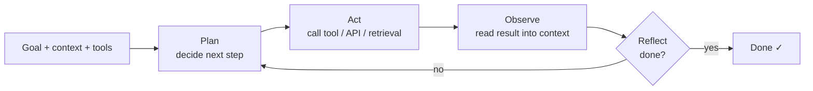

**The architectural shift is easy to miss: control flow moves from your code into the model's output.** In a workflow you wrote the DAG — its path count is known and testable. In an agent, the path is decided at runtime by a sampler → the set of reachable states is unbounded and differs between two runs of the same input.

**Decide early whether a task needs an agent at all.** If you can write the steps down in advance, a **workflow with LLM calls at fixed nodes** is cheaper, faster, and testable with ordinary tests. Reserve the loop for tasks where the next step depends on what the last step found and branching is too wide to enumerate.

**The autonomy ladder — climb a rung only when traces prove the rung below can't express the task:**

| Rung | Use when | Steps | How to test |
|---|---|---|---|
| **1 · Single call** | Output depends only on input | 1 | Unit tests + eval set |
| **2 · Fixed workflow** | Steps knowable in advance; LLM at named nodes (extract, classify, draft) | 2-6 fixed | Per-node evals; path is code |
| **3 · Router + bounded loop** | A few recurring shapes; model picks the branch, loop capped at small k | p95 ≤ ~8 | Per-branch evals + cap-hit rate |
| **4 · Open agent** | Next step depends on what the last one found; branching too wide to enumerate | long tail | Trajectory evals, tracing, budgets |

**The cheapest move after launch is usually a step DOWN.** Log every trajectory as its sequence of tool names and cluster them. In many production agents, a small number of sequences account for most successful runs (`lookup → check policy → act`; `lookup → escalate`). **Each dominant sequence can be frozen into a workflow branch behind a router.** The router is one cheap classification call; each branch has known path, latency, and ordinary tests. The agent then only handles the residue — where its flexibility is actually needed, and where your evals should concentrate.

**Climb UP only when the router's "none of the above" rate stays high after you add branches**, meaning the task space genuinely does not cluster.

**Second-order effect — ownership.** A workflow step has an owner who can reason about it like any other service. An agent's behavior belongs to the prompt, model version, tool descriptions, and retrieval corpus **together** — a change to any of them can shift which path is taken. When a model upgrade arrives, a workflow needs its node evals re-run; an **open agent needs its trajectory distribution re-baselined**, because the new model may take different paths to the same answers, and your caps, costs, and latency SLOs were all set against the old paths.

### 2. Tool calling — the model asks, your orchestrator acts

**Simple version:** with tool calling, the model emits a **typed request** and the orchestrator decides whether to honor it. **The model never touches your systems.** That makes the orchestrator the **trust boundary** — design it like any public API facing a caller you don't control: schema validation, per-call authorization using the **end user's identity**, rate limits, audit log. **The model is best thought of as an untrusted client that happens to live inside your process.**

```
MODEL emits:    getOrder(id: "A-91")
                      ↓
ORCHESTRATOR:   validate → authz as end user → run real API → RESULT → CONTEXT
                      ↓
MODEL continues reasoning on {status: "shipped"}
```

**Production issues live in the details of that boundary, not in the concept:**

| Issue | What goes wrong | Fix |
|---|---|---|
| **Tool descriptions are prompt, not docs** | Model chooses tools from names + descriptions → overlapping tools (`search_orders`, `find_order`) cause mis-selection. Each schema also costs prefix tokens every turn | Scope the toolset per task; **don't send all tools every time** |
| **Validation failures are observations, not exceptions** | Throwing ends the task; vague errors invite retrying the same thing forever | Return a **short, specific error** (`"date must be ISO-8601; got 'next Tues'"`) so the model can self-correct on the next turn |
| **Result size is a recurring cost** | A tool dumping 300-row JSON puts those tokens into every later turn (§3) | **Paginate, project to needed fields, cap response bytes in the orchestrator** — not in the prompt |
| **Side-effecting tools need idempotency keys the model doesn't choose** | `hash(task_id, tool, args)` protects against retried HTTP but **not against a re-sampled turn** — second sample may write `49.9` instead of `49.90`, hash changes, charge happens twice | **Derive the key from the business operation:** `(task_id, "refund", order_id)` so that "at most one refund per order per task" holds whatever the model writes |

**Put numbers on the toolbelt.** 40 tools × ~250 tokens of schema = **10k tokens of tool definitions on every turn**. Over 20 turns = **200k input tokens spent describing tools before any work**. Prefix caching makes most of that cheap — **only if the tool list is byte-identical every turn**. The moment you filter tools dynamically per turn (standard advice for large toolsets), you change the prefix and lose the cache from that point on.

→ **Scope the toolset ONCE per task, at routing time, and keep it fixed for the life of the loop.** Don't re-filter per turn.

**Granularity — the design decision with the largest effect on reliability.** The conventional advice to mirror your REST API is wrong. Fine-grained tools (`get_customer`, `list_orders`, `get_order`, `get_refund`) turn one question into four turns. **Each turn is a sampling step that can fail** — the reliability table in §4 shows what that does.

A coarse tool shaped around the question (`get_order_with_refund_history`) makes it one turn, with the join done in code where it's deterministic.

**Rule of thumb:** if traces show the same 2-3 tools called in the same order most of the time, **that sequence should be one tool**. Keep tools fine-grained only where the model genuinely chooses between them based on what it found.

**Parallel tool calls — a new coordination problem.** Most APIs can emit several tool calls in one turn; the orchestrator can run them concurrently (saves turns = saves quadratic context growth as well as latency). But **the calls in one batch were planned without seeing each other's results.** Two independent reads are fine. A read + a write that depends on it are not — the write was decided before the read returned.

→ **Allow parallel execution only for read-only calls; serialize anything with side effects.**

### 3. Context economics — the transcript is the working set, and it grows quadratically

**Simple version:** the loop has no memory besides the transcript. Every turn re-sends the system prompt, tool schemas, and every thought/call/observation so far → an 8-turn task is **not 8× the cost of one call**. Turn k costs the prefix plus everything appended in turns 1 to k−1 → cumulative input tokens grow **quadratically**.

```
Assuming 4k-token prefix + ~2.3k tokens appended per turn:

turns:   1       8        20        40
tokens:  4k      96k      517k      1.95M       ← quadratic
                                    ─────
                      compacted to ~12k/turn:   480k   ← linear
```

Turn k re-sends `4k + 2.3k·(k−1)` → total grows as n². Prefix caching discounts the repeated part but **does not change the shape** — only truncating observations or compacting history does.

**The dollars** (illustrative: $3/M input, $0.30/M cached, $15/M output, ~300 output tokens/turn):

| Turns | Input tokens | Uncached cost | Cached cost |
|---|---|---|---|
| 8 | 96k | $0.33 | $0.12 |
| 40 (cap) | 1.95M | **$6.04** | **$1.02** |

Now take a fleet of 10,000 tasks/day where **2% hit the cap**. Uncached: that 2% is **over a quarter of the bill**. Cached: ~15%. Two conclusions:

1. **The runaway tail, not the median task, is what your caps are really pricing.**
2. **Prefix-cache hit rate is a first-class production metric for an agent** — a silent cache regression roughly **triples spend with no change in behavior**.

**What breaks prefix caching more easily than teams expect:**

- Timestamp or request ID in the system prompt
- Tools filtered per turn (see §2)
- User-profile block re-rendered with fresh data
- Non-deterministic JSON key order in serialized tool results
- **Caches expire after short idle periods (minutes)** → human-in-the-loop is expensive: an approval that waits an hour means the next turn pays full price to prefill a 150k-token transcript (also several seconds of added TTFT right when the human who just approved is watching).

**Long contexts cost quality, not just money.** Models attend less reliably to material in the middle of a long context → the fact the agent needs at turn 25 is often an observation from turn 4 it can technically see and still ignores. **The practical threshold is empirical** — measure task success against transcript length in your own traces; compact *before* the curve bends (usually well below the advertised window).

**Context management strategies — every one is a trade:**

| Strategy | Input growth | Prefix cache | What it loses / how it fails |
|---|---|---|---|
| Append everything | Quadratic | Hit on prior prefix every turn | Window overflow; recall degrades mid-context |
| Cap at the tool boundary | Quadratic, lower slope | Intact | Detail the model needed later; calls the tool again to page through |
| Mask old observations | Near-linear | **Broken from the first masked turn**, every time | Exact values; masking every turn pays full prefill every turn |
| **Rolling summary every K turns** | **Sawtooth** | Rebuilt once per compaction | Caveats, IDs, which side effects already ran |
| Sub-agent isolation (§5) | Parent stays flat | Separate cache per context | Nuance at the handoff; the summary is the contract |

→ **Invariant regardless of strategy:** the record of which side-effecting steps completed lives in the **orchestrator's log**, never only in the transcript. **Compaction may forget reasoning; it must not forget that the refund was already issued.**

**The pattern that holds up in production combines three:**

1. **Cap and project tool results at the boundary** (free).
2. **Compact in infrequent, large steps** (summarize once the transcript crosses a threshold) rather than masking a little every turn — because each rewrite of the prefix costs one full uncached prefill.
3. **Keep a structured task state** (completed side effects, IDs in play, user-stated constraints) in the orchestrator, **re-injected after every compaction**, so the summary is never the only place a fact lives.

**The failure this prevents is subtle and expensive:** after compaction, the summary says *"investigated the refund"* rather than *"issued refund R-7"* → the agent issues it again.

### 4. The dangers — loops compound cost, latency, and blast radius

**Simple version:** cost is one axis along which a loop compounds. The other two are **latency** and **reliability** — reliability decides whether long loops are viable at all.

**Latency compounds roughly linearly while the cache is warm, worse than linearly when it isn't** — each turn is a prefill over the transcript, then decode, then the tool's own latency. Illustrative: 1.5s model + 0.5s tool per turn → 12-turn task takes ~**24s before retries** → past what a synchronous UI tolerates.

→ **Long-horizon agents need an async job model** (task ID, progress events, resumability), not a spinner on an HTTP request.

**End-to-end p95 is set by the turn-count distribution** (per-turn latency is fairly tight; turn count isn't — a task whose median is 6 may have p95=20). The levers that move it are the ones that **remove turns** (coarser tools, parallel reads, routing common shapes to workflows), not a faster model. Decode is the dominant term per turn → a thought running to 800 tokens when 150 would do costs more than most tool calls. **Constrain reasoning length on routine steps; spend it only where the trace shows the model actually deliberating.**

**Reliability compounds exponentially. End-to-end success ≈ p^n when errors go unrecovered:**

| per-step p ↓ / steps n → | n=5 | n=10 | n=20 | n=40 |
|---|---|---|---|---|
| p = 0.99 | 95% | 90% | 82% | 67% |
| p = 0.97 | 86% | 74% | 54% | 30% |
| p = 0.95 | 77% | 60% | **36%** | 13% |
| p = 0.90 | 59% | 35% | 12% | 1.5% |

**A 97%-per-step agent finishes a 20-step task barely half the time.** The lever is **not a better model** (0.97 → 0.99 is hard); it's **making errors recoverable**: validation that returns a correctable error, verification steps, checkpoints that turn one bad step into a retry rather than a failed task.

**Worked:** take p=0.97. Suppose the orchestrator catches 80% of bad steps (schema checks, business-rule validation, a verification read after each write) and hands them back as correctable errors, with the retry succeeding at the same 0.97. Effective per-step success becomes:

```
0.97 + 0.03 × 0.8 × 0.97  ≈  0.993

Over 20 steps:  54%  →  87%   (bought with ~2.4% more turns)
```

**No model upgrade gets you anything like that.** This is why "make errors observable and correctable" is the highest-leverage reliability work on an agent — and why a tool that fails silently (a write that returns 200 but did nothing) costs far more than one that fails loudly.

**The p^n model is wrong in two directions, both matter for design:**

- **Optimistic:** real step failures are **correlated**. A model that misread the goal at step 2 makes consistent, confident mistakes for the rest of the task → retries at the same temperature reproduce the same misreading. **Sampling the same step again is weak recovery; changing what the model sees (validator's specific error, re-stated constraint) is strong.**
- **Pessimistic:** models often notice and repair their own earlier errors when a later observation contradicts them unambiguously.

Both effects point the same way: **invest in observations specific enough to contradict a wrong belief.**

**Anatomy of an agent runaway:**

```
t0           tool starts returning ambiguous errors (e.g., 200 with empty body
             from a degraded dependency)

+minutes     models read empty as "not found, try different query" → rephrase
             → every retry adds a turn → every turn costs more than the last

+tens of min cost per turn climbs (turn 15 costs several times turn 3)
             per-request timeouts never fire — every individual call succeeded

+~1 hour     shared quota exhausted (TPM) on the shared key → 429s start

then         unrelated features on the same key (summaries, search, support copilot)
             fail — page says "LLM provider down"

Breaks: EMPTY ≠ UNAVAILABLE  ·  repetition detector  ·  per-task $ cap
       ·  per-feature quota  ·  separate keys per feature

           earliest fix is cheapest: it's a tool contract bug, not a model bug
```

**Layered defenses — every one lives in the orchestrator:**

- **Per-task caps on turns, tokens, dollars, wall-clock time.** Set from observed distribution (~3× p95 turn count of successful tasks), not round numbers.
- **Repetition detection** — same tool + near-identical args 3× in a window → end task or escalate.
- **Tenant- and fleet-level budgets** so one customer's stuck tasks can't exhaust the shared rate limit (**agent-version of a bulkhead**).
- **Unambiguous tool errors.** "Dependency unavailable, do not retry" is a different observation from "no results". **Many runaways start as an error-contract bug, not a model bug.**

**Setting caps is a trade — set them from data.** If successful tasks have p95=12 turns and p99=18: a cap at **36 (3× p95)** kills almost no task that would have succeeded, bounds worst case to ~1.6M input tokens. A cap at **15** saves more in a runaway but kills a few % of tasks on their way to succeeding — each is user-visible and already cost 15 turns.

**Two refinements make caps cheaper to hit:**

1. **End with a handoff** — task state + what was tried + partial answer routed to a human or retry queue, not a bare error.
2. **Progress cap alongside the absolute one** — if N turns pass without a new distinct tool result, stop. **Catches rephrasing loops long before the turn cap does.**

→ **Stop conditions must be enforced by the orchestrator.** If the model is only asked in the prompt to stop after N steps, it can reason its way past the limit. **Log every cap that fires, broken down by cause** — a rising rate of cap hits is often the earliest signal that a tool has degraded or a prompt has regressed.

### 5. One agent or many — resist the multi-agent temptation

**Simple version:** a planner delegating to specialist sub-agents is usually premature. Every extra agent adds a handoff that can lose info, another loop with its own caps and failure modes, and a trace that has to be stitched back together before anyone can debug it. **Default: one agent with a well-shaped toolbelt.** Splitting by *role* ("researcher", "coder", "critic") is the **weakest** reason to split — roles are prompt text and one agent can hold several.

**The strong reasons concern context, privilege, parallelism — and each can be checked with numbers.**

**The one specific case where multi-agent is right: context isolation.** Say a subtask must read far more material than it returns (scan 40 docs to extract 3 facts). If a sub-agent does that in its own context and hands back a short summary, the parent's context stays small. Given the quadratic curve from §3, **this can make the whole system cheaper, even though it makes more model calls.**

Worked (40 docs × 5k tokens, read 4/turn over 10 turns, then 10 reasoning turns @ 2.3k each):

| Approach | Reading cost | Reasoning cost | **Total input** | Parent peak context |
|---|---|---|---|---|
| **Inline** (parent reads all 40) | 954k | 2,174k | **~3.13M** | 207k |
| **Isolated** (sub-agent reads, returns 1.5k) | 934k | 166k | **~1.10M** (~2.8× cheaper) | **~27k** |

**The reading cost is the same either way.** What changes is that the parent's last 10 turns re-send 207k each inline, vs under 30k when only the summary came back. **The saving scales with how many turns follow the read, not with how much was read.**

**But observation masking (§3) could have captured most of this inside one agent** by replacing the 40 docs with extracted facts once they were read. The difference is operational — a sub-agent has a typed contract at its boundary, can run on a cheaper model, and can fan out (10 sub-agents over 4 docs each finish in ~the wall-clock time of one). Masking keeps one trace and one set of caps but breaks the prefix cache at the mask point. **Choose the sub-agent when you also want the parallelism or the model-tier split; otherwise masking is simpler.**

**The legitimate reasons to split, narrow and checkable:**

| Reason | Signal |
|---|---|
| **Read/return ratio** | Sub-agent consumes an order of magnitude more tokens than it returns |
| **Independence** | Subtasks don't need each other's intermediate state — can run in parallel without coordination |
| **Different trust/privilege** | One role touches untrusted content, another holds write tools — a **security boundary**, not decoration |
| **Different model tier** | Cheap model handles high-volume extraction; stronger one plans |

**How multi-agent fails in production:**

- **Lossy handoffs** — summary drops the one caveat that mattered, parent confidently builds on it.
- **Duplicated work** — two workers pursue the same lead because neither sees the other.
- **Conflicting writes** — parallel agents mutate shared state with no concurrency control (an ordinary distributed-systems race dressed up as AI).
- **Failure attribution** — need traces linking each parent step to the child runs behind it, or debugging becomes archaeology.

**If a design has workers talking peer-to-peer rather than through one coordinator, ask who owns termination.** Fan-out multiplies the runaway problem — a planner that spawns sub-agents inside its own loop can create dozens of concurrent loops from one user request, each drawing on the same TPM quota.

→ **Budgets must be hierarchical:** a child's spend counts against its parent's cap, and the task tree carries a **spawn budget** (max depth and total children) that the orchestrator enforces — the way a process tree has ulimits.

### 6. Prompt injection — the defining security problem of agents

**Simple version:** everything an agent reads enters the **same token stream** as its instructions. There is no type system separating "data" from "command" inside the context. So a web page, a support ticket, a PDF, or a tool result from a third-party API can carry text the model treats as instructions — and an agent holding an email tool may act on it.

**No filter solves it.** This is closer to SQL injection before parameterized queries existed than to spam — **with one difference: there is no parameterized-query equivalent at the model layer**. The fix has to be structural, and it lives in the orchestrator.

**The strongest structural pattern: the model with tools never reads untrusted text at all.** (Willison's "dual-LLM"; Google DeepMind's CaMeL extends with capability tracking per value.)

```
PRIVILEGED PLANNER         ⇄   ORCHESTRATOR (code)         ⇄   QUARANTINED READER
Sees: user request,            Stores values behind             Reads untrusted text.
      tool schemas,            handles, tags each               Has NO tools.
      handles like             with provenance.
      $doc1.summary.                                            Returns schema-
Holds: write tools.            Policy at the call site:         validated fields:
Never sees: retrieved          send_email.to must be            enums, dates,
            text, email        a trusted value, never           bounded strings.
            bodies, pages      a tainted one.
                                                                If injected, worst it can
                                                                do is return a wrong field.
```

**The price is capability** — the planner can't branch on content it hasn't seen, so "reply appropriately to this email" becomes "draft for a human," not autonomous send. Enums and numbers are safe to hand back; **free-text fields are a second-order injection channel** if the planner ever reads them.

**Full quarantine costs capability**, so most products need a sharper rule for when it's required. **The "lethal trifecta" framing** (Simon Willison): exfiltration needs three capabilities to coexist in one context. **Remove any one → the attack class goes away.**

```
                    PRIVATE DATA
                 (CRM, mailbox, docs,
                  other tenants' rows)
                        ●
                       ╱ ╲
                      ╱   ╲
                     ╱     ╲
         UNTRUSTED ●───────● EXFILTRATION
         CONTENT              CHANNEL
         (web, email,         (send_email,
          tickets,            http_fetch,
          files, tool         markdown image
          output)             URLs, links)
```

**Cutting each leg:**

| Leg | Where it hides | How to cut it |
|---|---|---|
| **Private data** | CRM, mailbox, internal docs, other tenants' rows | **Scope the data tool to the requesting user's rows**; never a service account that sees everyone |
| **Untrusted content** | Web pages, inbound email, tickets, uploaded files, third-party tool output | **Quarantine**: a tool-less model reads it and returns typed fields, not free text |
| **Exfiltration channel** | `send_email`, `http_fetch`, `create_ticket`, **rendered markdown image URLs, links** | Allow-list destinations; **strip auto-loading URLs**; require confirmation for outbound writes |

→ **Taint rule**: once untrusted content enters the context, the orchestrator downgrades the session. Outbound-write tools become confirm-only or disappear for the rest of the task. **Enforced in code — the model cannot argue its way out.**

**Why conventional mitigations underperform:**

- **Detection classifiers and "ignore instructions in documents" prompts** are probabilistic defenses against an adaptive attacker. Worth having as telemetry, but a 99% block rate means the attacker iterates until they land in the other 1%.
- **Exfiltration doesn't need an email tool.** A chat UI that renders markdown will fetch `` automatically. **Rendering is an outbound channel** — and the model just built the URL.
- **Human-in-the-loop degrades into rubber-stamping.** If reviewers approve dozens of benign actions an hour, approval turns reflexive. **Keep confirmations rare and high-signal** — show the concrete diff or recipient, not "Allow agent to proceed?"

**Decision rule:**

| If a session can… | …then |
|---|---|
| Never hold all three legs (e.g., internal agent with no outbound) | Per-user credentials + audit, not much more |
| Hold all three but **outbound is low-volume + high-stakes** (payments, external email) | Keep legs in one agent, **confirmation on every outbound write showing concrete recipient and payload** |
| Hold all three at **high volume** | Confirmations will be rubber-stamped → **quarantine split or taint rules** that drop outbound tools after untrusted reads |

**Two routinely-missed surfaces:**

1. **Tool descriptions from third parties.** When you connect an external tool server, its descriptions are prompt text written by someone else, loaded into your privileged context every turn. **Pin them, review like code, alert when they change.**
2. **Memory.** An agent that writes notes for future sessions can be injected once and carry the payload into every later session — where it no longer looks like untrusted input. **Treat memory writes as taint-carrying; record provenance per entry.**

### 7. Reliable agents — design for a controller you don't fully trust

**Simple version:** put it together and a production agent is a **bounded, observed, least-privilege loop whose state lives somewhere a deploy cannot destroy**.

```
   Bound                   Observe                 Least privilege          Durable
   turns · $ · time ·      step-level traces       user creds · taint       journal every step
   spawn
```

The first three were covered above. **The fourth catches teams whose agents grew out of a prototype.** In a prototype, the loop lives in process memory. A deploy or pod eviction mid-task loses the transcript — client retries, agent starts again from the goal.

**The trap: re-running is NOT the same as replaying.** A model is a sampler → the second run can take a different path to the same goal, and any side effect it reaches by that path is **new** as far as your idempotency layer is concerned.

```
In-memory loop (process dies at step 7, client retries):

1 read → 2 read → 3 plan → 4 CHARGE → 5 read → 6 write → 7 ✕
                                                          ↓ retry
1' read → 2' plan → 3' CHARGE   ← different args from step 4
                      ↑
          Idempotency key hashed from model's arguments does NOT match.
          Customer is charged TWICE.

Durable journal (worker resumes from the log):

1 log · 2 log · 3 log · 4 log · 5 log · 6 log · 7 run · 8 run · 9 done
                                                 ↑
                           Steps 1-6 replay recorded outputs, no calls made.
                           Only step 7 samples again. Key = (task, charge, order)
                           → even a re-sampled charge is a no-op.
```

**Durable execution** fixes this by **journaling each step** (model output + tool result) *before* the next one begins. On resume, recorded outputs replay rather than regenerate; only the interrupted step runs again. Workflow engines built for durable execution already provide this — an agent loop maps onto them naturally: model call and each tool call are activities, the loop is the workflow.

**Three details decide whether it actually works:**

1. **The gap between a side effect and its journal entry.** If the process dies after the payment API accepted the charge but before the result was journaled, replay runs that step again. **Only an idempotency key the external system honors closes that gap** — the business-operation key from §2 is still required. The journal reduces how often you reach this case; the key makes it safe when you do.
2. **Versioning a task in flight.** A task started under prompt v12 that resumes after a deploy of v13 replays a history the new prompt wouldn't have produced. **For short tasks, drain before deploying. For long ones, pin the prompt, model, and tool-set version to the task at creation** (the way a workflow engine pins workflow code versions).
3. **Waiting as a first-class state.** Human approvals, rate-limit backoff, slow external jobs → **durable timers or signals, not a blocked thread holding a connection**. A task can wait days for an approval at zero compute cost. (§3's note: it will pay one full uncached prefill when it wakes — budget for that turn.)

**Observability has to follow the same unit.** The useful trace for an agent is a **tree**: the task at the root, each turn as a span holding the exact context hash, token counts (cached and uncached), model version, and the sampled output, with tool calls and sub-agent runs as children. With that, a wrong final answer can be walked back to the observation that misled it, and a cost spike can be attributed to a tool, a tenant, or a prompt version in minutes rather than at the end of the month.

### Design-review checklist (Chapter 6)

- Could this be a **fixed workflow with LLM nodes**, or a router over a few frozen branches, instead of an open loop?
- What are the p50/p95 turn counts of **successful** tasks, and where are caps set relative to them? What happens to a task when a cap fires?
- What is the **prefix-cache hit rate**, and what in the prompt or tool list could silently break it?
- Which tools have side effects? Are their idempotency keys derived from the **business operation**, not the model's arguments?
- Which compaction strategy is used, and where does the record of completed side effects live after compaction?
- Does any single context hold **private data + untrusted content + an outbound channel** at the same time?
- What does a tool return when its dependency is degraded, and does that differ from "no results"?
- If the process dies at step 7, what happens to the side effects of steps 1-6 on resume?
- Is there a **fleet-level budget**, or can one tenant's stuck tasks exhaust the shared rate limit?
- Can a wrong final answer be traced back to the specific step and observation that caused it?
- Do sub-agents count against their parent's budget? Is there a spawn limit?
- Are **third-party tool descriptions and agent memory** treated as untrusted input?

---

## Chapter 7: Evals, Cost & Latency

*Source: [Algoroq — Evals, Cost & Latency](https://algoroq.io/specializations/ai-native-architecture/evals-cost-latency/)*

> You've built every lane. This final chapter is what makes the whole thing safe to run and safe to change: **evals** to prove quality moved the right way, and the **cost/latency levers** that decide whether any of it can actually ship. This is the trust & operations lane — the difference between a demo and a product.

### 1. Why evals — you can't change what you can't measure

**Simple version:** a probabilistic system has a paralyzing property — you can't tell by looking whether a change helped. Tweak a prompt, upgrade a model, adjust retrieval → did quality go up or down? Without measurement you're guessing, and you'll discover regressions from angry users instead of a dashboard.

**Evals estimate a *rate* of a component you often don't own, whose behavior the provider can change under a stable name — and every number carries a confidence interval whether or not the dashboard shows one.** A unit test asserts a deterministic property of code you own; an eval is something different in kind.

**The strongest argument for investing early isn't quality — it's optionality.** Hosted models get deprecated on the provider's schedule. A cheaper model arrives that might handle 70% of your traffic. A competitor's model is better on your domain. **Each of those is a migration, and a team without an eval suite either can't take it or takes it blind.** The eval suite is the contract that makes the model a **swappable dependency** instead of a load-bearing assumption. Teams that skip it discover this the first time a forced deprecation lands and they have to re-derive, from user complaints, what "working" meant.

**Build evals as layers with very different costs — run each at the cadence its cost allows.** The mistake is a single end-to-end judged suite that is too slow and expensive to run on every PR, so it runs weekly and regressions ship between runs. Most breakage in a compound system is **localized** — retrieval stopped returning the right chunk, the planner picked the wrong tool, output stopped parsing — and component evals catch it at a fraction of the cost and with a **precise location**.

| Layer | What it checks | Cost · latency | Cadence |
|---|---|---|---|
| **L0 · Deterministic** | Schema, tool name, refusal regex, length cap | ~free · ms | Every commit |
| **L1 · Component** | recall@k, tool-choice accuracy, extractor F1 | Cheap · seconds | Every PR |
| **L2 · End-to-end judged** | Rubric / pairwise judge, full task, k runs | $$ · minutes-hours | Nightly / pre-release |
| **L3 · Human review** | Expert labels, judge calibration, new slices | $$$ · days | Weekly, model changes |
| **L4 · Online** | Implicit + explicit signals, canary gates | Traffic · days | Continuous |

→ **Push checks down the stack.** A failure an L2 judge finds every night that an L1 assertion could have found on the PR is a **process bug**, not an eval result.

### 2. Offline evals — a regression suite for quality

**Simple version:** curated inputs paired with expected qualities, run against a candidate change and scored. Mix deterministic checks where you can (exact match, contains, valid JSON, correct tool called) with softer scoring where you can't. Workflow mirrors CI: run on every change, compare score distribution to baseline, gate the ship on it. **Start small — 50 hand-picked hard cases are enough to catch catastrophic regressions** — grow the set as you find failures.

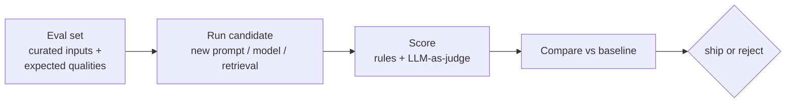

**The part most teams get wrong: resolving power.** A pass rate is a binomial estimate — at 50 cases the 95% interval is **~±10 points**. A prompt change that silently drops you from 85% to 78% is indistinguishable from noise. Teams then ship on "the number went up by 2," which at that size is a **coin flip dressed as a metric**.

| n cases | ±points of pass rate (95% CI, unpaired, single run) at ~85% |
|---|---|
| 50 | ±9.9 |
| 100 | ±7.0 |
| 200 | ±4.9 |
| 400 | ±3.5 |
| **1,000** | **±2.2** |
| 2,000 | ±1.6 |

**Three fixes, in order of leverage:**

1. **Compare paired, not pooled.** Run baseline and candidate on the same items; look at the **discordant cases** — items that flipped pass→fail and fail→pass. If 12 flipped to fail and 2 flipped to pass, that's a signal even on a small set (McNemar-style test); two independent averages would bury it.
2. **Model the sampling noise.** At non-zero temperature, the same item can pass one run and fail the next. Run each item **k times (3-5)** and score pass-rate-per-item. Items unstable on the baseline are telling you about your prompt, not about the change.
3. **Slice before you average.** A +2 overall can hide **−15 on a 5% slice** (a language, a tenant, a document type). **Gate on per-slice floors** for the slices the business cares about, not only the mean.

**Worked (paired):** 300 items, baseline and candidate both ~85%. **Pooled:** interval on each is ~±4 points → a 3-point drop invisible. **Paired:** only look at disagreements. 14 flipped pass→fail, 4 flipped fail→pass. McNemar's statistic with continuity correction:

```
(|14 − 4| − 1)² / (14 + 4)  =  81 / 18  =  4.5    > 3.84 (p < 0.05)
```

**The same 300 items that couldn't see a 3-point move in aggregate can see it when you count flips** — because the 282 concordant items contribute no noise at all.

→ Corollary: **if your suite is mostly items every model passes, it has very few chances to disagree** and will report "no significant change" for regressions that matter. **Curate for discrimination** — an item that 100% of candidates pass is a smoke test, not an eval case; it belongs in L0.

**Slice floors need their own sizing.** A 5% slice of a 1,000-item suite is 50 items (the ±10-point row). **Fix: stratified oversampling** — build the suite so every slice you gate on has at least a few hundred items; reweight to production mix only when you report the headline number. That makes the suite **unrepresentative on purpose** — correct, because its job is to detect regressions where they're expensive, not to mirror traffic. **Decide the minimum detectable effect first** (say, "5-point drop on any gated slice"), then derive items/slice from it.

**Two slower failures:**

- **Overfitting the suite.** After months of prompt-tweaking against 300 cases, the prompt is tuned to them. **Keep a held-out split you look at rarely; treat a widening gap between tuned-set and held-out scores as the alarm.**
- **Suite staleness.** The set was drawn from last year's traffic; the product has moved. If offline pass rate is flat while online signals (§4) decline, **refresh from recent traces, not from imagination**.

### 3. LLM-as-judge — scoring open-ended output at scale

**Simple version:** much AI output has no single right answer (summary, explanation, tone). When you can't write an assert, use **LLM-as-judge**: a strong model scores the output against a written rubric. Cheap and scalable — that's its whole value. But judges are **biased** (toward longer answers, toward the first option, toward their own style), so calibrate against human labels and treat the score as a **proxy, not truth**.

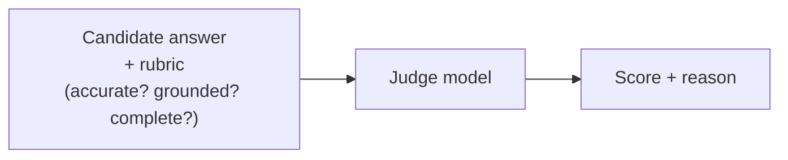

**How judges fail in production, more specific than "they're biased":**

| Failure | What happens | Fix |
|---|---|---|
| **Judge drift masquerading as product change** | Provider updates judge model behind same alias → every score shifts a few points overnight; nobody changed the product | Pin judge to a dated model version. When you *must* move it, **re-score the baseline with the new judge** before comparing anything |
| **Scale compression** | Ask for 1-10, nearly everything lands on 7 or 8 → no dynamic range, real regressions barely move it | **Decompose rubric into binary per-criterion checks** ("cites a source that contains the claim: yes/no") or use **pairwise preference** (A vs B, both orders) |
| **Self-preference and shared blind spots** | Judge from same model family as candidate rewards its own phrasing, misses the same factual errors | For factuality, check against **retrieved sources** (groundedness check), not against the judge's world knowledge |
| **Unmeasured agreement** | "We calibrated against humans" = someone eyeballed 20 examples | Label a few hundred items, measure judge-human agreement with **Cohen's κ**, compare to human-human agreement on same items |

**Once agreement is measured, USE it — don't just report it.** A binary judge is a classifier with sensitivity (marks good as good) and specificity (marks bad as bad), both measurable on the human-labeled set. **The observed pass rate is biased by both; the bias is correctable** (Rogan-Gladen estimator):

```
true rate  ≈  (observed + specificity − 1) / (sensitivity + specificity − 1)
```

Illustrative: sens=0.90, spec=0.80, observed=80% → true ≈ (0.80 + 0.80 − 1) / 0.70 = **86%**.

**Two consequences matter more than the number:**

- **A lenient judge (low specificity) compresses the gap between good and bad candidates** — a real regression shows up smaller than it is. Slope of observed vs true = `sens + spec − 1`. A judge at `sens 0.9, spec 0.6` has slope **0.5** → turns a true 90% → 80% regression into an observed 85% → 80%: **half the signal, same noise**.
- **If judge error rates differ between baseline and candidate** (candidate is more verbose, judge likes verbosity), **the correction is wrong and so is the comparison**. A change of candidate style warrants **re-checking judge calibration on a sample of the new outputs**.

**Budget it.** Illustratively: 2,000 items × 3 samples × 2 orderings for pairwise × ~3,000 tokens judge input (question, sources, two answers, rubric) = **36M judge input tokens per full run, before output**. At strong-model prices that's a real line item per run — running it on every PR across a dozen engineers can cost more than inference for a modest-traffic feature.

**The shape that works:**

- L0 + L1 on every PR.
- A **judged paired sample** of a few hundred high-discrimination items on PRs that touch prompts or models.
- The **full judged suite nightly and before release**.
- **Cache judge verdicts** keyed by `(item, candidate output hash, judge version, rubric version)` — an unchanged output needs no re-judging, and on a typical PR most outputs don't change.

### 4. Online evals — production is your largest, truest eval set

**Simple version:** offline evals can't cover everything real users do. Online evals watch production: **explicit** feedback (thumbs), **implicit** signals (did they retry, edit, abandon?), and **sampled human review**. The enabler is **tracing** — every request carrying its retrieved chunks, tool calls, tokens, cost, latency per span — so when quality drops, you can see **where** in the pipeline it broke.

**The flywheel:** failures caught in production become new offline eval cases → the system compounds in quality instead of drifting.

**Three properties of online signals are routinely misread:**

1. **Explicit feedback is sparse and self-selected.** A small minority of sessions leave a thumb at all, and they skew toward the annoyed. **A thumbs-down rate is a measure of who bothers to click as much as of quality**, and it moves when you move the button. Use it to **find failures, not to rate them**.
2. **Implicit signals are ambiguous in sign.** "No follow-up question" = either the answer was complete or the user gave up. "User edited the draft" = either it was wrong or it was a good starting point they personalized. **Each implicit signal needs a one-time validation against labeled sessions before anyone puts it on a dashboard, and that validation expires when the UX changes.**
3. **Trustworthy online signal is slow** (the expensive one).

**The arithmetic of #3 decides how you roll out.** Sampled human review is the only online signal you can fully trust, and it's capacity-limited. Detecting a drop from 85% → 82% at conventional power (α = 0.05 two-sided, 80% power):

```
n  ≈  (1.96 + 0.84)² × 2 × p(1−p) / δ²   ≈  2,400 reviewed items per arm
```

At 200 reviews/day/arm, that's **12 days during which a regressed canary is serving real users**.

| Drop from 85% | Days of canary exposure at 200 rev/day/arm | n per arm |
|---|---|---|
| −10 pts | 1.3 days | 251 |
| −5 pts | 4.5 days | 905 |
| **−3 pts** | **12 days** | 2,401 |
| −2 pts | **26 days** | 5,268 |

**Halving the regression you want to see quadruples the wait.** Everything smaller than ~5 points **must be caught offline, paired** — online review only confirms absence of large surprises and mines new eval cases.

**Fast guardrail metrics gate the canary in hours instead:** refusal rate, parse failures, tool-error rate, output length distribution, latency and cost per request. **Output-length and refusal-rate shifts in particular are early tells of a changed model** — they're free to compute and they flag silent provider-side updates before any quality metric does.

**The promotion ladder that follows:**

```
1. SHADOW                 Run candidate on mirrored prod inputs; discard output;
                          judge pairwise against incumbent on same inputs.
                          Paired → variance argument from §2 applies; a few hundred
                          items are informative.
                          ⚠ Shadowing an agent is safe only if its tools are stubbed
                            or read-only. A shadow agent that can send email is a
                            second production system.

2. CANARY (small %)       Gate on cheap, fast guardrail metrics (refusals, parse
                          errors, length, cost) — each moves within hours and
                          correlates with regressions.

3. RAMP                   With the slow human-reviewed metric as trailing
                          confirmation.
```

**Tracing economics bite at scale.** An agent trace storing full prompts, retrieved chunks, tool results can easily be **tens of kilobytes per request**. At 50 KB and 2M req/day = **100 GB/day of mostly sensitive text**, with the retention, PII, and access-control obligations that come with it.

→ **Keep span metadata** (tokens, latency, cost, model version, prompt version, chunk ids) for everything, and **full payloads by tail-based sampling**: all errors, all negative feedback, all requests over the latency or cost budget, plus a small uniform sample for baselines.

→ **Head-based sampling at 1% throws away 99% of the failures you built tracing to find.** And **store chunk ids + index version, not only chunk text** — "why did it retrieve this?" is unanswerable if the index has been rebuilt since.

### 5. The three dials — quality, cost, latency — pick your point

**Simple version:** evals tell you where quality **is**. The rest of the system's life is spent balancing it against cost and latency. **You can push any two hard; all three at once isn't free.** The art is knowing which dial your product actually needs — a legal-research tool pays for quality, a high-volume support bot optimizes cost, an interactive assistant guards latency — and **tuning deliberately instead of by accident**.

```
                    Quality
                      ●
                     ╱ ╲
                    ╱   ╲
                   ╱     ╲
                  ╱       ╲
                 ●─────────●
               Cost       Latency

Push quality:   bigger model, rerank, more context, self-critique
Push cost down: smaller model, model cascade, semantic cache, shorter prompts
Push latency:   streaming, speculative decoding, parallel tools, smaller output
```

**Latency deserves its own decomposition — the model call is rarely one call.** A typical request is a **serial chain** (guardrail → query rewrite → retrieval → planner turn → tool → final answer), and each hop adds its **full TTFT** before the user sees anything.

Illustrative — where 6.4 seconds goes:

| Stage | ~Time |
|---|---|
| Guardrail classifier | 0.2 s |
| Query rewrite (small model) | 0.5 s |
| Embed + ANN + rerank | 0.4 s |
| Planner call → tool choice | 1.2 s |
| Tool (internal API) | 0.3 s |
| **Final answer: TTFT** | **2.4 s** |
| Final answer: 400-token decode | 1.4 s |

User-perceived latency is **TTFT of the final call (~2.4s), if you stream it**. Every pre-answer hop adds to that number *serially*; decode length sets total time.

**Three architectural rules:**

1. **Stream the final answer** so perceived latency is its TTFT, not its completion.
2. **Count hops before model speed** — collapsing rewrite and planner into one call often beats any model swap.
3. **Output tokens are the expensive axis.** Decode is sequential → a 400-token answer costs time roughly linear in its length, while a longer *input* mostly costs TTFT. **Cap output length where the product allows.**

**Watch the tail, not the mean.** The p99 of a five-hop chain is dominated by whichever hop has the fattest tail. **Tails compound across serial hops** — if each of 5 independent hops has its own p99:

```
P(request hits ≥1 p99)  =  1 − 0.99⁵  ≈  4.9%
```

→ **The per-hop p99 is roughly your end-to-end p95.** Budgeting each hop to "p99 under 1s" does *not* give you an end-to-end p99 under 5s — it gives you **one in twenty requests paying a tail somewhere**. **Put a deadline on the whole request** and a budget on agent iterations; propagate the remaining deadline to every hop so a late hop can pick a cheaper path; **decide in advance what the degraded answer is when the deadline hits**.

**Classic tail fix — hedged requests — needs adapting.** Hedging a full generation (send a duplicate after p95, take whichever finishes first) **doubles the cost of the most expensive calls**, and because the two outputs differ, "winner" is whatever was shorter → **quality bias**. **Hedge on TTFT instead:** if the primary hasn't produced a token by its TTFT p95, send the duplicate (ideally to a different region/provider), keep whichever streams first, cancel the other. You pay for a few % of duplicated prefill, not duplicated decode, and **you cut the tail that is usually queueing, not generation**.

**On cost: the unit that matters is cost per *successful task*; per-token price is a poor proxy.** Two effects dominate.

**(a) Agent loops re-send context.** Turn k carries system prompt S + everything accumulated, so input grows by ~Δ/turn → total over n turns is **n·S + Δ·n(n−1)/2** — quadratic. With S=4k and Δ=1.5k:

| Turns | No cache | Prefix-cached (illustrative 10%) |
|---|---|---|
| 2 | 11k | 7k |
| 6 | 46.5k | 15k |
| 10 | 107.5k | 26.5k |

**67% more turns, 130% more tokens.** Prefix caching changes the slope dramatically — but **agent prompts must be append-only; one timestamp or re-ranked tool list near the top invalidates the cache for every turn after it**.

**(b) Success rate divides everything.** Illustratively: strong model completes 70% of tasks in 6 turns. Model at 40% of its token price completes 55% but loops for 9 turns → tokens per attempt rise ~1.9× (~90k vs 46k input):

| Model | Price | Tokens/attempt | Success | **Cost per success** |
|---|---|---|---|---|
| Strong | 1.00× | 46k | 70% | 1/0.70 = **1.43** |
| Cheap | 0.40× | 90k (1.9× more) | 55% | 0.4 × 1.9 / 0.55 = **1.4** |

**A wash on cost, with a 15-point worse success rate and 50% more latency.** This is where "use the cheapest model that works" goes wrong — the cheap model's per-token saving is **spent on extra turns and failures**, and "works" was measured on single-shot evals that never saw the loop.

→ **Measure tokens-per-success and turns-per-success per model on the agent eval**, not price per million tokens.

### 6. The levers — how you actually buy cost and latency back

**Simple version:** two levers do most of the work. A **model cascade** routes easy queries (the majority) to a cheap model and escalates only the hard tail. A **semantic cache** serves near-duplicate questions from a prior answer, skipping the model for repeat traffic. Neither is free.

**Model cascade — try cheap first, escalate what's hard:**

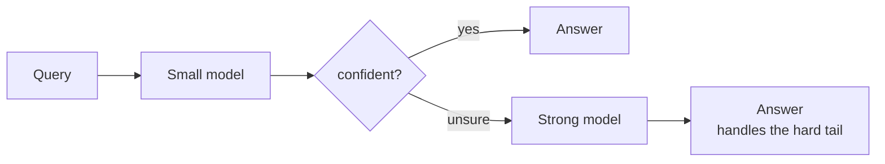

**Do the arithmetic before you build it.** The small model runs on every query, escalated queries pay for *both* → blended cost = `cs + e·cl`. With a 20:1 price ratio (strong/small):

| Escalation rate `e` | Blended cost | vs strong-only |
|---|---|---|
| 10% | 3.0 | **6.7× cheaper** |
| 30% | 7.0 | 2.9× |
| 60% | 13 | 1.5× |
| **95% (break-even e = 1 − cs/cl)** | 20 | 1.0× |

→ At 60% escalation, you have doubled latency on escalated requests and extra system to operate — **probably not worth it**. **Practical threshold is far lower than break-even.**

**The escalation rate is the number everyone tracks. The number that matters is the FALSE-CONFIDENT rate** — queries the small model answered **wrongly without escalating**. Model self-reported confidence and token log-probs are poorly calibrated on exactly the hard inputs you need to catch, so **a cascade that "saves 80%" can quietly ship a worse answer on a slice nobody measured**.

→ **Evaluate the router as its own component** — on a labeled set, measure accuracy of the small model on the queries it kept and compare to strong-only on the same queries. Re-check whenever either model changes.

**Before a semantic cache, take the cheaper and safer lever: PREFIX (prompt) caching.** Most providers and self-hosted servers can reuse the computed state for an identical prompt prefix, discounting and speeding up repeated input tokens. **It's exact-match → cannot return a wrong answer.** Its only design requirement is that you put the stable parts (system prompt, tool schemas, few-shot examples, shared document) **first** and the per-request parts **last**. **Reordering a prompt is often the single highest-ROI cost change available, and it's invisible to quality evals.**

**A semantic cache is a correctness risk you accept for cost.** Failure modes:

- **Negation and entity blindness.** "Cancel my order" and "don't cancel my order" — or the same question about two different accounts — can sit very close in embedding space.
- **Cross-tenant leakage.** A cache keyed only on the question serves user A's personalized answer to user B. **That's a security incident, not a quality bug.**
- **Staleness.** The cached answer outlives the policy or price it quotes.

→ **Key the cache by tenant AND by versions** (prompt, model, source data); restrict it to intents classified as **generic**; track hit rate honestly.

**Put the risk in the same units as the saving and the decision usually makes itself.** Each hit saves one model call (say $0.01). Each **false hit** costs whatever a wrong answer costs (support contact, refund, churn — call it $5). **Break-even false-hit rate = 0.01 / 5 = 0.2% of hits.** Almost no similarity threshold on real paraphrase traffic is that precise, and **you can't know your false-hit rate without labeling cache hits, which few teams do**.

→ **The semantic cache pays only where** a wrong answer is cheap (suggestions, autocomplete, drafts a human edits) **or** the answer space is closed enough that "near-duplicate" really means "same" (FAQ intents mapped to curated answers — at which point it's an **intent classifier + lookup table**, which should be built and evaluated as one).

→ **Also count the tax on misses:** every request now pays an embedding call and an ANN lookup → adds latency to the majority to save it on the minority.

### 7. Capacity & failure — rate limits, retries, and fallbacks

**Simple version:** most AI-native outages are **not model failures**. They are capacity failures: a provider quota measured in **tokens/minute** (not just requests), a retry policy written for stateless HTTP, and a fallback path nobody evaluated.

Provider limits usually have **two axes** — RPM and TPM — and the tokens axis is the one that surprises teams, because it's consumed by **input as well as output**. A feature launch that adds 8k tokens of retrieved context to every request can hit the token ceiling at a request rate that was comfortably inside it last week, with no change in traffic.

**The failure cascade:**

```
1. Requests near ceiling → 429s
2. Each layer retries — SDK, framework, agent wrapper, HTTP client
   → RETRIES MULTIPLY RATHER THAN ADD
      Worst case: (1 + r)^layers
      3 layers × 3 retries = 64× attempts per user request

3. Extra attempts consume the SAME quota → 429 rate RISES → more retries
4. Each retry of a long prompt re-bills its prefill (agent: restarts a turn
   whose context is large)
5. Latency → client timeout → client retries whole request
   → provider sees multiple of real demand
6. System spends most of its quota on requests whose users already gave up
```

**Containment — old distributed-systems practice applied with TOKEN awareness:**

- **Retry in exactly one layer; others fail fast.**
- **Retry BUDGET, not per-request count** (retries ≤ 10% of recent successful calls) — retries vanish under sustained overload instead of multiplying it.
- **Client-side admission control on a token budget** — estimate input tokens before sending, keep a local token bucket shaped like the provider quota, **shed or queue low-priority work (batch summarization, backfills, offline judges) before it ever produces a 429**.
- **Propagate the deadline** — a retry that cannot finish before the user's deadline is pure waste; don't send it.

**Evals are a classic hidden consumer here** — a nightly judged suite sharing a quota with production will **degrade production at night** unless it has its own key or a lower priority.

**Fallbacks deserve suspicion. "If provider A fails, route to B" is a QUALITY change disguised as an availability feature.** Prompts are not portable — tool-calling formats, system-prompt adherence, refusal behavior, and output-length habits differ across model families, and a prompt tuned for one can lose a meaningful share of quality on another. **A fallback never run against the eval suite is an untested deployment that activates only during incidents, when nobody is watching quality.**

→ Treat each fallback as a **first-class target**: own prompt variant, own eval gate, scheduled game-day routing a slice of real traffic through it, and a **UI or response flag when a degraded path answered**.

→ **The cheapest fallback is often not a different model at all** but a **degraded mode** — retrieval results without synthesis, a cached answer, a queued "we'll email you" — **whose quality is known**.

**Capacity model.** Pay-per-token vs reserved/self-hosted has a break-even at utilization ≈ `reserved_cost_per_hour / (per_token_price × tokens_per_hour_full_use)`. If that lands at illustrative 40% utilization and traffic has a 4:1 diurnal peak-to-trough, capacity sized for peak averages ~60% utilization → **looks like a clear win for reserving everything. It isn't**, because the decision is marginal:

- The **base-load slice** is busy nearly all day → clears break-even easily.
- The **top slice** (exists only for peak) is busy a few hours a day, well under 40% → **cheaper bought per token**.

**The shape most teams converge on:**

```
┌───────────────────────── peak ─────────────────────────┐
│ PAY-PER-TOKEN for peaks and bursts                     │
├────────────────────────────────────────────────────────┤
│ RESERVED CAPACITY for the base load                    │
│ (near 100% duty → wins against per-token)              │
├────────────────────────────────────────────────────────┤
│ DEFERRABLE WORK (evals, batch enrichment, backfills)   │
│ scheduled into the TROUGH — effectively free           │
└────────────────────────────────────────────────────────┘
```

**Evaluate the reserved path's latency UNDER LOAD, not idle.** A saturated self-hosted deployment has TTFT that climbs with queue depth, and the per-token math in Chapter 5 assumes batching that only exists when the queue is non-empty.

### 8. Where the conventional advice is wrong

| Advice | Reality |
|---|---|
| "Use the cheapest model that works." | Compare **cost per successful task**, including loop length and retries — per-token price can invert. |
| "Add a semantic cache to cut cost." | Only if false-hit rate is below `saved_call_cost ÷ wrong_answer_cost` — often a fraction of a percent. |
| "Watch production metrics to catch regressions." | Trustworthy online signal takes **days to weeks** for small drops — small regressions must be caught **offline, paired**. |
| "Add a fallback provider for reliability." | An unevaluated fallback is a **quality incident** that only fires during an availability incident. |
| "Higher average judge score = better." | Without measured judge **specificity** and a **paired** comparison, the number is compressed and noisy. |

### Design-review checklist (Chapter 7)

- What's the **smallest regression your eval suite can detect**, and is that smaller than the regression you'd care about?
- Is the judge **pinned to a model version**, and what's its measured agreement with human labellers?
- For the cascade: what's the **false-confident rate** on the kept queries, per slice, and who re-tunes the threshold when a model changes?
- What is **cost per successful task** (not per request) — including retries, agent turns, judge calls?
- What's the latency budget per hop, what happens at the deadline, and is the final answer **streamed**?
- Is the prompt **ordered for prefix caching**? If there's a semantic cache, what is it keyed on, and can it ever cross tenants?
- What is the **measured false-hit rate** of the semantic cache, and what does a wrong cached answer cost compared with the call it saved?
- How many days of canary traffic would it take to detect a **3-point regression** online — and what catches it before then?
- Which single layer retries on a 429? What's the retry **budget**? Do evals and batch jobs share a quota with production?
- Has every fallback model or provider passed the **same eval gate** as the primary, and when was it last exercised with real traffic?
- For agents: **tokens-per-success** and **turns-per-success** per model, and what is the iteration cap in dollars?

---

## The whole track — bound the core

**One idea in seven chapters.** An AI-native system puts a probabilistic core on the critical path, and your job as an architect is to **bound it** so the system around it is dependable even though the core isn't.

```
GROUND it           retrieval + vector search      (knowledge lane · Ch.3-4)
SERVE it            prefill, decode, KV cache      (intelligence lane · Ch.5)
ORCHESTRATE it      with tools and agents          (orchestration · Ch.6)
                    behind guardrails              (orchestration · Ch.1-2)
PROVE AND TUNE it   evals, cost, latency           (trust & ops · Ch.7)
```

**The model is the commodity. The system you build around it is the architecture — and it's yours.**

```
┌──────────────────────────────────────────────────────────────┐
│   Evals ─── Trace ─── Cascade ─── BOUND THE CORE             │
│   prove    see where   biggest    the whole track            │
│   quality  it broke    cost                                  │
│   moved                lever                                 │
└──────────────────────────────────────────────────────────────┘
```

---

<!-- Add next article below this line -->
**
