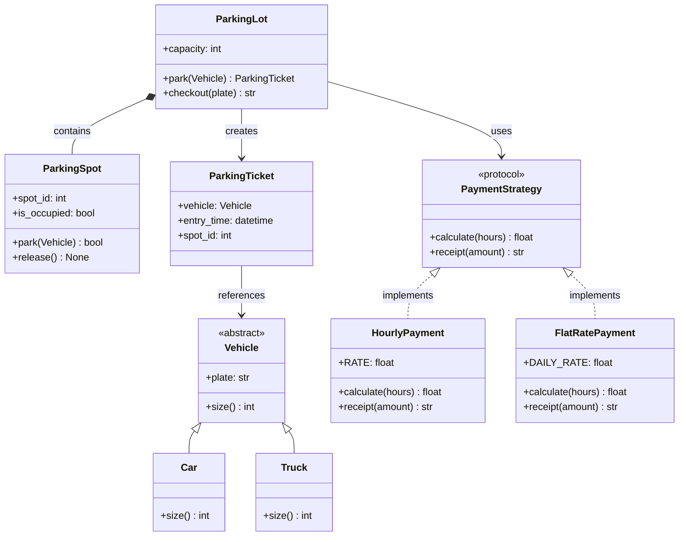
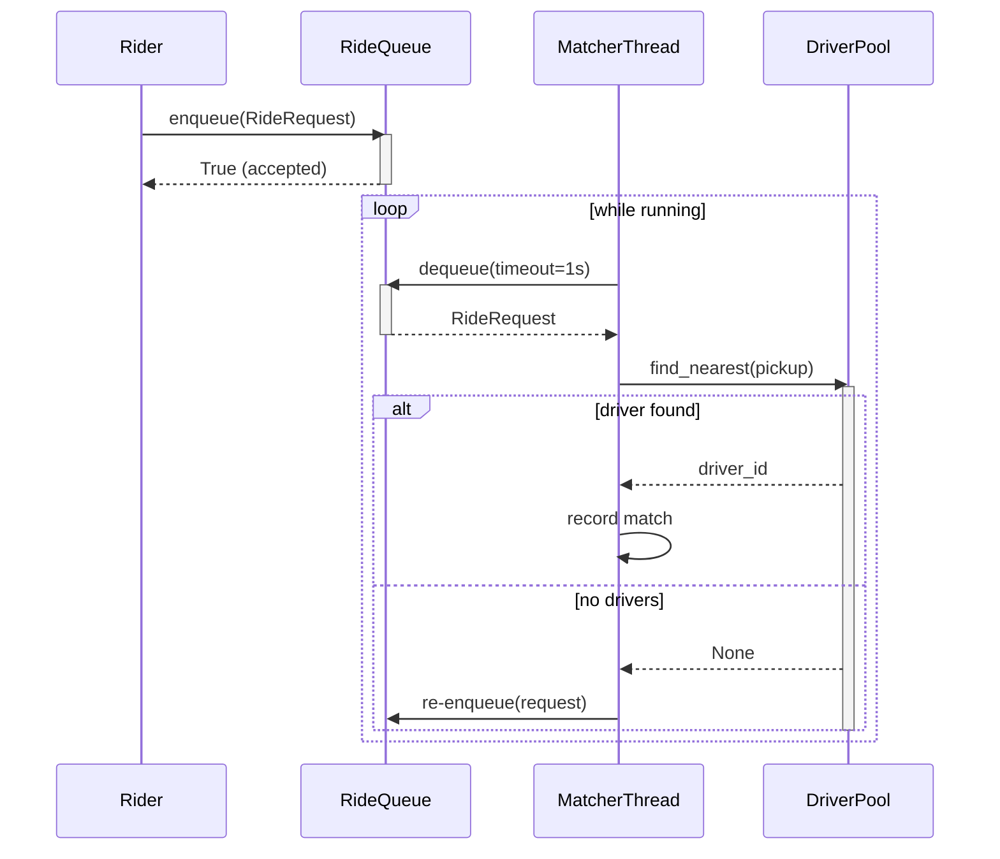
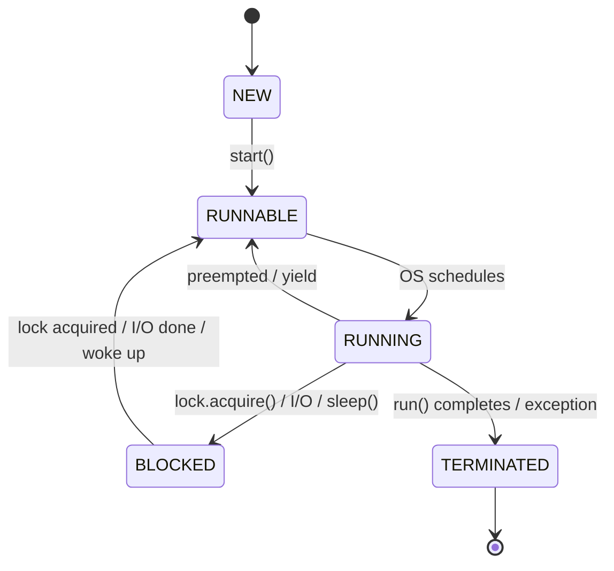

# Python for Low-Level Design Engineers — The Complete Reference

> **Goal:** Master every Python concept that appears in LLD / OOD interviews.
> Each section is self-contained, runnable, and interview-ready.

---

## Table of Contents

1. [Classes vs Abstract Classes vs Protocols](#1-classes-vs-abstract-classes-vs-protocols)
2. [Type Hinting](#2-type-hinting)
3. [Dataclasses](#3-dataclasses)
4. [Composition Over Inheritance](#4-composition-over-inheritance)
5. [Reading UML Class Diagrams](#5-reading-uml-class-diagrams)
6. [Reading Sequence Diagrams](#6-reading-sequence-diagrams)
7. [What Is a Thread?](#7-what-is-a-thread)
8. [Concurrency vs Parallelism](#8-concurrency-vs-parallelism)
9. [Synchronization, Mutex, Semaphore](#9-synchronization-mutex-semaphore)
10. [Race Conditions](#10-race-conditions)
11. [Deadlocks](#11-deadlocks)
12. [LLD & Concurrency Interview Expectations](#12-lld--concurrency-interview-expectations)

---

## 1. Classes vs Abstract Classes vs Protocols

### 1.1 Regular Classes

A regular class is the bread-and-butter building block in Python OOP. It defines both **state** (attributes) and **behavior** (methods).

```python
class PaymentProcessor:
    """Concrete class — fully implemented, directly instantiable."""

    def __init__(self, merchant_id: str, api_key: str) -> None:
        self.merchant_id = merchant_id
        self.api_key = api_key
        self._transaction_log: list[dict] = []

    def charge(self, amount: float, currency: str = "USD") -> str:
        txn_id = f"txn_{id(self)}_{len(self._transaction_log)}"
        self._transaction_log.append(
            {"txn_id": txn_id, "amount": amount, "currency": currency}
        )
        return txn_id

    def refund(self, txn_id: str) -> bool:
        for txn in self._transaction_log:
            if txn["txn_id"] == txn_id:
                txn["refunded"] = True
                return True
        return False

    def get_history(self) -> list[dict]:
        return list(self._transaction_log)


# Usage
processor = PaymentProcessor("MERCH_001", "sk_live_xxx")
tid = processor.charge(49.99)
print(f"Charged → {tid}")
print(f"Refund success → {processor.refund(tid)}")
print(f"History → {processor.get_history()}")
```

**Key properties of regular classes:**

| Property | Regular Class |
|---|---|
| Can instantiate directly | Yes |
| Can have abstract methods | No |
| Subclassing required | No |
| Provides default behavior | Yes |
| Enforces interface contract | No |

---

### 1.2 Abstract Classes (ABC)

Abstract classes exist to **enforce a contract**: subclasses *must* implement certain methods. Python provides the `abc` module for this.

```python
from abc import ABC, abstractmethod


class NotificationService(ABC):
    """Abstract base class — cannot be instantiated directly."""

    def __init__(self, sender: str) -> None:
        self.sender = sender

    @abstractmethod
    def send(self, recipient: str, message: str) -> bool:
        """Subclasses MUST implement this."""
        ...

    @abstractmethod
    def validate_recipient(self, recipient: str) -> bool:
        """Subclasses MUST implement this."""
        ...

    def format_message(self, message: str) -> str:
        """Concrete method — shared across all subclasses."""
        return f"[From: {self.sender}] {message}"
```

```python
class EmailNotification(NotificationService):
    def send(self, recipient: str, message: str) -> bool:
        if not self.validate_recipient(recipient):
            return False
        formatted = self.format_message(message)
        print(f"EMAIL → {recipient}: {formatted}")
        return True

    def validate_recipient(self, recipient: str) -> bool:
        return "@" in recipient and "." in recipient


class SMSNotification(NotificationService):
    def send(self, recipient: str, message: str) -> bool:
        if not self.validate_recipient(recipient):
            return False
        formatted = self.format_message(message)
        print(f"SMS → {recipient}: {formatted}")
        return True

    def validate_recipient(self, recipient: str) -> bool:
        return recipient.startswith("+") and len(recipient) >= 10
```

```python
# This will raise TypeError:
# svc = NotificationService("admin")  # ← Cannot instantiate abstract class

email_svc = EmailNotification("noreply@shop.com")
email_svc.send("user@example.com", "Your order shipped!")

sms_svc = SMSNotification("ShopAlert")
sms_svc.send("+1234567890", "Your OTP is 482910")
```

**What happens if you forget to implement an abstract method?**

```python
class BrokenNotification(NotificationService):
    def send(self, recipient: str, message: str) -> bool:
        return True
    # forgot validate_recipient!

# broken = BrokenNotification("x")
# TypeError: Can't instantiate abstract class BrokenNotification
#            with abstract method validate_recipient
```

#### Abstract Properties

```python
from abc import ABC, abstractmethod


class Shape(ABC):
    @property
    @abstractmethod
    def area(self) -> float:
        ...

    @property
    @abstractmethod
    def perimeter(self) -> float:
        ...


class Rectangle(Shape):
    def __init__(self, width: float, height: float) -> None:
        self._width = width
        self._height = height

    @property
    def area(self) -> float:
        return self._width * self._height

    @property
    def perimeter(self) -> float:
        return 2 * (self._width + self._height)


r = Rectangle(5, 3)
print(f"Area = {r.area}, Perimeter = {r.perimeter}")
```

---

### 1.3 Protocols (Structural Typing)

Protocols (PEP 544, `typing.Protocol`) enable **structural subtyping** — also called *duck typing with static checks*. A class satisfies a Protocol if it has the right methods/attributes, **without** explicitly inheriting from it.

```python
from typing import Protocol, runtime_checkable


@runtime_checkable
class Drawable(Protocol):
    def draw(self, canvas: str) -> None:
        ...


class Circle:
    """Does NOT inherit from Drawable, but satisfies it structurally."""
    def draw(self, canvas: str) -> None:
        print(f"Drawing circle on {canvas}")


class Square:
    def draw(self, canvas: str) -> None:
        print(f"Drawing square on {canvas}")


class DatabaseConnection:
    def connect(self) -> None:
        print("Connecting...")


def render(shape: Drawable, canvas: str) -> None:
    shape.draw(canvas)


render(Circle(), "main_canvas")    # ✅ works
render(Square(), "main_canvas")    # ✅ works
# render(DatabaseConnection(), "x") # ✗ mypy error — no draw() method

# Runtime check (requires @runtime_checkable)
print(isinstance(Circle(), Drawable))          # True
print(isinstance(DatabaseConnection(), Drawable))  # False
```

#### Protocol with Attributes

```python
from typing import Protocol


class HasName(Protocol):
    name: str


class HasAge(Protocol):
    age: int


class Identifiable(HasName, HasAge, Protocol):
    """Composed protocol — requires both name and age."""
    pass


class User:
    def __init__(self, name: str, age: int) -> None:
        self.name = name
        self.age = age


def greet(entity: Identifiable) -> str:
    return f"Hello {entity.name}, age {entity.age}"


print(greet(User("Alice", 30)))  # ✅ User satisfies Identifiable
```

---

### 1.4 When to Use Each

```
┌──────────────────────────────────────────────────────────────────────┐
│                     Decision Flowchart                              │
├──────────────────────────────────────────────────────────────────────┤
│                                                                      │
│  Do you need to enforce an interface contract?                       │
│     │                                                                │
│     ├─ NO  → Use a regular class                                     │
│     │                                                                │
│     └─ YES → Do you own / control the implementing classes?          │
│                │                                                     │
│                ├─ YES → Do you need shared base behavior?            │
│                │   │                                                 │
│                │   ├─ YES → Abstract Base Class (ABC)                │
│                │   └─ NO  → Protocol (lighter weight)                │
│                │                                                     │
│                └─ NO (third-party code) → Protocol                   │
│                                                                      │
└──────────────────────────────────────────────────────────────────────┘
```

### 1.5 Comparison Table

| Feature | Regular Class | ABC | Protocol |
|---|---|---|---|
| Instantiable | ✅ | ❌ | ❌ (used as type only) |
| Enforces method impl | ❌ | ✅ (runtime) | ✅ (static, mypy) |
| Requires inheritance | — | Yes | No (structural) |
| Shared base logic | ✅ | ✅ | ❌ |
| Works with 3rd-party | — | ❌ | ✅ |
| `isinstance()` check | ✅ | ✅ | ✅ (`@runtime_checkable`) |
| Best for LLD | Concrete entities | Core abstractions | Pluggable strategies |

### 1.6 Real LLD Example — Parking Lot Payment Strategy

```python
from abc import ABC, abstractmethod
from typing import Protocol
from dataclasses import dataclass
from datetime import datetime, timedelta


# ─── ABC for the core domain entity ───
class Vehicle(ABC):
    def __init__(self, plate: str) -> None:
        self.plate = plate

    @abstractmethod
    def size(self) -> int:
        """Returns number of spots needed."""
        ...


class Car(Vehicle):
    def size(self) -> int:
        return 1


class Truck(Vehicle):
    def size(self) -> int:
        return 3


# ─── Protocol for pluggable payment strategies ───
class PaymentStrategy(Protocol):
    def calculate(self, hours: float) -> float:
        ...

    def receipt(self, amount: float) -> str:
        ...


class HourlyPayment:
    RATE = 5.0

    def calculate(self, hours: float) -> float:
        return self.RATE * hours

    def receipt(self, amount: float) -> str:
        return f"Hourly charge: ${amount:.2f}"


class FlatRatePayment:
    DAILY_RATE = 30.0

    def calculate(self, hours: float) -> float:
        days = max(1, int(hours // 24) + (1 if hours % 24 > 0 else 0))
        return self.DAILY_RATE * days

    def receipt(self, amount: float) -> str:
        return f"Flat rate charge: ${amount:.2f}"


# ─── Regular class for the concrete system ───
@dataclass
class ParkingTicket:
    vehicle: Vehicle
    entry_time: datetime
    spot_id: int


class ParkingLot:
    def __init__(self, capacity: int, payment: PaymentStrategy) -> None:
        self.capacity = capacity
        self.payment = payment
        self._tickets: dict[str, ParkingTicket] = {}
        self._next_spot = 1

    def park(self, vehicle: Vehicle) -> ParkingTicket | None:
        if self._next_spot + vehicle.size() - 1 > self.capacity:
            return None
        ticket = ParkingTicket(vehicle, datetime.now(), self._next_spot)
        self._tickets[vehicle.plate] = ticket
        self._next_spot += vehicle.size()
        return ticket

    def checkout(self, plate: str) -> str | None:
        ticket = self._tickets.pop(plate, None)
        if not ticket:
            return None
        hours = max(1.0, (datetime.now() - ticket.entry_time).total_seconds() / 3600)
        amount = self.payment.calculate(hours)
        return self.payment.receipt(amount)


# Usage
lot = ParkingLot(capacity=100, payment=HourlyPayment())
car = Car("ABC-1234")
ticket = lot.park(car)
print(f"Parked at spot {ticket.spot_id}" if ticket else "Lot full")
print(lot.checkout("ABC-1234"))
```

---

## 2. Type Hinting

### 2.1 Why Type Hints Matter in LLD Interviews

1. **Clarity** — the interviewer reads your code; types serve as inline documentation.
2. **Correctness** — you catch design errors before running code.
3. **Professionalism** — signals you write production-grade Python.
4. **Tool support** — `mypy`, `pyright`, IDE autocomplete all leverage hints.

### 2.2 Basic Type Hints

```python
def create_user(name: str, age: int, balance: float, active: bool = True) -> dict:
    return {
        "name": name,
        "age": age,
        "balance": balance,
        "active": active,
    }


user = create_user("Alice", 30, 100.50)
```

**Variable annotations:**

```python
username: str = "alice"
retry_count: int = 0
pi: float = 3.14159
is_admin: bool = False

# Annotation without assignment (forward declaration)
connection: "DatabaseConnection"
```

### 2.3 Complex Types

Since Python 3.9+ you can use built-in generics (`list[int]`). For older code you import from `typing`.

```python
from typing import Optional, Union

# ─── Collections ───
names: list[str] = ["Alice", "Bob"]
scores: dict[str, int] = {"Alice": 95, "Bob": 87}
coordinates: tuple[float, float] = (12.5, 45.3)
unique_ids: set[int] = {1, 2, 3}

# ─── Nested collections ───
matrix: list[list[int]] = [[1, 2], [3, 4]]
user_roles: dict[str, list[str]] = {
    "alice": ["admin", "editor"],
    "bob": ["viewer"],
}

# ─── Optional (value or None) ───
def find_user(user_id: int) -> Optional[dict]:
    """Returns user dict or None if not found."""
    db = {1: {"name": "Alice"}}
    return db.get(user_id)

# Python 3.10+ shorthand:
def find_user_v2(user_id: int) -> dict | None:
    ...

# ─── Union (multiple possible types) ───
def parse_id(raw: Union[str, int]) -> int:
    return int(raw)

# Python 3.10+ shorthand:
def parse_id_v2(raw: str | int) -> int:
    return int(raw)
```

### 2.4 Callable Types

```python
from typing import Callable


# Function that takes (str, int) and returns bool
Validator = Callable[[str, int], bool]


def retry(action: Callable[[], bool], max_attempts: int = 3) -> bool:
    for _ in range(max_attempts):
        if action():
            return True
    return False


def apply_transform(
    data: list[int],
    transform: Callable[[int], int],
) -> list[int]:
    return [transform(x) for x in data]


# Usage
doubled = apply_transform([1, 2, 3], lambda x: x * 2)
print(doubled)  # [2, 4, 6]
```

### 2.5 TypeVar and Generics

```python
from typing import TypeVar, Generic

T = TypeVar("T")
K = TypeVar("K")
V = TypeVar("V")


class Stack(Generic[T]):
    """A generic stack that works with any type."""

    def __init__(self) -> None:
        self._items: list[T] = []

    def push(self, item: T) -> None:
        self._items.append(item)

    def pop(self) -> T:
        if not self._items:
            raise IndexError("pop from empty stack")
        return self._items.pop()

    def peek(self) -> T:
        if not self._items:
            raise IndexError("peek at empty stack")
        return self._items[-1]

    def is_empty(self) -> bool:
        return len(self._items) == 0

    def __len__(self) -> int:
        return len(self._items)


# Type-safe usage
int_stack: Stack[int] = Stack()
int_stack.push(1)
int_stack.push(2)
print(int_stack.pop())  # 2

str_stack: Stack[str] = Stack()
str_stack.push("hello")
# str_stack.push(42)  # mypy error: Argument 1 has incompatible type "int"
```

#### Bounded TypeVar

```python
from typing import TypeVar

class Comparable:
    def __lt__(self, other: "Comparable") -> bool:
        ...

CT = TypeVar("CT", bound=Comparable)


def find_min(items: list[CT]) -> CT:
    """Works only with types that support < comparison."""
    result = items[0]
    for item in items[1:]:
        if item < result:
            result = item
    return result
```

#### Generic LLD Example — Repository Pattern

```python
from typing import TypeVar, Generic, Protocol

T = TypeVar("T")


class HasId(Protocol):
    id: int


E = TypeVar("E", bound=HasId)


class Repository(Generic[E]):
    def __init__(self) -> None:
        self._store: dict[int, E] = {}

    def save(self, entity: E) -> None:
        self._store[entity.id] = entity

    def find_by_id(self, entity_id: int) -> E | None:
        return self._store.get(entity_id)

    def find_all(self) -> list[E]:
        return list(self._store.values())

    def delete(self, entity_id: int) -> bool:
        return self._store.pop(entity_id, None) is not None


class User:
    def __init__(self, id: int, name: str) -> None:
        self.id = id
        self.name = name


class Product:
    def __init__(self, id: int, title: str, price: float) -> None:
        self.id = id
        self.title = title
        self.price = price


user_repo: Repository[User] = Repository()
user_repo.save(User(1, "Alice"))
user_repo.save(User(2, "Bob"))

product_repo: Repository[Product] = Repository()
product_repo.save(Product(1, "Laptop", 999.99))

print(user_repo.find_by_id(1))       # User object
print(product_repo.find_all())       # [Product object]
```

### 2.6 Type Aliases

```python
from typing import TypeAlias

# Simple aliases
UserId: TypeAlias = int
Email: TypeAlias = str
JSON: TypeAlias = dict[str, "JSON | str | int | float | bool | None | list[JSON]"]

# Complex aliases for LLD
Coordinate: TypeAlias = tuple[float, float]
Grid: TypeAlias = list[list[int]]
EventHandler: TypeAlias = Callable[[str, dict], None]
Middleware: TypeAlias = Callable[["Request", "Response", Callable], None]
Observer: TypeAlias = Callable[[str, dict], None]


def notify_observers(observers: list[Observer], event: str, data: dict) -> None:
    for obs in observers:
        obs(event, data)
```

### 2.7 Quick Reference Table

| Need | Syntax | Example |
|---|---|---|
| Basic | `int`, `str`, `float`, `bool` | `age: int = 25` |
| List of X | `list[X]` | `list[str]` |
| Dict | `dict[K, V]` | `dict[str, int]` |
| Tuple (fixed) | `tuple[X, Y]` | `tuple[str, int]` |
| Tuple (variable) | `tuple[X, ...]` | `tuple[int, ...]` |
| Set | `set[X]` | `set[int]` |
| Nullable | `X \| None` | `str \| None` |
| Multiple types | `X \| Y` | `str \| int` |
| Callable | `Callable[[args], ret]` | `Callable[[int], bool]` |
| Generic class | `class Foo(Generic[T])` | see above |
| Type alias | `TypeAlias = ...` | `UserId = int` |

---

## 3. Dataclasses

### 3.1 The `@dataclass` Decorator

Dataclasses eliminate boilerplate for classes that primarily hold data. The decorator auto-generates `__init__`, `__repr__`, `__eq__`, and optionally `__hash__`, `__lt__`, etc.

```python
from dataclasses import dataclass


@dataclass
class Point:
    x: float
    y: float


# Auto-generated __init__, __repr__, __eq__
p1 = Point(1.0, 2.0)
p2 = Point(1.0, 2.0)
print(p1)           # Point(x=1.0, y=2.0)
print(p1 == p2)     # True (value equality, not identity)
```

**Without dataclass — the boilerplate you avoid:**

```python
class PointManual:
    def __init__(self, x: float, y: float) -> None:
        self.x = x
        self.y = y

    def __repr__(self) -> str:
        return f"PointManual(x={self.x}, y={self.y})"

    def __eq__(self, other: object) -> bool:
        if not isinstance(other, PointManual):
            return NotImplemented
        return self.x == other.x and self.y == other.y
```

### 3.2 The `field()` Function

`field()` gives fine-grained control over individual fields.

```python
from dataclasses import dataclass, field
from datetime import datetime


@dataclass
class Order:
    order_id: str
    customer_name: str
    items: list[str] = field(default_factory=list)  # mutable default
    total: float = 0.0
    created_at: datetime = field(default_factory=datetime.now)
    _internal_notes: str = field(default="", repr=False)  # hidden from repr
    priority: int = field(default=0, compare=False)       # excluded from ==

    # field() parameters:
    # - default          : static default value
    # - default_factory  : callable for mutable defaults (list, dict, set)
    # - repr             : include in __repr__? (default True)
    # - compare          : include in __eq__/__lt__? (default True)
    # - hash             : include in __hash__? (default None → follows compare)
    # - init             : include in __init__? (default True)
    # - kw_only          : keyword-only argument? (Python 3.10+)


o1 = Order("ORD-001", "Alice", ["Laptop", "Mouse"])
o2 = Order("ORD-001", "Alice", ["Laptop", "Mouse"], priority=99)
print(o1)          # Note: _internal_notes is hidden
print(o1 == o2)    # True — priority is excluded from comparison
```

### 3.3 `__post_init__`

Runs after the auto-generated `__init__`, perfect for validation and computed fields.

```python
from dataclasses import dataclass, field


@dataclass
class BankAccount:
    owner: str
    balance: float
    account_type: str = "checking"
    account_number: str = field(init=False)  # computed, not passed to __init__

    def __post_init__(self) -> None:
        # Validation
        if self.balance < 0:
            raise ValueError(f"Initial balance cannot be negative: {self.balance}")
        if self.account_type not in ("checking", "savings"):
            raise ValueError(f"Invalid account type: {self.account_type}")

        # Computed field
        self.account_number = f"ACCT-{id(self):012d}"

        # Normalization
        self.owner = self.owner.strip().title()


acct = BankAccount("  alice smith  ", 1000.0)
print(acct)
# BankAccount(owner='Alice Smith', balance=1000.0,
#             account_type='checking', account_number='ACCT-...')

# This raises ValueError:
# bad = BankAccount("Bob", -500.0)
```

### 3.4 Frozen Dataclasses (Immutable)

```python
from dataclasses import dataclass


@dataclass(frozen=True)
class Color:
    red: int
    green: int
    blue: int

    def to_hex(self) -> str:
        return f"#{self.red:02x}{self.green:02x}{self.blue:02x}"


RED = Color(255, 0, 0)
print(RED.to_hex())  # #ff0000

# RED.red = 128  # FrozenInstanceError — cannot modify

# Frozen dataclasses are hashable → can be dict keys and set members
color_names = {Color(255, 0, 0): "red", Color(0, 255, 0): "green"}
print(color_names[RED])  # "red"
```

### 3.5 Dataclass Decorator Parameters

```python
@dataclass(
    init=True,       # generate __init__
    repr=True,       # generate __repr__
    eq=True,         # generate __eq__ and __ne__
    order=False,     # generate __lt__, __le__, __gt__, __ge__
    unsafe_hash=False,
    frozen=False,    # make immutable
    match_args=True, # support structural pattern matching (3.10+)
    kw_only=False,   # all fields keyword-only (3.10+)
    slots=False,     # use __slots__ for memory efficiency (3.10+)
)
class Example:
    ...
```

**Ordering example:**

```python
from dataclasses import dataclass


@dataclass(order=True)
class Priority:
    level: int
    name: str


tasks = [Priority(3, "Low"), Priority(1, "Critical"), Priority(2, "Medium")]
print(sorted(tasks))
# [Priority(level=1, name='Critical'), Priority(level=2, name='Medium'),
#  Priority(level=3, name='Low')]
```

### 3.6 Dataclass vs NamedTuple

```python
from dataclasses import dataclass
from typing import NamedTuple


# NamedTuple approach
class PointNT(NamedTuple):
    x: float
    y: float


# Dataclass approach
@dataclass(frozen=True)
class PointDC:
    x: float
    y: float


pnt = PointNT(1.0, 2.0)
pdc = PointDC(1.0, 2.0)

# NamedTuple is a tuple subclass
print(isinstance(pnt, tuple))   # True
print(pnt[0])                   # 1.0  (indexable)
x, y = pnt                      # unpacking works

# Dataclass is NOT a tuple
print(isinstance(pdc, tuple))   # False
# pdc[0]                        # TypeError
```

| Feature | `NamedTuple` | `@dataclass` | `@dataclass(frozen=True)` |
|---|---|---|---|
| Mutable | ❌ | ✅ | ❌ |
| Hashable | ✅ | ❌ | ✅ |
| Indexable | ✅ | ❌ | ❌ |
| Unpackable | ✅ | ❌ | ❌ |
| Inheritance | Limited | Full | Full |
| `__post_init__` | ❌ | ✅ | ✅ |
| `__slots__` | ✅ (automatic) | ✅ (3.10+) | ✅ (3.10+) |
| Default factory | ❌ | ✅ | ✅ |
| Best for | Simple immutable records | Domain entities | Value objects |

### 3.7 When to Use Dataclasses in LLD

```python
from dataclasses import dataclass, field
from datetime import datetime
from enum import Enum, auto


class RideStatus(Enum):
    REQUESTED = auto()
    MATCHED = auto()
    IN_PROGRESS = auto()
    COMPLETED = auto()
    CANCELLED = auto()


@dataclass
class Location:
    lat: float
    lng: float

    def distance_to(self, other: "Location") -> float:
        return ((self.lat - other.lat) ** 2 + (self.lng - other.lng) ** 2) ** 0.5


@dataclass
class Rider:
    rider_id: str
    name: str
    rating: float = 5.0


@dataclass
class Driver:
    driver_id: str
    name: str
    rating: float = 5.0
    current_location: Location = field(default_factory=lambda: Location(0, 0))
    is_available: bool = True


@dataclass
class Ride:
    ride_id: str
    rider: Rider
    pickup: Location
    dropoff: Location
    driver: Driver | None = None
    status: RideStatus = RideStatus.REQUESTED
    created_at: datetime = field(default_factory=datetime.now)
    fare: float = 0.0

    def __post_init__(self) -> None:
        if self.pickup.distance_to(self.dropoff) < 0.001:
            raise ValueError("Pickup and dropoff too close")

    def assign_driver(self, driver: Driver) -> None:
        self.driver = driver
        self.status = RideStatus.MATCHED
        driver.is_available = False

    def complete(self, fare: float) -> None:
        self.fare = fare
        self.status = RideStatus.COMPLETED
        if self.driver:
            self.driver.is_available = True


# Usage
rider = Rider("R1", "Alice")
driver = Driver("D1", "Bob", current_location=Location(12.9, 77.6))
ride = Ride("RIDE-001", rider, Location(12.9, 77.6), Location(13.0, 77.7))
ride.assign_driver(driver)
ride.complete(fare=250.0)
print(ride)
```

---

## 4. Composition Over Inheritance

### 4.1 The Problem with Deep Inheritance

```python
# ❌ BAD — fragile deep hierarchy

class Animal:
    def eat(self) -> None:
        print("Eating")


class FlyingAnimal(Animal):
    def fly(self) -> None:
        print("Flying")


class SwimmingAnimal(Animal):
    def swim(self) -> None:
        print("Swimming")


# A duck flies AND swims — which do we inherit from?
# class Duck(FlyingAnimal, SwimmingAnimal):  # Diamond problem!
#     pass
```

**Problems with deep inheritance:**

1. **Tight coupling** — child classes depend on parent implementation details.
2. **Fragile base class** — changing a parent breaks all descendants.
3. **Diamond problem** — multiple inheritance creates ambiguous MRO.
4. **God classes** — parents accumulate unrelated responsibilities.
5. **Rigid hierarchies** — hard to recombine behaviors.

### 4.2 Composition Solution

```python
from dataclasses import dataclass, field
from typing import Protocol


# ─── Capabilities as composable components ───
class FlyingAbility:
    def __init__(self, max_altitude: int = 1000) -> None:
        self.max_altitude = max_altitude

    def fly(self) -> str:
        return f"Flying up to {self.max_altitude}m"


class SwimmingAbility:
    def __init__(self, max_depth: int = 50) -> None:
        self.max_depth = max_depth

    def swim(self) -> str:
        return f"Swimming down to {self.max_depth}m"


class WalkingAbility:
    def __init__(self, speed: float = 5.0) -> None:
        self.speed = speed

    def walk(self) -> str:
        return f"Walking at {self.speed} km/h"


# ─── Animals compose capabilities ───
@dataclass
class Duck:
    name: str
    flying: FlyingAbility = field(default_factory=lambda: FlyingAbility(500))
    swimming: SwimmingAbility = field(default_factory=SwimmingAbility)
    walking: WalkingAbility = field(default_factory=WalkingAbility)

    def describe(self) -> str:
        return (
            f"{self.name} can: "
            f"{self.flying.fly()}, {self.swimming.swim()}, {self.walking.walk()}"
        )


@dataclass
class Penguin:
    name: str
    swimming: SwimmingAbility = field(default_factory=lambda: SwimmingAbility(200))
    walking: WalkingAbility = field(default_factory=lambda: WalkingAbility(2.0))
    # No flying ability!

    def describe(self) -> str:
        return f"{self.name} can: {self.swimming.swim()}, {self.walking.walk()}"


duck = Duck("Donald")
penguin = Penguin("Tux")
print(duck.describe())
print(penguin.describe())
```

### 4.3 Delegation Pattern

Delegation forwards method calls to a composed object, making the composition transparent.

```python
from typing import Protocol


class Logger(Protocol):
    def log(self, message: str) -> None:
        ...


class ConsoleLogger:
    def log(self, message: str) -> None:
        print(f"[CONSOLE] {message}")


class FileLogger:
    def __init__(self, path: str) -> None:
        self.path = path

    def log(self, message: str) -> None:
        print(f"[FILE:{self.path}] {message}")


class OrderService:
    """Delegates logging to a composed Logger — easy to swap implementations."""

    def __init__(self, logger: Logger) -> None:
        self._logger = logger

    def place_order(self, item: str, qty: int) -> str:
        order_id = f"ORD-{id(self)}"
        self._logger.log(f"Placing order {order_id}: {qty}x {item}")
        # ... business logic ...
        self._logger.log(f"Order {order_id} placed successfully")
        return order_id


# Swap logger without changing OrderService
svc = OrderService(ConsoleLogger())
svc.place_order("Widget", 5)

svc_file = OrderService(FileLogger("/var/log/orders.log"))
svc_file.place_order("Gadget", 3)
```

### 4.4 Mixins as Middle Ground

Mixins are small, focused classes that add a single capability through inheritance, without the problems of deep hierarchies.

```python
import json
from datetime import datetime


class JsonSerializableMixin:
    def to_json(self) -> str:
        data = {}
        for key, value in self.__dict__.items():
            if isinstance(value, datetime):
                data[key] = value.isoformat()
            else:
                data[key] = value
        return json.dumps(data, indent=2)


class TimestampMixin:
    def __init_subclass__(cls, **kwargs: object) -> None:
        super().__init_subclass__(**kwargs)
        original_init = cls.__init__

        def new_init(self: object, *args: object, **kw: object) -> None:
            original_init(self, *args, **kw)
            self.created_at = datetime.now()  # type: ignore[attr-defined]
            self.updated_at = datetime.now()  # type: ignore[attr-defined]

        cls.__init__ = new_init  # type: ignore[attr-defined]


class AuditMixin:
    _change_log: list[str]

    def record_change(self, field: str, old_val: object, new_val: object) -> None:
        if not hasattr(self, "_change_log"):
            self._change_log = []
        self._change_log.append(
            f"{datetime.now().isoformat()}: {field} changed from {old_val} to {new_val}"
        )

    def get_audit_trail(self) -> list[str]:
        return getattr(self, "_change_log", [])


# Compose mixins — each adds one focused capability
class UserAccount(JsonSerializableMixin, AuditMixin):
    def __init__(self, username: str, email: str) -> None:
        self.username = username
        self.email = email

    def update_email(self, new_email: str) -> None:
        self.record_change("email", self.email, new_email)
        self.email = new_email


user = UserAccount("alice", "alice@old.com")
user.update_email("alice@new.com")
print(user.to_json())
print(user.get_audit_trail())
```

### 4.5 Real-World Refactoring: Inheritance → Composition

**Before (inheritance-heavy):**

```python
# ❌ Rigid hierarchy — what if we need CreditCardPayment with logging?
class Payment:
    def process(self, amount: float) -> bool:
        raise NotImplementedError

class LoggingPayment(Payment):
    def process(self, amount: float) -> bool:
        print(f"Processing ${amount}")
        return True

class CreditCardPayment(Payment):
    def process(self, amount: float) -> bool:
        print(f"Charging credit card ${amount}")
        return True

# Now we need CreditCardPayment WITH logging... multiple inheritance mess
class LoggingCreditCardPayment(LoggingPayment, CreditCardPayment):
    pass  # Which process() gets called? MRO confusion.
```

**After (composition-based):**

```python
from typing import Protocol
from dataclasses import dataclass


class PaymentGateway(Protocol):
    def charge(self, amount: float) -> bool:
        ...


class PaymentLogger(Protocol):
    def log_payment(self, amount: float, success: bool) -> None:
        ...


class StripeGateway:
    def charge(self, amount: float) -> bool:
        print(f"Stripe: charging ${amount:.2f}")
        return True


class PayPalGateway:
    def charge(self, amount: float) -> bool:
        print(f"PayPal: charging ${amount:.2f}")
        return True


class ConsolePaymentLogger:
    def log_payment(self, amount: float, success: bool) -> None:
        status = "SUCCESS" if success else "FAILED"
        print(f"[LOG] Payment ${amount:.2f} → {status}")


class NoOpLogger:
    def log_payment(self, amount: float, success: bool) -> None:
        pass


@dataclass
class PaymentService:
    """Composes gateway + logger — mix and match freely."""
    gateway: PaymentGateway
    logger: PaymentLogger

    def process(self, amount: float) -> bool:
        success = self.gateway.charge(amount)
        self.logger.log_payment(amount, success)
        return success


# Any combination works
stripe_with_logs = PaymentService(StripeGateway(), ConsolePaymentLogger())
stripe_with_logs.process(99.99)

paypal_silent = PaymentService(PayPalGateway(), NoOpLogger())
paypal_silent.process(49.99)
```

---

## 5. Reading UML Class Diagrams

### 5.1 Core Elements

```
┌─────────────────────────────┐
│       <<stereotype>>        │  ← optional stereotype
│        ClassName            │  ← class name (bold in real UML)
├─────────────────────────────┤
│ - private_attr: Type        │  ← attributes section
│ # protected_attr: Type      │
│ + public_attr: Type         │
├─────────────────────────────┤
│ + public_method(): RetType  │  ← methods section
│ - _helper(): None           │
│ # _internal(): bool         │
└─────────────────────────────┘

Visibility:
  +  public
  -  private
  #  protected
  ~  package (rarely used in Python)
```

### 5.2 All Relationship Types

```
 ┌─────────────────────────────────────────────────────────────────────────┐
 │                     UML RELATIONSHIP ARROWS                            │
 ├────────────────────┬────────────────────────┬───────────────────────────┤
 │ Relationship       │ Arrow                  │ Meaning                   │
 ├────────────────────┼────────────────────────┼───────────────────────────┤
 │ Association        │ A ──────── B           │ A knows about B           │
 │ Directed Assoc.    │ A ───────> B           │ A uses/references B       │
 │ Aggregation        │ A ◇──────> B           │ A has-a B (B can exist    │
 │                    │                        │   independently)          │
 │ Composition        │ A ◆──────> B           │ A owns B (B dies with A)  │
 │ Inheritance        │ A ────────▷ B          │ A extends/inherits B      │
 │ Realization        │ A ┈┈┈┈┈┈┈▷ B          │ A implements interface B  │
 │ Dependency         │ A ┈┈┈┈┈┈┈> B          │ A depends on B (weakly)   │
 └────────────────────┴────────────────────────┴───────────────────────────┘
```

### 5.3 Association

Two classes know about each other — the most general relationship.

```
  ┌──────────┐          ┌──────────┐
  │ Student  │──────────│  Course  │
  └──────────┘          └──────────┘
      A student is enrolled in courses; a course has students.
```

```python
class Course:
    def __init__(self, name: str) -> None:
        self.name = name
        self.students: list["Student"] = []

    def enroll(self, student: "Student") -> None:
        self.students.append(student)
        student.courses.append(self)


class Student:
    def __init__(self, name: str) -> None:
        self.name = name
        self.courses: list[Course] = []
```

### 5.4 Aggregation (hollow diamond)

The "whole" contains "parts", but parts can exist independently.

```
  ┌──────────────┐            ┌──────────┐
  │  Department  │◇──────────│  Teacher  │
  └──────────────┘            └──────────┘
      A department has teachers, but teachers exist without the department.
```

```python
class Teacher:
    def __init__(self, name: str) -> None:
        self.name = name


class Department:
    def __init__(self, name: str) -> None:
        self.name = name
        self.teachers: list[Teacher] = []

    def add_teacher(self, teacher: Teacher) -> None:
        self.teachers.append(teacher)

    def remove_teacher(self, teacher: Teacher) -> None:
        self.teachers.remove(teacher)


# Teachers exist independently
alice = Teacher("Alice")
bob = Teacher("Bob")

cs_dept = Department("Computer Science")
cs_dept.add_teacher(alice)
cs_dept.add_teacher(bob)

# If cs_dept is deleted, alice and bob still exist
del cs_dept
print(alice.name)  # "Alice" — still alive
```

### 5.5 Composition (filled diamond)

The "whole" owns "parts" — parts are **created and destroyed** with the whole.

```
  ┌──────────┐            ┌──────────┐
  │   House  │◆──────────│   Room   │
  └──────────┘            └──────────┘
      Rooms are created with the house and destroyed when it's demolished.
```

```python
class Room:
    def __init__(self, name: str, area: float) -> None:
        self.name = name
        self.area = area


class House:
    def __init__(self, address: str) -> None:
        self.address = address
        # Rooms are created INSIDE the House — composition
        self.rooms: list[Room] = [
            Room("Living Room", 30.0),
            Room("Kitchen", 15.0),
            Room("Bedroom", 20.0),
        ]

    def total_area(self) -> float:
        return sum(r.area for r in self.rooms)

    def add_room(self, name: str, area: float) -> None:
        self.rooms.append(Room(name, area))  # House creates Room internally
```

### 5.6 Inheritance (open triangle)

```
  ┌──────────┐
  │  Shape   │
  └────▲─────┘
       │
  ┌────┴─────┐
  │  Circle  │
  └──────────┘
```

```python
from abc import ABC, abstractmethod
import math


class Shape(ABC):
    @abstractmethod
    def area(self) -> float:
        ...


class Circle(Shape):
    def __init__(self, radius: float) -> None:
        self.radius = radius

    def area(self) -> float:
        return math.pi * self.radius ** 2
```

### 5.7 Multiplicity Notation

```
  ┌──────────┐   1     0..*  ┌──────────┐
  │   Order  │────────────── │ LineItem │
  └──────────┘               └──────────┘

  1       → exactly one
  0..1    → zero or one (Optional)
  *       → zero or more (list)
  0..*    → zero or more (same as *)
  1..*    → one or more
  3..5    → between 3 and 5
```

**Translating multiplicity to Python:**

```python
from dataclasses import dataclass, field


@dataclass
class LineItem:
    product: str
    quantity: int
    unit_price: float

    @property
    def total(self) -> float:
        return self.quantity * self.unit_price


@dataclass
class Order:
    order_id: str
    customer_id: str                                          # 1   (required)
    shipping_address: str | None = None                       # 0..1 (Optional)
    items: list[LineItem] = field(default_factory=list)       # 0..* (list)

    def add_item(self, item: LineItem) -> None:
        self.items.append(item)

    @property
    def total(self) -> float:
        return sum(item.total for item in self.items)

    def validate(self) -> bool:
        return len(self.items) >= 1  # enforcing 1..* at runtime
```

### 5.8 Full UML → Python Translation Example

```
  ┌───────────────────────┐
  │   <<abstract>>        │
  │   NotificationService │
  ├───────────────────────┤
  │ - sender: str         │
  ├───────────────────────┤
  │ + send(msg): bool     │
  │ + format(msg): str    │
  └───────────▲───────────┘
              │
     ┌────────┴──────────┐
     │                   │
  ┌──┴──────────┐   ┌───┴────────────┐
  │EmailService │   │ SMSService     │
  ├─────────────┤   ├────────────────┤
  │- smtp: SMTP │   │- provider: str │
  ├─────────────┤   ├────────────────┤
  │+ send(): bool│  │+ send(): bool  │
  └──────┬──────┘   └────────────────┘
         │ 1
         │
         │ 0..*
  ┌──────┴──────┐
  │  Template   │
  ├─────────────┤
  │- name: str  │
  │- body: str  │
  └─────────────┘
```

```python
from abc import ABC, abstractmethod
from dataclasses import dataclass, field


class NotificationService(ABC):
    def __init__(self, sender: str) -> None:
        self._sender = sender              # - private

    @abstractmethod
    def send(self, recipient: str, msg: str) -> bool:  # + public, abstract
        ...

    def format(self, msg: str) -> str:     # + public, concrete
        return f"[{self._sender}] {msg}"


@dataclass
class Template:
    name: str                              # - private
    body: str                              # - private


class EmailService(NotificationService):
    def __init__(self, sender: str, smtp_host: str) -> None:
        super().__init__(sender)
        self._smtp = smtp_host             # - private
        self._templates: list[Template] = []   # 0..* relationship

    def add_template(self, t: Template) -> None:
        self._templates.append(t)

    def send(self, recipient: str, msg: str) -> bool:
        formatted = self.format(msg)
        print(f"EMAIL via {self._smtp}: {formatted} → {recipient}")
        return True


class SMSService(NotificationService):
    def __init__(self, sender: str, provider: str) -> None:
        super().__init__(sender)
        self._provider = provider          # - private

    def send(self, recipient: str, msg: str) -> bool:
        formatted = self.format(msg)
        print(f"SMS via {self._provider}: {formatted} → {recipient}")
        return True
```

### 5.9 Common UML Patterns in LLD Interviews

```
┌──────────────────────────────────────────────────────────────────────┐
│                      Pattern Cheat Sheet                            │
├───────────────────┬──────────────────────────────────────────────────┤
│ Strategy          │ Context ◇──> <<interface>> Strategy              │
│                   │                    ▲                             │
│                   │              ┌─────┴─────┐                      │
│                   │         ConcreteA    ConcreteB                   │
├───────────────────┼──────────────────────────────────────────────────┤
│ Observer          │ Subject ◇──> <<interface>> Observer              │
│                   │                    ▲                             │
│                   │            ConcreteObserver                      │
├───────────────────┼──────────────────────────────────────────────────┤
│ Factory Method    │ Creator ────▷ ConcreteCreator                    │
│                   │     │                │                           │
│                   │     ◇                ◇                           │
│                   │  Product ────▷ ConcreteProduct                   │
├───────────────────┼──────────────────────────────────────────────────┤
│ Decorator         │ Component ◁─── Decorator                        │
│                   │     ▲               ◇                           │
│                   │     │               │                           │
│                   │ ConcreteComp   (wraps Component)                 │
└───────────────────┴──────────────────────────────────────────────────┘
```

---

## 6. Reading Sequence Diagrams

### 6.1 Core Elements

```
  ┌───────┐          ┌───────┐          ┌───────┐
  │Client │          │Server │          │  DB   │
  └───┬───┘          └───┬───┘          └───┬───┘
      │                  │                  │       ← lifelines
      │  request()       │                  │
      │─────────────────>│                  │       ← synchronous message
      │                  │  query()         │
      │                  │─────────────────>│       ← synchronous message
      │                  │                  │
      │                  │  result          │
      │                  │<─────────────────│       ← return message
      │  response        │                  │
      │<─────────────────│                  │
      │                  │                  │
```

**Key elements:**

| Element | Symbol | Meaning |
|---|---|---|
| Participant | Box at top | An object/actor in the interaction |
| Lifeline | Dashed vertical line | Object's existence over time |
| Synchronous message | Solid arrow `──>` | Caller waits for response |
| Asynchronous message | Open arrow `-->` | Caller does NOT wait |
| Return message | Dashed arrow `<--` | Response from callee |
| Self-call | Arrow looping back | Object calls its own method |
| Activation bar | Thin rectangle on lifeline | Period the object is active |

### 6.2 Synchronous vs Asynchronous Messages

```
  Synchronous (blocking):
  ┌───┐          ┌───┐
  │ A │          │ B │
  └─┬─┘          └─┬─┘
    │  doWork()    │
    │═════════════>│      ← A waits (blocked)
    │              │──┐
    │              │  │   processing...
    │              │<─┘
    │   result     │
    │<═════════════│      ← A resumes
    │              │

  Asynchronous (non-blocking):
  ┌───┐          ┌───┐
  │ A │          │ B │
  └─┬─┘          └─┬─┘
    │  notify()    │
    │─ ─ ─ ─ ─ ─ >│      ← A continues immediately
    │              │──┐
    │  (continues) │  │   processing...
    │──┐           │<─┘
    │  │           │
    │<─┘           │
```

```python
import threading
import time


class NotificationEngine:
    """Demonstrates sync vs async message patterns."""

    def send_sync(self, message: str) -> bool:
        """Synchronous — caller blocks until done."""
        print(f"[SYNC] Sending: {message}")
        time.sleep(1)  # simulate network call
        print(f"[SYNC] Sent: {message}")
        return True

    def send_async(self, message: str) -> threading.Thread:
        """Asynchronous — caller gets Thread handle and continues."""
        def _send() -> None:
            print(f"[ASYNC] Sending: {message}")
            time.sleep(1)
            print(f"[ASYNC] Sent: {message}")

        t = threading.Thread(target=_send)
        t.start()
        return t


engine = NotificationEngine()

# Synchronous — main thread blocks
engine.send_sync("Order confirmation")

# Asynchronous — main thread continues immediately
handle = engine.send_async("Marketing email")
print("Main thread continues working...")
handle.join()  # optionally wait later
```

### 6.3 Fragments: alt, opt, loop

```
  ┌───────┐          ┌───────┐          ┌───────┐
  │Client │          │ Auth  │          │  DB   │
  └───┬───┘          └───┬───┘          └───┬───┘
      │  login(creds)    │                  │
      │─────────────────>│                  │
      │                  │  findUser(name)  │
      │                  │─────────────────>│
      │                  │  user            │
      │                  │<─────────────────│
      │                  │                  │
      │   ┌──────────────┴──────────────┐   │
      │   │ alt [password matches]      │   │
      │   │                             │   │
      │   │  token                      │   │
      │   │<────────────────────────────│   │
      │   │                             │   │
      │   ├─────────────────────────────┤   │
      │   │ [else]                      │   │
      │   │                             │   │
      │   │  error("Invalid creds")     │   │
      │   │<────────────────────────────│   │
      │   │                             │   │
      │   └─────────────────────────────┘   │
      │                  │                  │

  Fragment Types:
  ┌─────────┬──────────────────────────────────────┐
  │ alt     │ If/else — exactly one branch executes │
  │ opt     │ Optional — executes if condition true  │
  │ loop    │ Repeats while condition holds          │
  │ par     │ Parallel execution                     │
  │ break   │ Exit the enclosing fragment            │
  │ critical│ Atomic (mutex) region                  │
  └─────────┴──────────────────────────────────────┘
```

### 6.4 Implementing a Sequence Diagram in Python

Given the auth sequence above:

```python
from dataclasses import dataclass


@dataclass
class User:
    username: str
    password_hash: str
    token: str = ""


class Database:
    def __init__(self) -> None:
        self._users: dict[str, User] = {
            "alice": User("alice", "hashed_pw_123"),
        }

    def find_user(self, username: str) -> User | None:
        return self._users.get(username)


class AuthService:
    def __init__(self, db: Database) -> None:
        self._db = db

    def login(self, username: str, password: str) -> str:
        # Step 1: findUser(name) → DB
        user = self._db.find_user(username)

        if user is None:
            # alt [else] branch
            raise ValueError(f"User '{username}' not found")

        # alt [password matches] branch
        if self._verify_password(password, user.password_hash):
            token = self._generate_token(user)
            return token
        else:
            # alt [else] branch
            raise ValueError("Invalid credentials")

    def _verify_password(self, plain: str, hashed: str) -> bool:
        return f"hashed_{plain}" == hashed

    def _generate_token(self, user: User) -> str:
        return f"token_{user.username}_{id(self)}"


class Client:
    def __init__(self, auth: AuthService) -> None:
        self._auth = auth
        self._token: str | None = None

    def login(self, username: str, password: str) -> bool:
        try:
            self._token = self._auth.login(username, password)
            print(f"Login successful, token: {self._token}")
            return True
        except ValueError as e:
            print(f"Login failed: {e}")
            return False


# Wire up and execute the sequence
db = Database()
auth = AuthService(db)
client = Client(auth)

client.login("alice", "pw_123")     # alt [password matches]
client.login("alice", "wrong")      # alt [else]
client.login("unknown", "pw")       # alt [else] — user not found
```

### 6.5 Loop Fragment Example

```
  ┌────────┐          ┌──────────┐
  │Scheduler│         │  Worker  │
  └───┬────┘          └────┬─────┘
      │                    │
      │  ┌─────────────────┤
      │  │ loop [for each  │
      │  │      pending    │
      │  │      task]      │
      │  │                 │
      │  │  execute(task)  │
      │  │────────────────>│
      │  │  result         │
      │  │<────────────────│
      │  │                 │
      │  └─────────────────┤
      │                    │
```

```python
from dataclasses import dataclass, field
from enum import Enum, auto


class TaskStatus(Enum):
    PENDING = auto()
    RUNNING = auto()
    DONE = auto()
    FAILED = auto()


@dataclass
class Task:
    name: str
    status: TaskStatus = TaskStatus.PENDING
    result: str = ""


class Worker:
    def execute(self, task: Task) -> str:
        task.status = TaskStatus.RUNNING
        print(f"  Worker: executing '{task.name}'")
        task.status = TaskStatus.DONE
        task.result = f"Result of {task.name}"
        return task.result


class Scheduler:
    def __init__(self) -> None:
        self._tasks: list[Task] = []
        self._worker = Worker()

    def add_task(self, name: str) -> None:
        self._tasks.append(Task(name))

    def run_all(self) -> list[str]:
        results: list[str] = []
        # loop [for each pending task]
        for task in self._tasks:
            if task.status == TaskStatus.PENDING:
                result = self._worker.execute(task)
                results.append(result)
        return results


scheduler = Scheduler()
scheduler.add_task("compile")
scheduler.add_task("test")
scheduler.add_task("deploy")
print(scheduler.run_all())
```

---

## 7. What Is a Thread?

### 7.1 OS-Level Concept

A **thread** is the smallest unit of execution scheduled by the operating system. Every process has at least one thread (the *main thread*). Multiple threads within the same process **share memory** (heap, global variables) but each has its own **stack** and **program counter**.

```
┌─────────────────────────── Process ───────────────────────────────┐
│                                                                    │
│   Shared: heap memory, global variables, file descriptors, code   │
│                                                                    │
│   ┌──────────┐   ┌──────────┐   ┌──────────┐                     │
│   │ Thread 1 │   │ Thread 2 │   │ Thread 3 │                     │
│   │ (main)   │   │          │   │          │                     │
│   ├──────────┤   ├──────────┤   ├──────────┤                     │
│   │ Stack    │   │ Stack    │   │ Stack    │   ← each has own    │
│   │ PC       │   │ PC       │   │ PC       │     stack & PC      │
│   │ Registers│   │ Registers│   │ Registers│                     │
│   └──────────┘   └──────────┘   └──────────┘                     │
│                                                                    │
└────────────────────────────────────────────────────────────────────┘
```

### 7.2 Thread Lifecycle

```
            start()
  NEW ───────────────> RUNNABLE ◄──────────────┐
                         │                      │
                         │ OS schedules         │ I/O completes /
                         ▼                      │ lock acquired /
                       RUNNING                  │ sleep ends
                         │                      │
              ┌──────────┼──────────┐          │
              │          │          │          │
          I/O wait   lock.acquire  sleep()     │
              │          │          │          │
              ▼          ▼          ▼          │
           BLOCKED / WAITING ──────────────────┘
              │
              │ (only from RUNNING)
              ▼
          TERMINATED
```

**States explained:**

| State | Description |
|---|---|
| **NEW** | Thread object created, `start()` not yet called |
| **RUNNABLE** | Ready to run, waiting for CPU time |
| **RUNNING** | Currently executing on a CPU core |
| **BLOCKED/WAITING** | Waiting for I/O, lock, sleep, or condition |
| **TERMINATED** | Execution finished (or exception raised) |

### 7.3 Thread vs Process

| Aspect | Thread | Process |
|---|---|---|
| Memory | Shared within process | Isolated (own address space) |
| Creation cost | Low (~μs) | High (~ms) |
| Communication | Shared variables, queues | IPC (pipes, sockets, shared mem) |
| Crash impact | Can crash entire process | Isolated — other processes survive |
| GIL (Python) | Affected — only one thread executes Python bytecode | Not affected — each has own GIL |
| Best for | I/O-bound concurrency | CPU-bound parallelism |

### 7.4 Python's `threading` Module

```python
import threading
import time


# ─── Method 1: Pass a target function ───
def download_file(url: str, delay: float = 1.0) -> None:
    thread_name = threading.current_thread().name
    print(f"[{thread_name}] Starting download: {url}")
    time.sleep(delay)  # simulate network I/O
    print(f"[{thread_name}] Finished download: {url}")


t1 = threading.Thread(target=download_file, args=("file1.zip",), name="Downloader-1")
t2 = threading.Thread(target=download_file, args=("file2.zip",), name="Downloader-2")

t1.start()
t2.start()

# Wait for both to finish
t1.join()
t2.join()
print("All downloads complete")
```

```python
# ─── Method 2: Subclass threading.Thread ───
import threading
import time


class PeriodicTask(threading.Thread):
    def __init__(self, name: str, interval: float, iterations: int) -> None:
        super().__init__(name=name, daemon=True)
        self.interval = interval
        self.iterations = iterations
        self._stop_event = threading.Event()

    def run(self) -> None:
        for i in range(self.iterations):
            if self._stop_event.is_set():
                break
            print(f"[{self.name}] Tick {i + 1}")
            time.sleep(self.interval)
        print(f"[{self.name}] Finished")

    def stop(self) -> None:
        self._stop_event.set()


task = PeriodicTask("Heartbeat", interval=0.5, iterations=5)
task.start()
task.join()
```

### 7.5 Daemon Threads

```python
import threading
import time


def background_cleanup() -> None:
    while True:
        print("[daemon] Cleaning up temp files...")
        time.sleep(2)


# Daemon thread dies when main thread exits
cleanup = threading.Thread(target=background_cleanup, daemon=True)
cleanup.start()

time.sleep(3)
print("Main thread exiting — daemon will be killed")
```

### 7.6 Thread-Local Data

```python
import threading

local_data = threading.local()


def worker(user_id: int) -> None:
    local_data.user_id = user_id  # each thread gets its own copy
    process_request()


def process_request() -> None:
    uid = getattr(local_data, "user_id", None)
    print(f"[{threading.current_thread().name}] Processing for user {uid}")


threads = [
    threading.Thread(target=worker, args=(i,), name=f"Worker-{i}")
    for i in range(3)
]
for t in threads:
    t.start()
for t in threads:
    t.join()
```

---

## 8. Concurrency vs Parallelism

### 8.1 Definitions

```
 Concurrency (interleaving):
 ┌────────────────────────────────────────────────────────────────┐
 │  CPU Core 1:                                                    │
 │  ┌──Task A──┐  ┌──Task B──┐  ┌──Task A──┐  ┌──Task B──┐      │
 │  └──────────┘  └──────────┘  └──────────┘  └──────────┘      │
 │                                                                 │
 │  Tasks take turns on ONE core → illusion of simultaneity       │
 └────────────────────────────────────────────────────────────────┘

 Parallelism (true simultaneous):
 ┌────────────────────────────────────────────────────────────────┐
 │  CPU Core 1:  ┌───────── Task A ─────────┐                    │
 │               └───────────────────────────┘                    │
 │  CPU Core 2:  ┌───────── Task B ─────────┐                    │
 │               └───────────────────────────┘                    │
 │                                                                 │
 │  Tasks run SIMULTANEOUSLY on separate cores                    │
 └────────────────────────────────────────────────────────────────┘
```

**Analogy:**

- **Concurrency** = One chef rapidly switching between chopping and stirring. Both tasks make progress, but never truly at the same instant.
- **Parallelism** = Two chefs — one chops, one stirs — at the exact same time.

### 8.2 CPU-Bound vs I/O-Bound

| Characteristic | CPU-Bound | I/O-Bound |
|---|---|---|
| Bottleneck | CPU computation | Waiting for external resource |
| Examples | Math, compression, ML inference | Network calls, disk reads, DB queries |
| Python solution | `multiprocessing`, C extensions | `threading`, `asyncio` |
| GIL impact | Severe (threads can't parallelize) | Minimal (GIL released during I/O) |

### 8.3 Python's Concurrency Model

```
┌──────────────────────────────────────────────────────────────────┐
│                    Python Concurrency Toolkit                     │
├──────────────┬───────────────┬───────────────┬──────────────────┤
│  threading   │   asyncio     │multiprocessing│ concurrent.futures│
├──────────────┼───────────────┼───────────────┼──────────────────┤
│ OS threads   │ Single thread │ OS processes  │ High-level API   │
│ Shared memory│ Event loop    │ Separate mem  │ Thread/Process   │
│ GIL-limited  │ Cooperative   │ True parallel │ Pool             │
│ I/O-bound ✓  │ I/O-bound ✓  │ CPU-bound ✓   │ Either ✓         │
└──────────────┴───────────────┴───────────────┴──────────────────┘
```

### 8.4 Comparison Example

```python
import time
import threading
from concurrent.futures import ThreadPoolExecutor, ProcessPoolExecutor


def io_bound_task(n: int) -> int:
    """Simulates I/O wait (network call, DB query)."""
    time.sleep(1)
    return n * 2


def cpu_bound_task(n: int) -> int:
    """Simulates CPU-heavy work."""
    total = 0
    for i in range(10_000_000):
        total += i * n
    return total


# ─── I/O-bound: threading wins ───
def run_io_sequential() -> None:
    start = time.perf_counter()
    results = [io_bound_task(i) for i in range(5)]
    print(f"I/O Sequential: {time.perf_counter() - start:.2f}s")


def run_io_threaded() -> None:
    start = time.perf_counter()
    with ThreadPoolExecutor(max_workers=5) as pool:
        results = list(pool.map(io_bound_task, range(5)))
    print(f"I/O Threaded:   {time.perf_counter() - start:.2f}s")


run_io_sequential()   # ~5.0s
run_io_threaded()     # ~1.0s


# ─── CPU-bound: multiprocessing wins ───
def run_cpu_threaded() -> None:
    start = time.perf_counter()
    with ThreadPoolExecutor(max_workers=4) as pool:
        results = list(pool.map(cpu_bound_task, range(4)))
    print(f"CPU Threaded:      {time.perf_counter() - start:.2f}s")


def run_cpu_multiprocess() -> None:
    start = time.perf_counter()
    with ProcessPoolExecutor(max_workers=4) as pool:
        results = list(pool.map(cpu_bound_task, range(4)))
    print(f"CPU Multiprocess:  {time.perf_counter() - start:.2f}s")


# Uncomment to run (CPU-heavy):
# run_cpu_threaded()       # ~Xs (no speedup due to GIL)
# run_cpu_multiprocess()   # ~X/4s (true parallelism)
```

### 8.5 When to Use What — Decision Matrix

```
  ┌─────────────────────────────────────────────────────┐
  │         Is the task I/O-bound or CPU-bound?         │
  │                                                      │
  │  I/O-bound                          CPU-bound        │
  │     │                                  │             │
  │     ├─ Many connections?               │             │
  │     │   YES → asyncio                  │             │
  │     │   NO  → threading                │             │
  │     │                                  │             │
  │     │                         multiprocessing        │
  │     │                         or C extension         │
  │     │                                                │
  │  ┌──┴──────────────────────────────────────────┐     │
  │  │ Need simplicity?                             │     │
  │  │ → concurrent.futures (ThreadPool / ProcPool)│     │
  │  └─────────────────────────────────────────────┘     │
  └─────────────────────────────────────────────────────┘
```

---

## 9. Synchronization, Mutex, Semaphore

### 9.1 Why Synchronization Is Needed

When multiple threads access shared mutable state, the outcome depends on **execution order** — which is non-deterministic. Without synchronization, you get **race conditions**, **corrupted data**, and **inconsistent state**.

```python
import threading

counter = 0

def increment(n: int) -> None:
    global counter
    for _ in range(n):
        counter += 1  # NOT atomic: read → modify → write


threads = [threading.Thread(target=increment, args=(100_000,)) for _ in range(5)]
for t in threads:
    t.start()
for t in threads:
    t.join()

print(f"Expected: 500000, Got: {counter}")
# Often prints something LESS than 500000 due to race condition
```

### 9.2 Mutex (Mutual Exclusion) with `threading.Lock`

A **mutex** (Lock) ensures only **one thread** can enter a critical section at a time.

```python
import threading

counter = 0
lock = threading.Lock()


def safe_increment(n: int) -> None:
    global counter
    for _ in range(n):
        lock.acquire()        # enter critical section
        try:
            counter += 1      # only one thread executes this at a time
        finally:
            lock.release()    # always release, even on exception


# Preferred: use context manager
def safe_increment_v2(n: int) -> None:
    global counter
    for _ in range(n):
        with lock:            # acquire on enter, release on exit
            counter += 1


threads = [threading.Thread(target=safe_increment_v2, args=(100_000,)) for _ in range(5)]
for t in threads:
    t.start()
for t in threads:
    t.join()

print(f"Expected: 500000, Got: {counter}")  # Always 500000
```

#### Reentrant Lock (RLock)

A regular `Lock` will **deadlock** if the same thread tries to acquire it twice. `RLock` allows the same thread to acquire it multiple times.

```python
import threading


class BankAccount:
    def __init__(self, balance: float) -> None:
        self.balance = balance
        self._lock = threading.RLock()  # reentrant!

    def deposit(self, amount: float) -> None:
        with self._lock:
            self.balance += amount

    def withdraw(self, amount: float) -> bool:
        with self._lock:
            if self.balance >= amount:
                self.balance -= amount
                return True
            return False

    def transfer_to(self, other: "BankAccount", amount: float) -> bool:
        with self._lock:       # first acquisition
            if self.withdraw(amount):   # second acquisition of same lock → RLock OK
                other.deposit(amount)
                return True
            return False


a = BankAccount(1000)
b = BankAccount(500)
a.transfer_to(b, 200)
print(f"A: {a.balance}, B: {b.balance}")  # A: 800, B: 700
```

### 9.3 Semaphore

A **semaphore** maintains a counter. `acquire()` decrements; `release()` increments. When the counter is 0, `acquire()` blocks until another thread calls `release()`.

```python
import threading
import time


# Limit to 3 concurrent connections
connection_pool = threading.Semaphore(3)


def access_database(thread_id: int) -> None:
    print(f"Thread-{thread_id}: Waiting for connection...")
    with connection_pool:  # acquire (decrement counter)
        print(f"Thread-{thread_id}: Connected! ({connection_pool._value} slots left)")
        time.sleep(1)      # simulate DB operation
        print(f"Thread-{thread_id}: Done, releasing connection")
    # release (increment counter) happens automatically


threads = [threading.Thread(target=access_database, args=(i,)) for i in range(8)]
for t in threads:
    t.start()
for t in threads:
    t.join()
```

#### Bounded Semaphore

```python
import threading

# BoundedSemaphore raises ValueError if you release more times than you acquire
pool = threading.BoundedSemaphore(3)

pool.acquire()
pool.release()
# pool.release()  # ValueError — would exceed initial count of 3
```

### 9.4 Binary Semaphore vs Mutex

| Aspect | Mutex (Lock) | Binary Semaphore (value=1) |
|---|---|---|
| Ownership | Only the owner thread can release | Any thread can release |
| Purpose | Protect critical section | Signaling between threads |
| Reentrant variant | RLock | No |
| Typical use | `with lock: ...` | Producer-consumer signaling |

```python
import threading
import time

# Binary semaphore for signaling (producer → consumer)
data_ready = threading.Semaphore(0)  # starts at 0 = "no data yet"
shared_data: list[str] = []


def producer() -> None:
    time.sleep(1)
    shared_data.append("important_result")
    print("Producer: data ready, signaling consumer")
    data_ready.release()  # increment to 1 → unblocks consumer


def consumer() -> None:
    print("Consumer: waiting for data...")
    data_ready.acquire()  # blocks until producer signals
    print(f"Consumer: got {shared_data[-1]}")


t1 = threading.Thread(target=consumer)
t2 = threading.Thread(target=producer)
t1.start()
t2.start()
t1.join()
t2.join()
```

### 9.5 Counting Semaphore — Rate Limiter Example

```python
import threading
import time
from collections import deque


class RateLimiter:
    """Allows at most `max_requests` in a sliding window."""

    def __init__(self, max_requests: int, window_seconds: float) -> None:
        self._semaphore = threading.Semaphore(max_requests)
        self._window = window_seconds
        self._lock = threading.Lock()
        self._timestamps: deque[float] = deque()

    def acquire(self) -> bool:
        self._semaphore.acquire()
        with self._lock:
            now = time.time()
            self._timestamps.append(now)
        # Schedule release after window expires
        threading.Timer(self._window, self._release).start()
        return True

    def _release(self) -> None:
        self._semaphore.release()
        with self._lock:
            if self._timestamps:
                self._timestamps.popleft()


# Allow 3 requests per 2 seconds
limiter = RateLimiter(max_requests=3, window_seconds=2.0)


def make_request(request_id: int) -> None:
    limiter.acquire()
    print(f"[{time.strftime('%H:%M:%S')}] Request {request_id} processed")


threads = [threading.Thread(target=make_request, args=(i,)) for i in range(6)]
for t in threads:
    t.start()
    time.sleep(0.1)
for t in threads:
    t.join()
time.sleep(2.5)  # let timers finish
```

### 9.6 Condition Variables

```python
import threading
import time
from collections import deque


class BoundedBuffer:
    """Classic producer-consumer with Condition variables."""

    def __init__(self, capacity: int) -> None:
        self._buffer: deque[str] = deque()
        self._capacity = capacity
        self._lock = threading.Lock()
        self._not_full = threading.Condition(self._lock)
        self._not_empty = threading.Condition(self._lock)

    def put(self, item: str) -> None:
        with self._not_full:
            while len(self._buffer) >= self._capacity:
                print(f"  Buffer full, producer waiting...")
                self._not_full.wait()
            self._buffer.append(item)
            print(f"  Produced: {item} (buffer size: {len(self._buffer)})")
            self._not_empty.notify()

    def get(self) -> str:
        with self._not_empty:
            while len(self._buffer) == 0:
                print(f"  Buffer empty, consumer waiting...")
                self._not_empty.wait()
            item = self._buffer.popleft()
            print(f"  Consumed: {item} (buffer size: {len(self._buffer)})")
            self._not_full.notify()
            return item


buffer = BoundedBuffer(capacity=3)


def producer() -> None:
    for i in range(6):
        buffer.put(f"item-{i}")
        time.sleep(0.3)


def consumer() -> None:
    for _ in range(6):
        buffer.get()
        time.sleep(0.7)


t1 = threading.Thread(target=producer, name="Producer")
t2 = threading.Thread(target=consumer, name="Consumer")
t1.start()
t2.start()
t1.join()
t2.join()
```

---

## 10. Race Conditions

### 10.1 What Is a Race Condition?

A **race condition** occurs when the correctness of a program depends on the **relative timing** of thread execution. The "race" is between threads, and the outcome is non-deterministic.

```
Thread A                    Thread B
────────                    ────────
read counter (= 0)
                            read counter (= 0)
increment (0 → 1)
                            increment (0 → 1)     ← should be 2!
write counter (= 1)
                            write counter (= 1)   ← LOST UPDATE
```

### 10.2 Classic Example: Bank Account

```python
import threading
import time


class UnsafeBankAccount:
    """This class has a race condition in transfer()."""

    def __init__(self, owner: str, balance: float) -> None:
        self.owner = owner
        self.balance = balance

    def withdraw(self, amount: float) -> bool:
        if self.balance >= amount:
            # Artificial delay to make race condition obvious
            time.sleep(0.001)
            self.balance -= amount
            return True
        return False

    def deposit(self, amount: float) -> None:
        time.sleep(0.001)
        self.balance += amount


def unsafe_transfer(src: UnsafeBankAccount, dst: UnsafeBankAccount, amount: float) -> None:
    if src.withdraw(amount):
        dst.deposit(amount)


account_a = UnsafeBankAccount("Alice", 1000.0)
account_b = UnsafeBankAccount("Bob", 1000.0)

threads = []
for _ in range(100):
    t1 = threading.Thread(target=unsafe_transfer, args=(account_a, account_b, 10.0))
    t2 = threading.Thread(target=unsafe_transfer, args=(account_b, account_a, 10.0))
    threads.extend([t1, t2])

for t in threads:
    t.start()
for t in threads:
    t.join()

total = account_a.balance + account_b.balance
print(f"Total should be 2000.0, got {total:.2f}")
# Often != 2000.0 due to race condition
```

### 10.3 Fixed Version with Locks

```python
import threading
import time


class SafeBankAccount:
    def __init__(self, owner: str, balance: float) -> None:
        self.owner = owner
        self.balance = balance
        self.lock = threading.Lock()

    def withdraw(self, amount: float) -> bool:
        if self.balance >= amount:
            self.balance -= amount
            return True
        return False

    def deposit(self, amount: float) -> None:
        self.balance += amount


def safe_transfer(src: SafeBankAccount, dst: SafeBankAccount, amount: float) -> None:
    # Always lock in consistent order to prevent deadlock
    first, second = sorted([src, dst], key=id)
    with first.lock:
        with second.lock:
            if src.withdraw(amount):
                dst.deposit(amount)


account_a = SafeBankAccount("Alice", 1000.0)
account_b = SafeBankAccount("Bob", 1000.0)

threads = []
for _ in range(100):
    t1 = threading.Thread(target=safe_transfer, args=(account_a, account_b, 10.0))
    t2 = threading.Thread(target=safe_transfer, args=(account_b, account_a, 10.0))
    threads.extend([t1, t2])

for t in threads:
    t.start()
for t in threads:
    t.join()

total = account_a.balance + account_b.balance
print(f"Total should be 2000.0, got {total:.2f}")
# Always 2000.0
```

### 10.4 Classic Example: Check-Then-Act (TOCTOU)

**Time-Of-Check to Time-Of-Use** — checking a condition and acting on it are not atomic.

```python
import threading
import os

# ❌ RACE CONDITION — file can be deleted between check and read
def read_config_unsafe(path: str) -> str | None:
    if os.path.exists(path):          # CHECK
        # Another thread/process could delete file here!
        with open(path) as f:          # USE
            return f.read()
    return None


# ✅ FIXED — use EAFP (Easier to Ask Forgiveness than Permission)
def read_config_safe(path: str) -> str | None:
    try:
        with open(path) as f:
            return f.read()
    except FileNotFoundError:
        return None
```

### 10.5 Classic Example: Lazy Initialization (Singleton)

```python
import threading


class UnsafeSingleton:
    """Race condition: two threads might both see _instance as None."""
    _instance = None

    def __new__(cls) -> "UnsafeSingleton":
        if cls._instance is None:       # Thread A checks → None
            # Thread B also checks → None (before A finishes creating)
            cls._instance = super().__new__(cls)
        return cls._instance


class SafeSingleton:
    """Thread-safe singleton using double-checked locking."""
    _instance = None
    _lock = threading.Lock()

    def __new__(cls) -> "SafeSingleton":
        if cls._instance is None:           # fast path (no lock)
            with cls._lock:
                if cls._instance is None:    # double-check inside lock
                    cls._instance = super().__new__(cls)
        return cls._instance


# Verify thread safety
instances: list[SafeSingleton] = []


def create() -> None:
    instances.append(SafeSingleton())


threads = [threading.Thread(target=create) for _ in range(100)]
for t in threads:
    t.start()
for t in threads:
    t.join()

print(f"All same instance: {len(set(id(x) for x in instances)) == 1}")  # True
```

### 10.6 Python-Specific Race Conditions

**GIL does NOT prevent all race conditions.** The GIL guarantees that only one thread executes Python bytecode at a time, but compound operations (`counter += 1`) involve multiple bytecodes.

```python
import dis

# counter += 1 compiles to:
dis.dis("counter += 1")
# LOAD_NAME     counter    ← thread switch can happen here
# LOAD_CONST    1
# BINARY_ADD
# STORE_NAME    counter    ← …or here
```

**Race conditions the GIL does NOT prevent:**

1. **Read-modify-write** on shared variables (`x += 1`)
2. **Check-then-act** patterns (`if x > 0: x -= 1`)
3. **Iteration while modifying** a shared collection
4. **Lazy initialization** without locks

**Race conditions the GIL DOES prevent:**

1. Corruption of Python object internals (segfaults)
2. Reference count corruption
3. Dict/list internal structure corruption during single operations

### 10.7 How to Detect Race Conditions

| Technique | How |
|---|---|
| Code review | Look for shared mutable state without locks |
| Stress testing | Run concurrent tests thousands of times |
| Thread sanitizers | `TSAN` for C extensions |
| `threading.settrace()` | Instrument thread switches |
| Formal analysis | Identify critical sections manually |

```python
import threading
import random
import time


def stress_test(fn: callable, iterations: int = 1000) -> None:
    """Run a function concurrently many times to expose race conditions."""
    errors = []

    def wrapper() -> None:
        try:
            fn()
        except Exception as e:
            errors.append(str(e))

    for i in range(iterations):
        threads = [threading.Thread(target=wrapper) for _ in range(10)]
        for t in threads:
            t.start()
        for t in threads:
            t.join()

    if errors:
        print(f"RACE CONDITION DETECTED! {len(errors)} errors in {iterations} runs")
        print(f"Sample: {errors[0]}")
    else:
        print(f"No errors in {iterations} runs (not proof of correctness)")
```

---

## 11. Deadlocks

### 11.1 What Is a Deadlock?

A **deadlock** occurs when two or more threads are **permanently blocked**, each waiting for a resource held by another thread in the cycle.

```
  Thread A                    Thread B
  ────────                    ────────
  holds Lock 1                holds Lock 2
  wants Lock 2 ─── waits ──→ wants Lock 1
       ↑                          │
       └────── waits ─────────────┘

  Neither thread can proceed → DEADLOCK
```

### 11.2 Coffman Conditions (All Four Must Hold)

A deadlock can occur **if and only if** all four conditions are present simultaneously:

| # | Condition | Description | How to Break |
|---|---|---|---|
| 1 | **Mutual Exclusion** | Resource can only be held by one thread | Use shareable resources (read-only) |
| 2 | **Hold and Wait** | Thread holds one resource while waiting for another | Acquire all resources atomically |
| 3 | **No Preemption** | Resources can't be forcibly taken | Allow timeouts / trylock |
| 4 | **Circular Wait** | Cycle in the resource-wait graph | Impose a global ordering on locks |

### 11.3 Classic Deadlock: The Dining Philosophers

```python
import threading
import time


def deadlock_philosophers() -> None:
    """Five philosophers, five forks — deadlock guaranteed eventually."""

    forks = [threading.Lock() for _ in range(5)]

    def philosopher(pid: int) -> None:
        left = forks[pid]
        right = forks[(pid + 1) % 5]

        for _ in range(3):
            print(f"Philosopher {pid}: thinking")
            time.sleep(0.01)

            # Pick up left fork, then right → circular wait → DEADLOCK
            left.acquire()
            print(f"Philosopher {pid}: got left fork")
            time.sleep(0.01)  # makes deadlock more likely

            right.acquire()
            print(f"Philosopher {pid}: got right fork, eating!")
            time.sleep(0.01)

            right.release()
            left.release()

    threads = [threading.Thread(target=philosopher, args=(i,)) for i in range(5)]
    for t in threads:
        t.start()
    for t in threads:
        t.join(timeout=5)

    alive = [t for t in threads if t.is_alive()]
    if alive:
        print(f"DEADLOCK! {len(alive)} philosophers stuck")
```

### 11.4 Fixing Deadlocks

#### Strategy 1: Consistent Lock Ordering (Breaks Circular Wait)

```python
import threading
import time


def ordered_philosophers() -> None:
    """Fix: always acquire lower-numbered fork first."""

    forks = [threading.Lock() for _ in range(5)]

    def philosopher(pid: int) -> None:
        left_idx = pid
        right_idx = (pid + 1) % 5
        first_idx = min(left_idx, right_idx)
        second_idx = max(left_idx, right_idx)

        for _ in range(5):
            time.sleep(0.01)
            with forks[first_idx]:       # always lower index first
                with forks[second_idx]:  # then higher index
                    print(f"Philosopher {pid}: eating")
                    time.sleep(0.01)

    threads = [threading.Thread(target=philosopher, args=(i,)) for i in range(5)]
    for t in threads:
        t.start()
    for t in threads:
        t.join()
    print("All philosophers finished — no deadlock!")


ordered_philosophers()
```

#### Strategy 2: Timeout (Breaks Hold-and-Wait)

```python
import threading
import time


def timeout_philosophers() -> None:
    """Fix: use trylock with timeout — give up and retry."""

    forks = [threading.Lock() for _ in range(5)]

    def philosopher(pid: int) -> None:
        left = forks[pid]
        right = forks[(pid + 1) % 5]

        meals = 0
        while meals < 5:
            time.sleep(0.01)
            if left.acquire(timeout=0.1):
                if right.acquire(timeout=0.1):
                    print(f"Philosopher {pid}: eating (meal {meals + 1})")
                    time.sleep(0.01)
                    meals += 1
                    right.release()
                else:
                    pass  # couldn't get right fork, release left and retry
                left.release()
            time.sleep(0.01)  # backoff before retry

    threads = [threading.Thread(target=philosopher, args=(i,)) for i in range(5)]
    for t in threads:
        t.start()
    for t in threads:
        t.join()
    print("All philosophers finished — no deadlock!")


timeout_philosophers()
```

#### Strategy 3: Acquire All at Once (Breaks Hold-and-Wait)

```python
import threading


class MultiLock:
    """Acquire multiple locks atomically in consistent order."""

    def __init__(self) -> None:
        self._master = threading.Lock()

    def acquire_all(self, *locks: threading.Lock) -> None:
        sorted_locks = sorted(locks, key=id)
        for lock in sorted_locks:
            lock.acquire()

    def release_all(self, *locks: threading.Lock) -> None:
        for lock in locks:
            lock.release()


multi = MultiLock()
lock_a = threading.Lock()
lock_b = threading.Lock()

# Always safe — no deadlock possible
multi.acquire_all(lock_a, lock_b)
try:
    print("Critical section with both locks")
finally:
    multi.release_all(lock_a, lock_b)
```

### 11.5 Detecting Deadlocks

```python
import threading
import sys
import traceback
import time


def dump_threads() -> None:
    """Print all thread stack traces — useful for deadlock diagnosis."""
    print("\n=== THREAD DUMP ===")
    for thread_id, frame in sys._current_frames().items():
        thread = None
        for t in threading.enumerate():
            if t.ident == thread_id:
                thread = t
                break
        name = thread.name if thread else f"Thread-{thread_id}"
        print(f"\n--- {name} (alive={thread.is_alive() if thread else '?'}) ---")
        traceback.print_stack(frame)
    print("=== END THREAD DUMP ===\n")


# Schedule periodic thread dumps for debugging
def monitor_deadlocks(interval: float = 5.0) -> threading.Thread:
    def _monitor() -> None:
        while True:
            time.sleep(interval)
            dump_threads()

    t = threading.Thread(target=_monitor, daemon=True, name="DeadlockMonitor")
    t.start()
    return t
```

### 11.6 Summary: Deadlock Prevention Strategies

```
┌──────────────────────────────────────────────────────────────────────┐
│                   Deadlock Prevention Matrix                         │
├──────────────────────┬───────────────────────────────────────────────┤
│ Strategy             │ Implementation                                │
├──────────────────────┼───────────────────────────────────────────────┤
│ Lock ordering        │ Sort locks by id() before acquiring           │
│ Lock timeout         │ lock.acquire(timeout=X)                       │
│ All-or-nothing       │ Acquire all locks atomically, or none         │
│ Lock hierarchy       │ Assign numeric levels; only acquire higher    │
│ Avoid nested locks   │ Redesign to use single lock or lock-free      │
│ Deadlock detection   │ Background thread dumps + cycle detection     │
└──────────────────────┴───────────────────────────────────────────────┘
```

---

## 12. LLD & Concurrency Interview Expectations

### 12.1 What Interviewers Look For

| Area | Expectation | Weight |
|---|---|---|
| **OOP Fundamentals** | Clean class design, SOLID principles | ★★★★★ |
| **Design Patterns** | Know and apply Strategy, Observer, Factory, Singleton | ★★★★☆ |
| **Thread Safety** | Identify shared state, apply appropriate synchronization | ★★★★☆ |
| **Code Quality** | Type hints, naming, separation of concerns | ★★★☆☆ |
| **Extensibility** | Easy to add new features without modifying existing code | ★★★★☆ |
| **Trade-off Discussion** | Articulate pros/cons of design decisions | ★★★★★ |

### 12.2 Common Mistakes

```
┌──────────────────────────────────────────────────────────────────────┐
│                         RED FLAGS                                    │
├──────────────────────────────────────────────────────────────────────┤
│                                                                      │
│  ❌ God class with 20+ methods                                      │
│  ❌ Deep inheritance hierarchy (>3 levels)                           │
│  ❌ No interfaces/protocols for pluggable components                 │
│  ❌ Ignoring concurrency ("assume single-threaded")                  │
│  ❌ Using global variables for shared state                          │
│  ❌ No type hints                                                    │
│  ❌ Mixing business logic with I/O                                   │
│  ❌ Hardcoded dependencies (no DI)                                   │
│  ❌ Not discussing thread safety when asked about multi-user systems │
│  ❌ Over-engineering (adding patterns where none are needed)         │
│                                                                      │
└──────────────────────────────────────────────────────────────────────┘
```

### 12.3 How to Discuss Concurrency in Design

**Step-by-step approach:**

1. **Identify shared state** — "The `ride_queue` and `driver_pool` are accessed by multiple threads."
2. **Classify operations** — "Reads are safe; writes need synchronization."
3. **Choose the right primitive** — "A Lock for the driver pool, a Condition for the ride queue."
4. **Discuss granularity** — "Per-driver locks are better than one global lock for throughput."
5. **Address failure modes** — "If a thread crashes while holding a lock, we use `try/finally`."

### 12.4 Interview Answer Template

Use this template when the interviewer asks "How would you handle concurrency?"

```python
"""
Step 1: Identify shared mutable state
Step 2: Define thread-safety requirements
Step 3: Choose synchronization primitives
Step 4: Implement with proper error handling
Step 5: Discuss trade-offs
"""

import threading
from typing import Protocol
from dataclasses import dataclass, field
from collections import deque
from datetime import datetime


# ─── Step 1: Identify shared state ───
# The RideQueue is shared between rider threads and driver-matching threads.

# ─── Step 2: Define thread-safety requirements ───
# - Multiple riders can request rides concurrently → needs Lock on queue
# - Driver matching reads and removes from queue → needs Condition
# - Ride status updates need atomic read-modify-write → needs Lock

# ─── Step 3 & 4: Implementation ───


class RideMatchingService(Protocol):
    def match(self, ride_id: str) -> str | None:
        ...


@dataclass
class RideRequest:
    ride_id: str
    rider_id: str
    pickup: tuple[float, float]
    requested_at: datetime = field(default_factory=datetime.now)


class ThreadSafeRideQueue:
    """Thread-safe ride queue using Lock + Condition."""

    def __init__(self, max_size: int = 1000) -> None:
        self._queue: deque[RideRequest] = deque()
        self._max_size = max_size
        self._lock = threading.Lock()
        self._not_empty = threading.Condition(self._lock)
        self._not_full = threading.Condition(self._lock)
        self._stats = {"enqueued": 0, "dequeued": 0, "rejected": 0}

    def enqueue(self, request: RideRequest, timeout: float = 5.0) -> bool:
        """Called by rider threads. Blocks if queue is full."""
        with self._not_full:
            if len(self._queue) >= self._max_size:
                if not self._not_full.wait(timeout=timeout):
                    self._stats["rejected"] += 1
                    return False

            self._queue.append(request)
            self._stats["enqueued"] += 1
            self._not_empty.notify()
            return True

    def dequeue(self, timeout: float = 10.0) -> RideRequest | None:
        """Called by matcher threads. Blocks if queue is empty."""
        with self._not_empty:
            if not self._queue:
                if not self._not_empty.wait(timeout=timeout):
                    return None

            request = self._queue.popleft()
            self._stats["dequeued"] += 1
            self._not_full.notify()
            return request

    @property
    def stats(self) -> dict[str, int]:
        with self._lock:
            return dict(self._stats)

    def __len__(self) -> int:
        with self._lock:
            return len(self._queue)


class DriverPool:
    """Thread-safe driver pool with per-driver locking."""

    def __init__(self) -> None:
        self._available: dict[str, tuple[float, float]] = {}
        self._lock = threading.Lock()

    def register(self, driver_id: str, location: tuple[float, float]) -> None:
        with self._lock:
            self._available[driver_id] = location

    def find_nearest(self, pickup: tuple[float, float]) -> str | None:
        with self._lock:
            if not self._available:
                return None

            best_id = min(
                self._available,
                key=lambda d: (
                    (self._available[d][0] - pickup[0]) ** 2
                    + (self._available[d][1] - pickup[1]) ** 2
                ),
            )
            del self._available[best_id]  # atomically remove
            return best_id


class RideMatchingEngine:
    """Continuously matches rides to drivers."""

    def __init__(self, queue: ThreadSafeRideQueue, pool: DriverPool) -> None:
        self._queue = queue
        self._pool = pool
        self._running = threading.Event()
        self._running.set()
        self._matched: list[tuple[str, str]] = []
        self._match_lock = threading.Lock()

    def start(self, num_workers: int = 3) -> list[threading.Thread]:
        threads = []
        for i in range(num_workers):
            t = threading.Thread(
                target=self._match_loop, name=f"Matcher-{i}", daemon=True
            )
            t.start()
            threads.append(t)
        return threads

    def stop(self) -> None:
        self._running.clear()

    def _match_loop(self) -> None:
        while self._running.is_set():
            request = self._queue.dequeue(timeout=1.0)
            if request is None:
                continue

            driver_id = self._pool.find_nearest(request.pickup)
            if driver_id:
                with self._match_lock:
                    self._matched.append((request.ride_id, driver_id))
                print(
                    f"[{threading.current_thread().name}] "
                    f"Matched ride {request.ride_id} → driver {driver_id}"
                )
            else:
                # Re-enqueue if no drivers available
                self._queue.enqueue(request)

    @property
    def matches(self) -> list[tuple[str, str]]:
        with self._match_lock:
            return list(self._matched)


# ─── Step 5: Trade-offs discussion ───
#
# Granularity:
#   - Global lock on queue is simple but limits throughput.
#   - Could shard queue by region for better parallelism.
#
# Fairness:
#   - FIFO queue ensures first-come-first-served.
#   - Priority queue would favor premium riders (trade-off: fairness vs revenue).
#
# Failure handling:
#   - Timeout on dequeue prevents indefinite blocking.
#   - Re-enqueue on failed match prevents ride loss.
#
# Scalability:
#   - In-memory queue works for single-process; distributed queue (Redis, Kafka)
#     needed for multi-node deployment.
```

### 12.5 Scoring Rubric

| Score | Level | Description |
|---|---|---|
| **1-2** | Weak | No OOP, no patterns, ignores concurrency |
| **3-4** | Below Average | Basic classes, but God-class tendency, no abstractions |
| **5-6** | Average | Uses ABC/interfaces, mentions thread safety but doesn't implement |
| **7-8** | Strong | Clean separation, patterns applied correctly, basic synchronization |
| **9-10** | Excellent | SOLID principles, proper sync primitives, discusses trade-offs, extensible design |

### 12.6 Quick Checklist Before Submitting Your Design

```
Before you say "I'm done":

□ Classes are small and focused (SRP)
□ Used ABC or Protocol for extensibility points
□ Type hints on all public methods
□ Identified shared mutable state
□ Applied appropriate locks / conditions
□ No potential deadlocks (consistent lock ordering)
□ Discussed at least one trade-off
□ Design supports adding new features without modifying existing code (OCP)
□ Used composition where possible (not deep inheritance)
□ Key entities are well-named and match the problem domain
```

### 12.7 Putting It All Together — Mini LLD Interview Solution

**Problem: Design a thread-safe Logger with multiple output targets.**

```python
import threading
import time
from abc import ABC, abstractmethod
from dataclasses import dataclass, field
from datetime import datetime
from enum import IntEnum
from typing import Protocol


# ─── Value objects ───
class LogLevel(IntEnum):
    DEBUG = 10
    INFO = 20
    WARNING = 30
    ERROR = 40
    CRITICAL = 50


@dataclass(frozen=True)
class LogRecord:
    timestamp: datetime
    level: LogLevel
    message: str
    source: str
    thread_name: str = field(default_factory=lambda: threading.current_thread().name)


# ─── Protocol for output targets (Strategy pattern) ───
class LogSink(Protocol):
    def write(self, record: LogRecord) -> None:
        ...

    def flush(self) -> None:
        ...


class ConsoleSink:
    _lock = threading.Lock()

    def write(self, record: LogRecord) -> None:
        line = (
            f"[{record.timestamp.strftime('%H:%M:%S')}] "
            f"{record.level.name:8s} | {record.source} | "
            f"({record.thread_name}) {record.message}"
        )
        with self._lock:
            print(line)

    def flush(self) -> None:
        pass


class FileSink:
    def __init__(self, path: str) -> None:
        self._path = path
        self._lock = threading.Lock()
        self._buffer: list[str] = []
        self._buffer_limit = 10

    def write(self, record: LogRecord) -> None:
        line = (
            f"{record.timestamp.isoformat()}|{record.level.name}|"
            f"{record.source}|{record.thread_name}|{record.message}\n"
        )
        with self._lock:
            self._buffer.append(line)
            if len(self._buffer) >= self._buffer_limit:
                self._flush_internal()

    def flush(self) -> None:
        with self._lock:
            self._flush_internal()

    def _flush_internal(self) -> None:
        if self._buffer:
            print(f"[FileSink] Flushing {len(self._buffer)} records to {self._path}")
            # In real code: open(self._path, "a") and write
            self._buffer.clear()


# ─── Core Logger (thread-safe, supports multiple sinks) ───
class Logger:
    _instances: dict[str, "Logger"] = {}
    _creation_lock = threading.Lock()

    def __init__(self, name: str, level: LogLevel = LogLevel.DEBUG) -> None:
        self._name = name
        self._level = level
        self._sinks: list[LogSink] = []
        self._sink_lock = threading.RLock()

    @classmethod
    def get_logger(cls, name: str, level: LogLevel = LogLevel.DEBUG) -> "Logger":
        """Thread-safe factory — one logger per name."""
        if name not in cls._instances:
            with cls._creation_lock:
                if name not in cls._instances:
                    cls._instances[name] = Logger(name, level)
        return cls._instances[name]

    def add_sink(self, sink: LogSink) -> None:
        with self._sink_lock:
            self._sinks.append(sink)

    def log(self, level: LogLevel, message: str) -> None:
        if level < self._level:
            return

        record = LogRecord(
            timestamp=datetime.now(),
            level=level,
            message=message,
            source=self._name,
        )

        with self._sink_lock:
            sinks = list(self._sinks)

        for sink in sinks:
            try:
                sink.write(record)
            except Exception as e:
                print(f"Sink error: {e}")

    def debug(self, msg: str) -> None:
        self.log(LogLevel.DEBUG, msg)

    def info(self, msg: str) -> None:
        self.log(LogLevel.INFO, msg)

    def warning(self, msg: str) -> None:
        self.log(LogLevel.WARNING, msg)

    def error(self, msg: str) -> None:
        self.log(LogLevel.ERROR, msg)

    def critical(self, msg: str) -> None:
        self.log(LogLevel.CRITICAL, msg)

    def flush_all(self) -> None:
        with self._sink_lock:
            sinks = list(self._sinks)
        for sink in sinks:
            sink.flush()


# ─── Usage: multi-threaded logging ───
def demo_threaded_logging() -> None:
    logger = Logger.get_logger("AppLogger", LogLevel.DEBUG)
    logger.add_sink(ConsoleSink())
    logger.add_sink(FileSink("/var/log/app.log"))

    def worker(worker_id: int) -> None:
        log = Logger.get_logger("AppLogger")
        for i in range(3):
            log.info(f"Worker {worker_id} processing item {i}")
            time.sleep(0.05)
        log.debug(f"Worker {worker_id} finished")

    threads = [
        threading.Thread(target=worker, args=(i,), name=f"Worker-{i}")
        for i in range(4)
    ]
    for t in threads:
        t.start()
    for t in threads:
        t.join()

    logger.flush_all()
    print("\n--- Design Discussion ---")
    print("• LogSink is a Protocol → new sinks (Kafka, HTTP) without modifying Logger")
    print("• LogRecord is frozen → immutable, thread-safe by design")
    print("• Logger uses double-checked locking for singleton per name")
    print("• Sinks have their own locks → Logger lock is only for the sink list")
    print("• Buffer in FileSink amortizes I/O cost")


demo_threaded_logging()
```

---

## Appendix A: Mermaid Diagrams

For tools that render Mermaid (GitHub, Notion, Obsidian, etc.):

### Class Diagram — Parking Lot



### Sequence Diagram — Ride Matching



### State Diagram — Thread Lifecycle



---

## Appendix B: Quick Reference Card

```
╔══════════════════════════════════════════════════════════════════╗
║                  PYTHON LLD CHEAT SHEET                         ║
╠══════════════════════════════════════════════════════════════════╣
║                                                                  ║
║  ABC vs Protocol:                                                ║
║    ABC    → enforce + share code   │ Protocol → structural type  ║
║                                                                  ║
║  Dataclass shortcuts:                                            ║
║    @dataclass(frozen=True)         │ immutable value object      ║
║    @dataclass(order=True)          │ sortable                    ║
║    @dataclass(slots=True)          │ memory-efficient (3.10+)    ║
║    field(default_factory=list)     │ mutable default             ║
║                                                                  ║
║  Threading primitives:                                           ║
║    Lock()       → mutex            │ one thread at a time        ║
║    RLock()      → reentrant mutex  │ same thread can re-acquire  ║
║    Semaphore(n) → counting         │ up to n threads             ║
║    Condition()  → wait/notify      │ producer-consumer           ║
║    Event()      → flag             │ one-shot signaling          ║
║    Barrier(n)   → rendezvous       │ n threads meet              ║
║                                                                  ║
║  Deadlock prevention:                                            ║
║    1. Consistent lock ordering     │ sorted(locks, key=id)       ║
║    2. Timeout on acquire           │ lock.acquire(timeout=X)     ║
║    3. All-or-nothing               │ acquire all atomically      ║
║                                                                  ║
║  Race condition fixes:                                           ║
║    1. Use Lock for read-modify-write                             ║
║    2. EAFP over LBYL (try/except over if/then)                   ║
║    3. Immutable objects (frozen dataclass)                        ║
║    4. Thread-local data for per-thread state                     ║
║                                                                  ║
║  Interview answer structure:                                     ║
║    1. Clarify requirements                                       ║
║    2. Identify entities & relationships                          ║
║    3. Define interfaces (ABC/Protocol)                            ║
║    4. Implement core classes                                     ║
║    5. Add thread safety                                          ║
║    6. Discuss trade-offs                                         ║
║                                                                  ║
╚══════════════════════════════════════════════════════════════════╝
```

---

*End of document. Total coverage: Classes, ABCs, Protocols, Type Hints, Dataclasses, Composition, UML Class Diagrams, Sequence Diagrams, Threads, Concurrency vs Parallelism, Synchronization (Mutex, Semaphore, Conditions), Race Conditions, Deadlocks, and Interview Expectations.*
