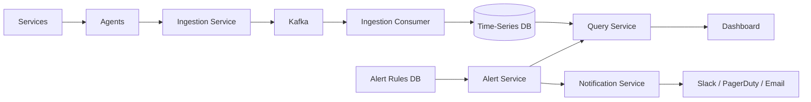
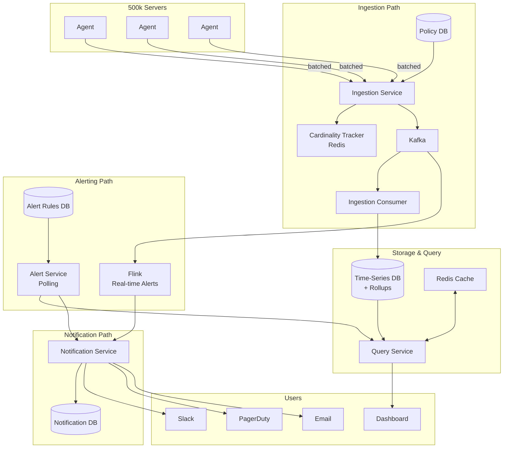

# Metrics Monitoring Platform (Datadog-style) — Deep HLD Guide

A complete reference for **designing a metrics monitoring platform** in system design interviews — with every scenario, tradeoff, and deep dive explained.

**Source:** [Hello Interview — Design a Metrics Monitoring Platform like Datadog](https://www.hellointerview.com/learn/system-design/problem-breakdowns/metrics-monitoring) (Stefan Mai, Feb 2026)

**Real-world analogs:** Datadog, Prometheus + Grafana, AWS CloudWatch, VictoriaMetrics, InfluxDB

---

## Table of Contents

1. [What Is This Problem?](#1-what-is-this-problem)
2. [Requirements — Functional & Non-Functional](#2-requirements--functional--non-functional)
3. [Scale Math — Know These Numbers Cold](#3-scale-math--know-these-numbers-cold)
4. [Core Entities](#4-core-entities)
5. [End-to-End Data Flow](#5-end-to-end-data-flow)
6. [API Design](#6-api-design)
7. [High-Level Design — The Four Pillars](#7-high-level-design--the-four-pillars)
8. [Pillar 1: Ingestion (Scaling Writes)](#8-pillar-1-ingestion-scaling-writes)
9. [Pillar 2: Storage & Query (Time-Series DB)](#9-pillar-2-storage--query-time-series-db)
10. [Pillar 3: Alerting (Polling vs Streaming)](#10-pillar-3-alerting-polling-vs-streaming)
11. [Pillar 4: Notifications (Dedup, Grouping, Escalation)](#11-pillar-4-notifications-dedup-grouping-escalation)
12. [Deep Dive 1: Low-Latency Dashboard Queries](#12-deep-dive-1-low-latency-dashboard-queries)
13. [Deep Dive 2: Alert Latency Below 1 Minute](#13-deep-dive-2-alert-latency-below-1-minute)
14. [Deep Dive 3: High Availability](#14-deep-dive-3-high-availability)
15. [Deep Dive 4: Cardinality Explosion](#15-deep-dive-4-cardinality-explosion)
16. [Final Architecture](#16-final-architecture)
17. [Scenario Playbook — Every Situation Explained](#17-scenario-playbook--every-situation-explained)
18. [Bad vs Good vs Great — Quick Reference](#18-bad-vs-good-vs-great--quick-reference)
19. [Interview Scripts — What to Say](#19-interview-scripts--what-to-say)
20. [Interview Bar by Level](#20-interview-bar-by-level)
21. [Test Your Knowledge — 15 Questions](#21-test-your-knowledge--15-questions)
22. [Comparison: Prometheus vs Datadog vs CloudWatch](#22-comparison-prometheus-vs-datadog-vs-cloudwatch)
23. [Common Interview Traps](#23-common-interview-traps)
24. [Complete Cheat Sheet](#24-complete-cheat-sheet)

---

## 1. What Is This Problem?

A **metrics monitoring platform** collects performance data from servers and services, stores it as **time-series data**, visualizes it on dashboards, and **fires alerts** when thresholds are breached.

```
┌─────────────┐     metrics      ┌──────────────────┐     query      ┌───────────┐
│ 500k servers│ ───────────────► │ Monitoring       │ ─────────────► │ Dashboard │
│ (CPU, mem,  │                  │ Platform         │                │ + Alerts  │
│  latency)   │                  │ (ingest/store)   │                └───────────┘
└─────────────┘                  └──────────────────┘
```

**Why it's hard:** This problem sits at the intersection of:

| Concern | Character |
|---------|-----------|
| Data ingestion | Write-heavy, continuous (5M points/sec) |
| Dashboard queries | Read-heavy, bursty (engineers debugging incidents) |
| Alert evaluation | Must be reliable, low latency |
| Notifications | Must not spam on-call engineers |

**Interview framing:** Start simple → identify bottlenecks → systematically address them. Build: **ingest → store → query → alert**.

---

## 2. Requirements — Functional & Non-Functional

### Functional Requirements (IN scope)

| # | Requirement | Example |
|---|-------------|---------|
| 1 | **Ingest metrics** from services | CPU, memory, latency, custom counters |
| 2 | **Query & visualize** on dashboards | Filters, aggregations, time ranges |
| 3 | **Define alert rules** with thresholds over time windows | "p99 latency > 500ms for 5 minutes" |
| 4 | **Receive notifications** when alerts fire | Email, Slack, PagerDuty |

### Functional Requirements (OUT of scope)

| Out of scope | Why separate |
|--------------|--------------|
| Log aggregation & full-text search | Different storage, query model (Elasticsearch) |
| Distributed tracing (spans, traces) | Different data model (Jaeger, Zipkin) |
| Anomaly detection via ML | Add-on, not core platform |

### Non-Functional Requirements (IN scope)

| # | Requirement | Target |
|---|-------------|--------|
| 1 | **Scale** | 5M metrics/sec from 500k servers |
| 2 | **Dashboard latency** | Return in **seconds**, even for days/weeks of data |
| 3 | **Alert latency** | < **1 minute** from metric emission to alert firing |
| 4 | **Availability** | Highly available; eventual consistency OK for dashboards; alerts must be reliable |
| 5 | **Late/out-of-order data** | Handle gracefully (network delays are common) |

### Non-Functional Requirements (OUT of scope)

| Out of scope | Why |
|--------------|-----|
| Multi-region replication | Adds complexity; mention if asked |
| Strong consistency guarantees | Eventual consistency is fine for metrics |

### Whiteboard Requirements Block (copy this)

```
FUNCTIONAL
1. Services emit metrics to platform
2. Query/visualize metrics on dashboards
3. Define alert rules with thresholds
4. Receive notifications when alerts fire

NON-FUNCTIONAL
1. Scale: 5M metrics/sec, 500k servers
2. Dashboard queries return in seconds
3. Alert latency < 1 minute
4. High availability (eventual consistency OK)
5. Handle late/out-of-order data gracefully
```

### Why is 1-minute alert latency acceptable?

> "Wouldn't we want to fire as soon as the event happens?"

**Yes and no.** In production:

- Alerts are often set on **moving averages** or **trends over time** (e.g., "avg CPU > 90% for 5 minutes")
- You need to **accumulate enough data** before a breach is meaningful
- Instant alerts require **special metric design** (e.g., Amazon tracks "milliseconds since last order" — very stable, fires almost instantly)

**Interview tip:** Don't jump to Flink/Spark unless the interviewer pushes for sub-second alerting. Polling every 30–60 seconds is battle-tested (Prometheus Alertmanager default).

---

## 3. Scale Math — Know These Numbers Cold

### Ingestion rate

```
500,000 servers × 100 data points / 10 seconds
= 500,000 × 10 points/sec
= 5,000,000 metrics/second  ← peak ingestion rate
```

### Data volume

```
5M metrics/sec × ~100–200 bytes/point
≈ 500 MB – 1 GB/second raw ingestion
≈ 43 – 86 TB/day (before compression)
```

### Dashboard query math (30-day panel)

```
10-second intervals → 259,200 points/series over 30 days
1,000 pods × 259,200 = 259 million rows to scan
~100 bytes/row → ~25 GB for ONE dashboard panel
6–10 panels per dashboard → engineers won't wait minutes
```

### Alert evaluator load

```
10,000 alert rules × 1 evaluation/minute
= ~167 queries/second to time-series DB

Increase to 15-second polling:
10,000 rules / 15 sec = ~667 queries/second
```

**Memorize:** 500k servers, 100 points/10s → **5M metrics/sec** → **~1 GB/sec** raw.

---

## 4. Core Entities

Understanding the relationship between **metrics**, **labels**, and **series** is the foundation of this entire design.

### Entity definitions

| Entity | Definition | Example |
|--------|------------|---------|
| **Label** | Key-value pair to slice/filter | `host="server-1"`, `region="us-east"` |
| **Metric** | Named measurement + labels + value at a point in time | `cpu_usage{host="server-1", region="us-east"} = 0.75` |
| **Series** | Full sequence of (timestamp, value) for one unique metric + label combo | `cpu_usage{host="server-1"}` over time |
| **Alert Rule** | Condition = metric query + threshold + duration | "avg CPU in us-east > 90% for 5 minutes" |
| **Dashboard** | Collection of panels, each running a query | 6–10 charts per dashboard |

### Series explosion — the central scaling challenge

```
cpu_usage on 500k servers with host label
→ 500,000 series

Add core label (if servers span cores):
→ potentially millions of series

http_requests{host, region, endpoint, status_code, method}
1,000 hosts × 5 regions × 200 endpoints × 10 status × 5 methods
→ up to 50 MILLION series in theory
```

**Key insight:** A series = **unique combination** of metric name + labels.

- Adding `region` label does NOT always multiply series — only if servers exist in multiple regions
- `server-1` in `us-east` exists; `server-1` in `us-west` does NOT → no extra series

### Cardinality vs series count

| Term | Meaning |
|------|---------|
| **Cardinality** | Number of unique label value combinations |
| **Series explosion** | Uncontrolled growth of unique series |
| **High cardinality** | Labels with unbounded values (user_id, request_id, trace_id) |

---

## 5. End-to-End Data Flow



### Step-by-step flow

| Step | What happens | Character |
|------|--------------|-----------|
| 1 | Services generate metric data points | Continuous, high volume |
| 2 | Platform ingests, validates, stores as time-series | Write-heavy |
| 3 | Users query via dashboards (filter, aggregate, time range) | Read-heavy, bursty |
| 4 | Alert rules periodically evaluated against stored metrics | Must be reliable |
| 5 | Breached conditions → notifications to configured channels | Must not spam |

**Critical observation:**

- Steps 1–2: **write-heavy**, continuous
- Step 3: **read-heavy**, bursty (incident debugging)
- Steps 4–5: **reliability** above all else

---

## 6. API Design

> At 5M metrics/sec, you'd use **protobuf** or binary format on the wire — JSON is fine for whiteboard clarity.

### Ingest metrics (high volume, batched)

```http
POST /metrics/ingest
```

```json
{
  "metrics": [
    {
      "name": "cpu_usage",
      "labels": {"host": "server-1", "region": "us-east"},
      "value": 0.75,
      "timestamp": 1706745600
    }
  ]
}
```

### Query metrics (read-heavy, PromQL-like DSL)

```http
GET /metrics/query?query=avg(cpu_usage{region="us-east"})&start=A&end=B&step=60
```

### Define alert rules (low write, high evaluation frequency)

```http
POST /alerts/rules
```

```json
{
  "name": "High CPU Alert",
  "query": "avg(cpu_usage{region='us-east'}) > 0.9",
  "for": "5m",
  "notifications": ["slack:#oncall", "pagerduty:team-infra"]
}
```

---

## 7. High-Level Design — The Four Pillars

| Pillar | Problem | Core solution |
|--------|---------|---------------|
| 1. Ingestion | 5M writes/sec overwhelms direct DB writes | Agents + Kafka + batching |
| 2. Storage & Query | Relational DB can't handle write/read scale | Time-series DB + query service |
| 3. Alerting | Detect threshold breaches reliably | Polling-based evaluator (queries same storage) |
| 4. Notifications | Don't spam on-call; survive provider outages | Notification service (dedup, grouping, retry) |

---

## 8. Pillar 1: Ingestion (Scaling Writes)

### Scenario: Naive direct POST

```
Servers (500k) ──POST──► Ingestion Service ──write──► Storage
```

**Problem:** 5M metrics/sec = 5M requests/sec if unbatched. Overwhelms ingestion service AND database.

---

### Bad Solution: Scale ingestion service horizontally

**Approach:** Add more ingestion instances behind load balancer. 50 instances × 100k writes/sec each.

**Why it fails:**

| Issue | Explanation |
|-------|-------------|
| Bottleneck moved, not removed | All 50 instances still write to ONE database at 5M/sec |
| No buffer | DB slows down → metrics dropped |
| No durability | No replay after failure |
| No backpressure | Spikes crash the system |

**Say in interview:** "Horizontal scaling of the ingestion service helps with request handling, but the database is still the bottleneck. We need decoupling."

---

### Good Solution: Message queue (Kafka)

```
Servers → Ingestion Service → Kafka (partitioned) → Ingestion Consumer → Storage
```

**What Kafka gives you:**

| Benefit | How |
|---------|-----|
| **Backpressure** | Kafka absorbs spikes; consumers process at their own pace |
| **Durability** | Metrics persisted until consumed |
| **Parallelism** | Partition by metric name or hash(metric + labels) |
| **Replay** | Re-process after consumer failure |

**Tradeoffs:**

- Operational complexity
- 10–50ms added latency
- At-least-once delivery semantics (need idempotent writes)
- **Catch-up problem:** If down 5 minutes, you have 5 min of backlog. At 75% normal capacity, catch-up takes 15 min — may need to drop data

> **Interview insight:** For monitoring, it's often better to **lose some data** than run persistently behind.

---

### Great Solution: Agent-based collection + Kafka

```
┌─────────┐  ┌─────────┐  ┌─────────┐
│ Server  │  │ Server  │  │ Server  │  ... (500k)
│ + Agent │  │ + Agent │  │ + Agent │
└────┬────┘  └────┬────┘  └────┬────┘
     │ batch      │ batch      │ batch
     └────────────┼────────────┘
                  ▼
         Ingestion Service → Kafka → Consumer → Storage
```

**What agents do:**

1. Collect metrics locally at high frequency
2. **Buffer and batch** locally (e.g., 100 points every 10 seconds)
3. Periodically flush batches to ingestion service

**Impact:**

```
Before: 5M requests/sec to ingestion service
After:  50k requests/sec (100x reduction from batching)
```

**Real-world examples:** Datadog Agent, OpenTelemetry Collector, Telegraf

**Additional agent capabilities:**

- Local aggregation (compute percentiles before shipping)
- Retry on network failure (local buffer)
- Config management across fleet

**Tradeoffs:**

- Deployment complexity (500k agents to version, configure, monitor)
- Standard pattern — Datadog, Prometheus, CloudWatch all use agents

### Pattern: Scaling Writes (memorize)

This ingestion path hits **3 of 4** scaling-write strategies:

| Strategy | Applied here |
|----------|--------------|
| Write-optimized database | Time-series DB (later) |
| Buffer bursts with queue | Kafka |
| Batch at the edge | Agents aggregate locally |
| Sharding | Partition Kafka + shard TSDB by series hash |

---

## 9. Pillar 2: Storage & Query (Time-Series DB)

### Scenario: Engineer debugging an incident

> "Show me p99 latency for all API endpoints in us-east over the last 6 hours, broken down by endpoint."

Potentially **millions of data points** — must return in **under a second**.

---

### Bad Solution: Relational database (Postgres)

```sql
-- Schema
| id | metric_name | labels | value | timestamp |

-- Query
SELECT time_bucket('1 minute', "timestamp") as bucket, AVG("value")
FROM metrics
WHERE "metric_name" = 'cpu_usage'
  AND "labels" @> '{"region": "us-east"}'
  AND "timestamp" BETWEEN '2024-01-01' AND '2024-01-02'
GROUP BY bucket;
```

**Why it breaks at scale:**

| Problem | At 5M writes/sec |
|---------|------------------|
| Write throughput | Postgres can't keep up |
| Sharding | Cross-shard queries become painful |
| Read degradation | Queries that worked for 1 week fail at 1 month |
| Retention (DELETEs) | Write amplification, vacuum pressure |
| Index bloat | Millions of rows per minute |

**When Postgres IS fine:** Small team, few hundred servers, weeks of retention.

---

### Great Solution: Time-series database

**Options:** InfluxDB, TimescaleDB, VictoriaMetrics, M3

**Why time-series DBs are built for this:**

| Property | Benefit |
|----------|---------|
| **Append-only writes** | LSM-tree / append-only engines → high write throughput |
| **Time-based partitioning** | "Last 6 hours" only touches recent chunks; old chunks dropped cheaply |
| **Columnar compression** | Timestamps + values compress 10–20x (100KB → 5KB) |
| **Built-in rollups** | Auto-compute 1-min, 1-hour, 1-day aggregates |

**Retention tiers (example):**

| Resolution | Retention |
|------------|-----------|
| Raw (10-second) | 15 days |
| 1-minute rollups | 90 days |
| 1-hour rollups | 1 year |

**Sharding:** Partition by time AND by hash(metric name + labels).

### Query service (separate from write path)

```
Dashboard ──query──► Query Service ──► Time-Series DB
```

**Why separate read/write paths:**

| Write path | Read path |
|------------|-----------|
| Constant, predictable | Sporadic, user-driven |
| Must never drop data | Can be expensive (scan weeks) |
| Tune for throughput | Tune for latency + cache |

Query service responsibilities:

- Accept PromQL-like DSL
- Translate to storage queries
- Select appropriate resolution (raw vs rollup)
- Cache layer (Redis) for hot queries

**Challenge:** High-cardinality data — millions of unique label combinations = millions of series, each with metadata overhead.

---

## 10. Pillar 3: Alerting (Polling vs Streaming)

### Default approach: Polling (recommended for interview)

```
Alert Rules DB (Postgres) ──► Alert Service ──query──► Query Service / TSDB
                                    │
                                    ▼ (on breach)
                              Alert Event
```

**How it works:**

1. Users register alert rules via API → stored in Postgres
2. Alert evaluator runs every **1 minute** (Prometheus default)
3. For each rule, fire a query against time-series storage
4. If threshold breached for configured duration → emit alert event

**Why this is the right default:**

| Reason | Detail |
|--------|--------|
| Meets NFR | < 1 minute latency requirement |
| Battle-tested | Exactly how Prometheus Alertmanager works |
| Simple mental model | "Alerts are just scheduled queries" |
| Reuses query path | No separate streaming system needed |

**Don't over-engineer:** Many candidates jump to Flink/Spark. Overkill unless interviewer asks for sub-minute alerting.

---

## 11. Pillar 4: Notifications (Dedup, Grouping, Escalation)

### Scenario: 100 servers breach CPU threshold simultaneously

**Bad approach:** Alert service calls Slack/PagerDuty directly for each breach → **100 pages** for one incident.

### Notification service (Alertmanager pattern)

```
Alert Service ──► Notification Service ──► Slack / PagerDuty / Email
                        │
                   Notification DB
```

**Four responsibilities:**

| Feature | What it does | Example |
|---------|--------------|---------|
| **Deduplication** | Track alert state: firing vs resolved. Only notify on **state transitions** | CPU still > 90% at minute 2, 3, 4... → no repeat pages. Page once on fire, once on resolve |
| **Grouping** | Collect alerts in 30-sec window, group by cluster/service | 100 server alerts → 1 notification: "CPU high in prod-cluster" |
| **Silencing** | Mute alerts during maintenance | "Silence all alerts for cluster-x until 3am" |
| **Escalation** | Re-notify via different channel if unacknowledged | Slack at T+0, PagerDuty at T+15min if no ack |

**Why separate from alert evaluation:**

| Alert evaluation | Notification management |
|------------------|------------------------|
| "Is the condition true?" | "Who do we tell, how often?" |
| Query time-series data | Call external APIs (flaky) |
| Scale with rule count | Scale with notification volume |
| Must be fast | Must be reliable + retry |

**Anti-pattern:** Alert service calls Slack directly → if Slack API is down, alert is lost.

---

## 12. Deep Dive 1: Low-Latency Dashboard Queries

**Pattern: Scaling Reads** — heavy aggregations, time-range scans, sub-second response.

### Scenario

> "Show CPU usage for all pods in production over the last 30 days"

Billions of data points. Must return in seconds.

---

### Bad: Query raw data directly

```
30 days × 10-sec intervals = 259,200 points/series
1,000 pods = 259 million rows
~25 GB per panel × 6-10 panels = unusable
```

Response time: **minutes**, not seconds.

---

### Good: Pre-computed rollups at multiple resolutions

| Resolution | Retention | Points for 30-day query |
|------------|-----------|-------------------------|
| Raw (10s) | 2 days | 259,200/series |
| 1-minute | 2 weeks | 20,160/series |
| 1-hour | 90 days | **720/series** ← used for 30-day query |
| 1-day | 2 years | 30/series |

Query engine selects resolution based on time range + requested granularity.

**Tradeoff — rollups are lossy:**

| You CAN query from rollups | You CANNOT query from rollups |
|----------------------------|-------------------------------|
| avg, min, max, sum, count | p99 from pre-aggregated averages |
| Trends over long ranges | Exact events in a 10s window |

**For percentiles:** Store **histograms** or **sketches** (t-digest, HdrHistogram) at each rollup level.

---

### Great: Caching + query splitting

```
Dashboard → Query Service → Redis (cache) → Time-Series DB
                                ↑
                         hit: sub-100ms
                         miss: query DB, cache result
```

**Three techniques:**

| Technique | How | When |
|-----------|-----|------|
| **Query splitting** | Recent 2 hours → query DB (fresh). Historical → check cache first | Sliding window: queries 10s apart share 99.9% of data |
| **Precomputation** | Popular dashboard queries run on schedule, results cached | Executive dashboards, SLO boards |
| **Result caching** | Cache key = query + time range + step. TTL aligned to freshness | Identical queries from multiple users |

**Cache invalidation challenges:**

- Data backfills → invalidate affected cache entries
- Monitor cache memory to prevent exhaustion

---

## 13. Deep Dive 2: Alert Latency Below 1 Minute

**When asked:** "What if we need faster than 1 minute?"

### Good: Increase polling frequency

```
Every 60s → up to 59s latency
Every 15s → up to 14s latency
Every 10s → up to 9s latency
```

**Load math:**

```
10,000 rules / 15 seconds = ~667 queries/sec to TSDB
```

**Tradeoff:** Alert queries compete with dashboard queries and ingestion writes. Still fundamentally limited by evaluation interval.

---

### Great: Stream processing (Flink)

```
Kafka ──► Flink (second consumer) ──► Alert Events
              │
         Windowed state
         (rolling 5-min buffer per series)
```

**How Flink alerting works:**

1. Flink reads metrics from Kafka (same topic as ingestion consumer)
2. Maintains windowed state per metric series (e.g., rolling 5-minute buffer)
3. Alert rules compiled into Flink operators
4. Threshold violated for configured duration → emit alert event immediately

**Latency:** "Up to 60 seconds" → "within seconds of metric arriving"

**No database query at evaluation time** — evaluates against in-memory window state.

**Hybrid approach (production reality):**

| Alert type | Mechanism |
|------------|-----------|
| Critical (payment, auth) | Flink real-time |
| Everything else (95%+) | Polling every 30–60s |

**Flink challenges:**

- Operational complexity
- Rule updates need graceful handling (don't lose state)
- Checkpointing critical for fault tolerance
- Rules must be translated to streaming operators

---

## 14. Deep Dive 3: High Availability

> If the monitoring system goes down during an incident, you're **blind at the worst moment**.

Design **two paths separately:**

| Path | Question |
|------|----------|
| Ingestion | Can we keep collecting and storing during failures? |
| Alerting + notifications | Can we still detect and notify when things break? |

---

### Bad: Single-instance everything

```
1 ingestion service + 1 Kafka broker + 1 TSDB node + 1 alert service
→ any failure = dropped metrics + silent alerts
```

---

### Good: Redundancy + durable buffers

| Component | HA approach |
|-----------|-------------|
| Ingestion | Multiple instances behind load balancer |
| Kafka | Replicated partitions, leader election, ISR |
| Storage | TSDB replication, multi-node writes |
| Alerting | Multiple Flink consumers in one consumer group |
| Notifications | Retry queue for failed deliveries |

**Key:** Kafka absorbs spikes when DB is slow. Failed notifications retry until provider recovers.

**Remaining risks:**

- Kafka retention expires if too far behind → data loss
- Misconfigured redundancy → false sense of security

---

### Great: End-to-end HA — never lose in-flight data

**Ingestion path:**

| Step | Resilience |
|------|------------|
| Agents | Buffer locally, retry on network failure |
| Kafka | Replicated across availability zones |
| Writes | **Idempotent** — retries don't create duplicate points |

**Alerting + notification path:**

| Step | Resilience |
|------|------------|
| Flink | Checkpointed state — resume after crash |
| Alert events | Written to Kafka **before** external notification |
| Notification service | Retry + failover to secondary channel (Slack → PagerDuty) |

**Principle:** Degrade **freshness**, not **correctness**. Metrics and alerts may arrive late, but they still arrive.

### Meta-monitoring — the amusing interview question

> "How do you monitor the monitoring system?"

**Wrong answer:** Use the monitoring system to monitor itself.

**Right answer:**

- Separate health checks (synthetic probes)
- External uptime monitor (Pingdom, separate CloudWatch account)
- Heartbeat metrics to a **different** system
- Watchdog service that alerts clients if data stops flowing

---

## 15. Deep Dive 4: Cardinality Explosion

**The sneakiest problem in metrics systems.**

### Scenario: Unbounded label values

```
http_requests{host, region, endpoint, status_code, method, user_id}
                                              ↑
                                    NEVER put user_id as a label
```

```
1,000 hosts × 5 regions × 200 endpoints × 10 status × 5 methods
= 50 million series (theoretical max)
```

### Why it hurts

| Side | Impact |
|------|--------|
| **Write side** | Each series = indexes + metadata + in-memory tracking. Memory spikes, write perf degrades |
| **Read side** | `sum(http_requests)` must read and aggregate every series. 50M series = very slow |

### Solution: Cardinality enforcement at ingestion

```
Ingestion Service → Cardinality Tracker (Redis) → Kafka
        ↑
   Policy DB (Postgres)
```

**Two new components:**

| Component | Role |
|-----------|------|
| **Policy store** (Postgres) | Per-metric: allowed label keys, max series count, per-label value limits |
| **Cardinality tracker** (Redis) | Fast counter: unique series per metric. SET membership check |

**Enforcement flow:**

```
1. Data point arrives at ingestion service
2. Strip label keys NOT in allowlist
3. Hash remaining labels → series ID
4. Check Redis: does this series exist?
5. If NEW → check against per-metric series cap
6. Under cap → accept, publish to Kafka
7. Over cap → DROP + increment dropped_metrics counter
8. Cap hit → alert team via notification service
```

**Example policy:**

```
http_requests:
  allowed_labels: [host, region, endpoint, status_code, method]
  max_series: 500,000
  forbidden_labels: [user_id, request_id, trace_id]
```

**Optimizations:**

- Bloom filter as first pass (reduce Redis round trips at 5M/sec)
- Batch cardinality checks

**Tuning tradeoff:**

| Too strict | Too loose |
|------------|-----------|
| Drop useful data | Don't prevent explosion |
| Engineers frustrated | System melts down |

---

## 16. Final Architecture



---

## 17. Scenario Playbook — Every Situation Explained

### Scenario 1: Traffic spike during Black Friday

**Symptoms:** 3x normal metric volume, dashboards slow, alerts delayed.

| Layer | What happens | Mitigation |
|-------|--------------|------------|
| Agents | Buffer locally, batch more aggressively | Already designed for this |
| Kafka | Absorbs spike (if retention + disk OK) | Monitor consumer lag |
| Ingestion consumer | Falls behind | Scale consumers; may drop old data if lag > retention |
| TSDB | Write pressure increases | Pre-provisioned headroom (50% normal capacity) |
| Query service | Dashboard queries compete with alert queries | Cache hot queries; rate-limit dashboard |
| Alerts | Polling still works but on slightly stale data | Acceptable per NFR |

**Interview answer:** "Kafka buffers the spike. We provision for 50% headroom so catch-up is fast. If we fall too far behind, we drop oldest data rather than run persistently behind — stale monitoring is worse than missing 5 minutes of history."

---

### Scenario 2: One team adds `user_id` as a metric label

**Symptoms:** Series count jumps from 500k to 50M overnight. Memory spikes. Writes slow. Queries timeout.

| Detection | Response |
|-----------|----------|
| `dropped_metrics` counter spikes | Cardinality enforcement drops new series |
| Alert fires: "http_requests series cap exceeded" | Team notified to remove high-cardinality label |
| TSDB memory alert | Emergency: drop metric or increase cap temporarily |

**Prevention:** Policy store forbids `user_id`, `request_id`, `trace_id` as labels. Document in onboarding.

**Interview answer:** "High-cardinality labels are the #1 way teams accidentally kill their monitoring system. We enforce caps at ingestion and alert when approached."

---

### Scenario 3: Engineer opens dashboard during incident

**Symptoms:** 10 engineers open same dashboard simultaneously. 10 identical heavy queries hit TSDB.

| Without cache | With cache |
|---------------|------------|
| 10 × 25GB scans | 1 DB query + 9 cache hits |
| Minutes to load | Sub-100ms after first query |

**Additional:** Precompute popular dashboards on schedule. Query splitting: only last 2 hours hit DB.

---

### Scenario 4: Kafka broker dies

**Symptoms:** Partition leader election. Brief write pause.

| Component | Behavior |
|-----------|----------|
| Agents | Buffer locally, retry |
| Kafka | ISR replica becomes leader (if configured correctly) |
| Consumers | Resume from last committed offset |
| Data loss | Zero if replication factor ≥ 3 and min.insync.replicas ≥ 2 |

---

### Scenario 5: Time-series DB node fails

**Symptoms:** Writes fail to one shard. Queries to that shard timeout.

| Mitigation | Detail |
|------------|--------|
| Replication | Replica promoted; writes rerouted |
| Kafka retention | Consumers pause; replay when DB recovers |
| Idempotent writes | Replay doesn't create duplicates |
| Dashboard | Eventual consistency — may show gap during failover |

---

### Scenario 6: Slack API is down

**Symptoms:** Notification delivery fails.

| Without notification service | With notification service |
|------------------------------|---------------------------|
| Alert lost forever | Queued, retried with backoff |
| | Failover to PagerDuty after N retries |
| | Alert state tracked — fires once, not per retry |

---

### Scenario 7: Late / out-of-order data arrives

**Symptoms:** Metric from 5 minutes ago arrives now (network partition, agent backlog).

| Approach | Detail |
|----------|--------|
| Accept within window | TSDB accepts points up to N minutes in the past (e.g., 15 min) |
| Reject too-old | Drop points older than window; increment counter |
| Alert re-evaluation | Polling-based alerts naturally pick up late data on next cycle |
| Cache invalidation | Invalidate cache entries for affected time range |

---

### Scenario 8: Maintenance window — silence alerts

**Symptoms:** Planned deploy causes expected CPU spike.

| Action | How |
|--------|-----|
| Create silence | "Mute High CPU alert for cluster-prod, 2am–4am" |
| Notification service | Suppresses matching alerts during window |
| Auto-expire | Silence expires; alerts resume automatically |

---

### Scenario 9: Interviewer asks "Pull vs Push?"

| Model | How | Examples | Tradeoffs |
|-------|-----|----------|-----------|
| **Push** (Datadog) | Agents push metrics to central service | Datadog, CloudWatch | Scales with fleet; agents buffer locally |
| **Pull** (Prometheus) | Central scraper pulls from /metrics endpoints | Prometheus | Simpler agents; scraper must reach all targets; harder at 500k scale |

**For 500k servers:** Push + agents is the standard answer. Mention pull for Kubernetes (Prometheus operator) as a variant.

---

### Scenario 10: Interviewer asks about percentile metrics (p99 latency)

**Problem:** You can't compute p99 from pre-aggregated averages.

| Approach | How |
|----------|-----|
| **Histograms** | Agent computes buckets locally (le=0.1, le=0.5, le=1.0...); store histogram, not single value |
| **Sketches** | t-digest or HdrHistogram at each rollup level |
| **Raw retention** | Keep raw data longer for percentile queries (expensive) |

**Interview answer:** "For p99 latency, we store histograms at ingestion time. Rollups merge histograms (not averages), so we can query approximate percentiles at any resolution."

---

## 18. Bad vs Good vs Great — Quick Reference

| Problem | Bad | Good | Great |
|---------|-----|------|-------|
| **Ingestion scale** | Scale ingestion service horizontally | Kafka message queue | Agents + batching + Kafka |
| **Storage** | Postgres | Time-series DB | TSDB + multi-resolution rollups + sharding |
| **Dashboard queries** | Query raw data | Pre-computed rollups | Rollups + Redis cache + query splitting |
| **Alerting** | Direct Slack call on breach | Polling evaluator (1 min) | Polling for most + Flink for critical |
| **Notifications** | Alert service → Slack directly | Notification service with dedup | Dedup + grouping + silencing + escalation + retry |
| **HA** | Single instance everything | Redundant components + Kafka buffer | End-to-end idempotent, checkpointed, meta-monitoring |
| **Cardinality** | No limits | Per-metric series caps | Caps + allowlists + bloom filter + alerts on drop |

---

## 19. Interview Scripts — What to Say

### Opening (first 5 minutes)

> "Let me clarify requirements. We need to ingest metrics from 500k servers, let users query dashboards, define alert rules, and send notifications. At scale that's roughly 5M metrics per second — about 1 GB/sec raw. Dashboards need second-level response even over weeks of data. Alerts within a minute. I'll design ingest → store → query → alert, and we can deep dive from there."

### When proposing Kafka

> "At 5M metrics/sec, direct writes to storage will bottleneck. I'd decouple with Kafka — it gives us backpressure during spikes, durability for replay, and parallelism via partitioning. Agents batch locally first so we're not sending 5M HTTP requests/sec."

### When proposing time-series DB

> "Postgres works for small scale, but at 5M writes/sec with time-range queries, we need a purpose-built time-series database. Append-only writes, time partitioning, columnar compression, and built-in rollups. I'd shard by hash of metric name plus labels and keep raw data 15 days with coarser rollups for longer retention."

### When proposing polling alerts

> "Our NFR is alert latency under a minute, not real-time. I'd use a polling-based evaluator — same pattern as Prometheus Alertmanager. Rules are just scheduled queries against the same storage dashboards use. Simple, debuggable, battle-tested. If we need sub-minute later, we can add Flink as a second Kafka consumer for critical rules only."

### When discussing cardinality

> "The sneakiest scaling problem is cardinality explosion — every unique metric plus label combination is a series. I'd enforce per-metric series caps at ingestion with a Redis-backed tracker and a policy store for allowed labels. Drop over-cap data and alert the team. Never allow unbounded labels like user_id."

### When discussing HA

> "I'd design ingestion and alerting as separate HA paths. Agents buffer locally, Kafka is zone-replicated, writes are idempotent. Alert events go to Kafka before external notification. If Slack is down, the notification service retries. And critically — meta-monitoring with an external watchdog, never monitor the monitoring system with itself."

---

## 20. Interview Bar by Level

### Mid-level (80% breadth, 20% depth)

| Expectation | Detail |
|-------------|--------|
| Core data flow | ingest → store → query → alert |
| Kafka | Know WHY (decoupling, durability, parallelism) |
| Time-series DB | Know WHY better than Postgres |
| Alerts | Basic "poll the database" understanding |
| Cardinality | Discuss when prompted, not proactive |
| Stream processing | Unlikely to cover |

### Senior (60% breadth, 40% depth)

| Expectation | Detail |
|-------------|--------|
| Proactive cardinality | Identify as critical challenge + propose controls |
| Stream vs polling | Articulate why polling is default, when Flink wins |
| Rollups + retention | Discuss for query performance |
| Deep dives | Clear thinking on 2–3 core challenges |
| Technologies | Discuss Flink, Kafka, InfluxDB with some depth |

### Staff+ (40% breadth, 60% depth)

| Expectation | Detail |
|-------------|--------|
| Drive conversation | Identify challenges before prompted |
| Production concerns | Meta-monitoring, backpressure cascades, alert fatigue |
| Pull vs push | Opinions backed by experience |
| Histogram aggregation | Percentile challenges at rollup levels |
| Failure modes | What happens when monitoring itself fails |
| Migration | Schema changes, storage backend migration |
| Judgment | What to optimize now vs defer |

---

## 21. Test Your Knowledge — 15 Questions

### Q1: Peak ingestion rate

500k servers × 100 data points every 10 seconds = ?

<details>
<summary>Answer</summary>

**5M metrics/second**

500,000 × (100/10) = 500,000 × 10 = 5,000,000/sec
</details>

---

### Q2: Why not scale ingestion service horizontally alone?

<details>
<summary>Answer</summary>

Moves bottleneck to database. All instances still write 5M/sec to one DB. No buffer, no durability, no backpressure.
</details>

---

### Q3: What do agents buy you?

<details>
<summary>Answer</summary>

Local collection, buffering, batching (5M req/sec → ~50k req/sec), local aggregation, retry on network failure.
</details>

---

### Q4: Why time-series DB over Postgres?

<details>
<summary>Answer</summary>

Append-only writes (LSM trees), time partitioning, columnar compression (10–20x), built-in rollups, designed for 5M writes/sec + time-range scans.
</details>

---

### Q5: What is a "series"?

<details>
<summary>Answer</summary>

Unique combination of metric name + labels, tracked as (timestamp, value) pairs over time. `cpu_usage{host="server-1"}` is one series; `cpu_usage{host="server-2"}` is another.
</details>

---

### Q6: Why polling for alerts instead of Flink?

<details>
<summary>Answer</summary>

NFR is < 1 minute, not real-time. Polling is simpler, reuses query path, battle-tested (Prometheus). Flink adds complexity justified only for sub-minute critical alerts.
</details>

---

### Q7: Why separate notification service?

<details>
<summary>Answer</summary>

Dedup (don't page every minute for same incident), grouping (100 servers → 1 notification), silencing (maintenance), escalation, retry when Slack/PagerDuty is down.
</details>

---

### Q8: 30-day dashboard query — how many raw data points per series?

<details>
<summary>Answer</summary>

**259,200** (10-second intervals: 30 × 24 × 3600 / 10)
</details>

---

### Q9: Why are rollups "lossy"?

<details>
<summary>Answer</summary>

Can't compute p99 from pre-aggregated averages. Can't recover exact events in a 10-second window. Need histograms/sketches for percentiles.
</details>

---

### Q10: What is cardinality explosion?

<details>
<summary>Answer</summary>

Uncontrolled growth of unique series from high-cardinality labels (user_id, request_id). 50M+ series → memory spikes, slow writes, slow aggregations.
</details>

---

### Q11: How to enforce cardinality limits?

<details>
<summary>Answer</summary>

Policy store (allowed labels, series cap per metric) + Redis tracker (SET membership per series hash). Drop over-cap at ingestion; alert the team.
</details>

---

### Q12: Kafka catch-up problem

<details>
<summary>Answer</summary>

If system down 5 min → 5 min backlog. At 75% capacity, catch-up takes 15 min. Better to drop data than run persistently behind.
</details>

---

### Q13: How to monitor the monitoring system?

<details>
<summary>Answer</summary>

NEVER use itself. External watchdog, synthetic probes, separate uptime monitor, heartbeat to different system.
</details>

---

### Q14: Query splitting for cache efficiency

<details>
<summary>Answer</summary>

Recent 2 hours → query DB (fresh). Historical → cache. Queries 10s apart share 99.9% of data (sliding window).
</details>

---

### Q15: Pull vs Push collection?

<details>
<summary>Answer</summary>

**Push** (Datadog): agents push to central — scales to 500k servers.
**Pull** (Prometheus): scraper pulls /metrics — simpler but scraper must reach all targets. Push + agents for this scale.
</details>

---

## 22. Comparison: Prometheus vs Datadog vs CloudWatch

| Aspect | Prometheus | Datadog | CloudWatch |
|--------|------------|---------|------------|
| **Collection** | Pull (scrape) | Push (agent) | Push (agent) |
| **Storage** | Local TSDB per instance | Centralized SaaS | AWS-managed |
| **Query language** | PromQL | Datadog DSL | CloudWatch Metrics Insights |
| **Alerting** | Alertmanager (polling) | Built-in | CloudWatch Alarms |
| **Cardinality** | Manual limits | Enforced + billing | Automatic limits |
| **Scale model** | Federation / Thanos / Mimir | Managed SaaS | Managed per AWS account |
| **Best for** | Kubernetes, self-hosted | Full observability SaaS | AWS-native workloads |

---

## 23. Common Interview Traps

| Trap | Weak answer | Strong answer |
|------|-------------|---------------|
| "Just use Postgres" | "We'll index by timestamp" | "5M writes/sec + time-range scans — need append-only TSDB with compression and rollups" |
| "Jump to Flink immediately" | "Stream processing for all alerts" | "Polling meets <1 min NFR. Flink only for critical sub-minute alerts" |
| "Alert service calls Slack" | "Direct integration" | "Notification service with dedup, retry, escalation — evaluation and delivery are different problems" |
| "No cardinality discussion" | Silence until asked | Proactively: "Biggest scaling risk is series explosion — enforce caps at ingestion" |
| "Monitor itself" | "We'll add dashboards for the monitoring system" | "External watchdog — teams have gone blind when monitoring died during incidents" |
| "Strong consistency" | "All reads must be latest" | "Eventual consistency fine for dashboards. Alert reliability matters more than freshness" |
| "One database for everything" | "Postgres for metrics, alerts, and config" | "TSDB for metrics, Postgres for alert rules and policies, Redis for cache and cardinality" |

---

## 24. Complete Cheat Sheet

```
PROBLEM:     Collect, store, query, alert on metrics at massive scale
SCALE:       500k servers, 5M metrics/sec, ~1 GB/sec raw
ENTITIES:    Label → Metric → Series (unique name+labels over time)

INGESTION:   Agents (batch) → Ingestion Service → Kafka → Consumer → TSDB
             Pattern: Scaling Writes (queue + batch + write-optimized DB)

STORAGE:     Time-series DB (NOT Postgres)
             Shard by time + hash(series)
             Retention: raw 15d → 1min 90d → 1hr 1yr

QUERY:       Query Service → TSDB (+ Redis cache)
             Rollups for long ranges, query splitting for freshness
             Pattern: Scaling Reads (cache + precompute)

ALERTS:      Rules in Postgres → Polling evaluator → query TSDB
             <1 min NFR → polling is enough (Prometheus pattern)
             Sub-minute → add Flink as 2nd Kafka consumer

NOTIFY:      Notification Service (NOT direct Slack)
             Dedup (state transitions only)
             Group (100 alerts → 1 page)
             Silence + Escalation + Retry

CARDINALITY: Policy DB + Redis tracker at ingestion
             Drop over-cap, alert team
             NEVER: user_id, request_id as labels

HA:          Agents buffer → Kafka replicated → idempotent writes
             Alert events to Kafka before external notify
             Meta-monitor externally

APIS:
  POST /metrics/ingest
  GET  /metrics/query?query=...&start=&end=&step=
  POST /alerts/rules
```

---

*Study order: Requirements → Scale math → Entities → Data flow → Four pillars → Four deep dives → Scenario playbook → Practice questions.*
